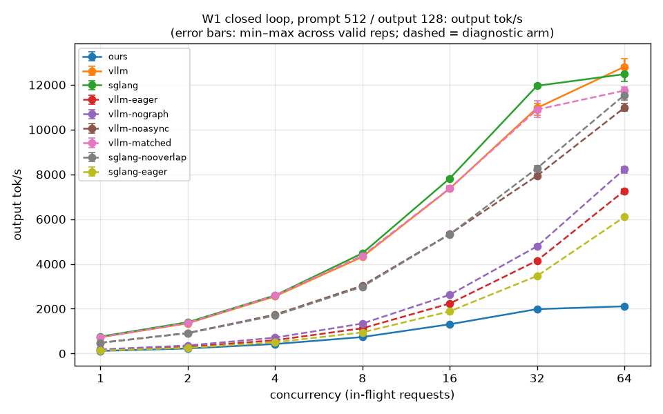
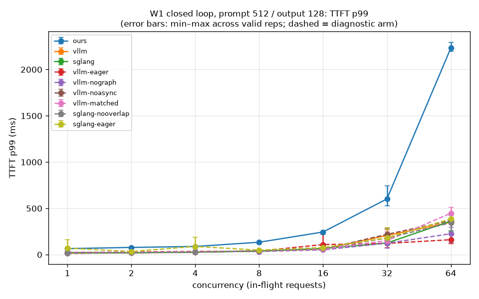
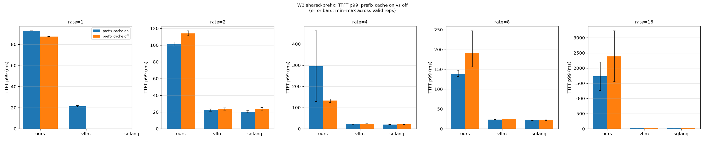

# Cross-engine benchmarks: this serving layer vs vLLM vs SGLang

This document compares this serving layer against vLLM and SGLang on the same
GPU, the same model (Llama-3.2-1B-Instruct, fp16) and byte-identical request
streams. It is a **measurement study, not an optimization effort**: the goal is
to measure where the gaps are and explain each one by mechanism. Losing with a
correct explanation counts as success.

- The binding contract (arms, workloads, artifact schema, hard rules) is
  [`SPEC.md`](SPEC.md).
- The governing decision is ADR-025 in [`docs/ADR.md`](../ADR.md), which
  supersedes ADR-013 (the earlier "no throughput comparison, scaling shape only"
  position).
- Source-code citations for vLLM and SGLang live in
  [`SOURCE_NOTES.md`](SOURCE_NOTES.md).

## How to read this document

Every number below is rendered by `bench/xengine/render.py` from the JSON
artifacts under `results/xengine/`. Run `make render` to refresh it. Only the
regions between `<!-- BEGIN GENERATED: … -->` and `<!-- END GENERATED: … -->`
markers are rewritten; everything else is hand-written and survives re-rendering.

Three rules govern the generated tables:

1. **`TODO` means no valid artifact exists for that cell.** The renderer never
   estimates, interpolates or extrapolates a value.
2. **Flags are printed, not smoothed away.** A cell with fewer than three
   repetitions, a large run-to-run spread, excluded invalid runs, or a
   harness-reported anomaly carries a bold bracketed flag.
3. **Diagnostic arms are not baselines.** Arms such as `vllm-eager` turn a
   feature off to measure that feature's contribution. They appear in separate
   tables and are never "the competitor".

## Setup

The block below lists the hardware, driver, CUDA and engine versions exactly as
the artifacts recorded them. If any of these differ across artifacts, a warning
appears at the top, because a comparison across two environments measures the
environment rather than the engines (SPEC hard rule 5).

<!-- BEGIN GENERATED: metadata -->
> **WARNING — METADATA MISMATCH ACROSS ARTIFACTS.** These runs did not all
> share one environment, so cross-arm comparisons may be confounded:
>
> - **node differs across artifacts: atl1-1-02-012-9-0, atl1-1-02-012-23-0**
> - **Slurm job id differs across artifacts: 13931401, 13931402, 13931403**

Values as recorded in the artifacts, invalid runs included (every distinct value is listed).

| field | recorded value(s) |
|---|---|
| GPU | NVIDIA H200 |
| GPU count | 1 |
| driver | 615.71.09 |
| CUDA | 13.0 |
| node | atl1-1-02-012-9-0, atl1-1-02-012-23-0 |
| Slurm job id | 13931401, 13931402, 13931403 |
| repo sha | 3a91fd7db4e00b4c6f2391a5977bca41b4c2e2a2 |
| repo dirty | false |
| harness version | 0.1.0 |
| SLO TTFT (ms) | 434.0 |
| SLO TPOT (ms) | 27.8 |
| SLO source | results/p2/RESULTS.md (job 11608159, H200; TTFT p50 43.4ms x10, TPOT p50 9.3ms x3) |
| engine `ours` version | git:3a91fd7db4e0+engine:v0.2.1 |
| engine `sglang` version | 0.5.21 |
| engine `vllm` version | 0.31.0 |
<!-- END GENERATED: metadata -->

## W1 — closed-loop concurrency sweep

**Workload.** A fixed number of requests is kept in flight (1, 2, 4, 8, 16, 32,
64), each with a 512-token prompt and exactly 128 output tokens. Closed loop
means a new request starts only when one finishes, so this measures raw
throughput and latency at a given level of parallelism.

<!-- BEGIN GENERATED: w1_table -->
Cells: `mean ± sample stdev (min–max)` across valid repetitions. `TODO` = no valid artifact. Bold brackets are flags: `n=k<3` too few reps, `CV x%` spread above the threshold, `anomaly: pool_held_by_cache_at_start` our server began the point with <5% free KV blocks and no requests (F-006), `p99 from n=k<100` tail backed by too few samples to be stable, `k invalid excluded` runs dropped from the aggregate (listed in the run inventory), `anomaly: kind` reported by the harness. `n/a (not exposed)` = the engine reported `null` for that counter.

**W1 — output tok/s — baseline arms**

| point | ours | vllm | sglang |
|---|---|---|---|
| concurrency=1 | 117 ± 0.355 (117–117) **[anomaly: bimodal_ttft; anomaly: bimodal_e2e; anomaly: bimodal_tpot]** | 730 ± 10.6 (718–737) **[anomaly: bimodal_ttft; anomaly: bimodal_tpot]** | 757 ± 3.97 (753–760) |
| concurrency=2 | 226 ± 0.859 (225–226) **[anomaly: bimodal_ttft; anomaly: bimodal_tpot; anomaly: bimodal_e2e]** | 1349 ± 26.2 (1320–1371) **[anomaly: bimodal_tpot; anomaly: bimodal_e2e]** | 1400 ± 10.6 (1388–1407) **[anomaly: tail_outliers_ttft]** |
| concurrency=4 | 425 ± 1.63 (424–427) | 2556 ± 22.6 (2531–2574) | 2600 ± 9.64 (2589–2607) **[anomaly: bimodal_ttft; anomaly: bimodal_tpot]** |
| concurrency=8 | 737 ± 2.93 (735–740) **[anomaly: bimodal_tpot; anomaly: bimodal_e2e]** | 4321 ± 62.5 (4264–4388) | 4479 ± 21.7 (4454–4495) **[anomaly: bimodal_ttft; anomaly: bimodal_tpot]** |
| concurrency=16 | 1307 ± 6.29 (1301–1314) **[anomaly: bimodal_ttft; anomaly: bimodal_tpot; anomaly: warmup_ttft]** | 7367 ± 84.7 (7271–7431) **[anomaly: bimodal_ttft; anomaly: bimodal_e2e]** | 7821 ± 54.3 (7760–7864) **[anomaly: bimodal_tpot; anomaly: bimodal_e2e]** |
| concurrency=32 | 1984 ± 30.1 (1950–2008) **[anomaly: bimodal_ttft; anomaly: bimodal_tpot; anomaly: bimodal_e2e; anomaly: rep_spread_goodput_rps; anomaly: warmup_ttft]** | 10970 ± 291 (10639–11181) **[anomaly: bimodal_ttft; anomaly: bimodal_tpot; anomaly: warmup_ttft; anomaly: bimodal_e2e]** | 11957 ± 71.1 (11886–12028) **[anomaly: bimodal_ttft; anomaly: bimodal_tpot]** |
| concurrency=64 | 2110 ± 34.6 (2071–2132) **[anomaly: bimodal_ttft; anomaly: bimodal_tpot; anomaly: bimodal_e2e; anomaly: warmup_ttft; anomaly: warmup_tpot]** | 12806 ± 333 (12547–13182) **[anomaly: bimodal_ttft; anomaly: bimodal_e2e; anomaly: warmup_ttft]** | 12478 ± 348 (12162–12851) **[anomaly: bimodal_tpot; anomaly: bimodal_e2e; anomaly: bimodal_ttft]** |

**W1 — output tok/s — diagnostic arms** (attribution only; never a competitor baseline)

| point | ours-noprefix | vllm-eager | vllm-nograph | vllm-noasync | vllm-noprefix | vllm-matched | sglang-noradix | sglang-nooverlap | sglang-eager | sglang-lpm |
|---|---|---|---|---|---|---|---|---|---|---|
| concurrency=1 | TODO | 154 ± 0.520 (154–155) **[anomaly: bimodal_e2e; anomaly: bimodal_tpot]** | 185 ± 0.581 (184–185) | 477 ± 0.591 (477–478) **[anomaly: bimodal_ttft]** | TODO | 734 ± 10.9 (723–745) **[anomaly: bimodal_ttft; anomaly: bimodal_tpot; anomaly: bimodal_e2e]** | TODO | 486 ± 0.978 (485–487) | 133 ± 0.407 (133–134) **[anomaly: tail_outliers_ttft]** | TODO |
| concurrency=2 | TODO | 304 ± 3.12 (301–307) **[anomaly: bimodal_ttft; anomaly: bimodal_e2e]** | 360 ± 1.55 (359–362) **[anomaly: bimodal_ttft; anomaly: bimodal_e2e]** | 918 ± 1.17 (917–919) **[anomaly: bimodal_ttft; anomaly: bimodal_tpot]** | TODO | 1363 ± 28.1 (1331–1384) **[anomaly: bimodal_tpot]** | TODO | 907 ± 1.10 (906–908) **[anomaly: bimodal_ttft; anomaly: bimodal_tpot]** | 255 ± 0.697 (254–256) **[anomaly: bimodal_ttft; anomaly: bimodal_e2e]** | TODO |
| concurrency=4 | TODO | 595 ± 9.51 (586–605) **[anomaly: bimodal_ttft]** | 711 ± 1.04 (710–712) **[anomaly: bimodal_ttft]** | 1740 ± 2.50 (1737–1742) | TODO | 2594 ± 9.49 (2587–2605) | TODO | 1698 ± 1.42 (1696–1699) **[anomaly: bimodal_tpot]** | 503 ± 0.171 (503–503) **[anomaly: tail_outliers_ttft; anomaly: bimodal_ttft]** | TODO |
| concurrency=8 | TODO | 1129 ± 15.4 (1118–1147) | 1341 ± 8.66 (1336–1351) | 3035 ± 10.1 (3024–3044) **[anomaly: bimodal_ttft]** | TODO | 4370 ± 70.7 (4288–4414) | TODO | 2985 ± 4.70 (2980–2990) **[anomaly: bimodal_ttft; anomaly: bimodal_tpot]** | 946 ± 1.65 (944–947) **[anomaly: bimodal_ttft]** | TODO |
| concurrency=16 | TODO | 2234 ± 43.4 (2188–2274) **[anomaly: bimodal_e2e; anomaly: warmup_ttft; anomaly: bimodal_ttft]** | 2622 ± 9.87 (2611–2629) **[anomaly: warmup_ttft; anomaly: bimodal_ttft; anomaly: bimodal_tpot; anomaly: bimodal_e2e]** | 5336 ± 64.1 (5287–5408) **[anomaly: bimodal_ttft; anomaly: bimodal_e2e]** | TODO | 7376 ± 128 (7246–7501) **[anomaly: bimodal_ttft]** | TODO | 5326 ± 1.49 (5324–5327) **[anomaly: bimodal_tpot]** | 1886 ± 7.00 (1878–1890) **[anomaly: bimodal_ttft]** | TODO |
| concurrency=32 | TODO | 4149 ± 61.5 (4079–4193) **[anomaly: warmup_ttft; anomaly: tail_outliers_ttft; anomaly: bimodal_ttft]** | 4789 ± 74.7 (4703–4838) **[anomaly: bimodal_ttft; anomaly: bimodal_e2e; anomaly: warmup_ttft; anomaly: rep_spread_ttft_p50]** | 7940 ± 180 (7825–8148) **[anomaly: bimodal_ttft; anomaly: bimodal_e2e]** | TODO | 10895 ± 378 (10556–11303) **[anomaly: bimodal_ttft; anomaly: bimodal_e2e]** | TODO | 8278 ± 200 (8048–8402) **[anomaly: bimodal_tpot; anomaly: bimodal_ttft; anomaly: bimodal_e2e]** | 3465 ± 25.2 (3436–3482) **[anomaly: bimodal_ttft; anomaly: bimodal_e2e]** | TODO |
| concurrency=64 | TODO | 7269 ± 118 (7133–7342) **[anomaly: bimodal_ttft; anomaly: bimodal_e2e; anomaly: warmup_ttft]** | 8234 ± 152 (8059–8327) **[anomaly: warmup_ttft; anomaly: bimodal_ttft]** | 10977 ± 183 (10824–11180) **[anomaly: bimodal_ttft; anomaly: bimodal_e2e]** | TODO | 11745 ± 205 (11518–11918) **[anomaly: bimodal_ttft; anomaly: bimodal_tpot]** | TODO | 11543 ± 189 (11325–11654) **[anomaly: bimodal_ttft; anomaly: bimodal_tpot; anomaly: bimodal_e2e]** | 6099 ± 17.4 (6082–6117) **[anomaly: bimodal_ttft; anomaly: bimodal_tpot]** | TODO |

**W1 — TTFT p99 (ms) — baseline arms**

| point | ours | vllm | sglang |
|---|---|---|---|
| concurrency=1 | 65.0 ± 1.46 (64.0–66.7) **[anomaly: bimodal_ttft; anomaly: bimodal_e2e; anomaly: bimodal_tpot]** | 15.5 ± 1.33 (14.3–16.9) **[anomaly: bimodal_ttft; anomaly: bimodal_tpot]** | 22.8 ± 13.9 (14.6–38.8) **[CV 61%]** |
| concurrency=2 | 78.1 ± 0.428 (77.7–78.6) **[anomaly: bimodal_ttft; anomaly: bimodal_tpot; anomaly: bimodal_e2e]** | 21.0 ± 0.128 (20.9–21.1) **[anomaly: bimodal_tpot; anomaly: bimodal_e2e]** | 19.5 ± 0.519 (18.9–19.9) **[anomaly: tail_outliers_ttft]** |
| concurrency=4 | 88.4 ± 2.04 (86.6–90.7) | 26.8 ± 2.12 (25.4–29.3) | 27.0 ± 0.514 (26.5–27.5) **[anomaly: bimodal_ttft; anomaly: bimodal_tpot]** |
| concurrency=8 | 134 ± 1.23 (133–136) **[anomaly: bimodal_tpot; anomaly: bimodal_e2e]** | 42.2 ± 1.35 (41.3–43.7) | 37.7 ± 0.667 (37.3–38.5) **[anomaly: bimodal_ttft; anomaly: bimodal_tpot]** |
| concurrency=16 | 245 ± 6.79 (239–252) **[anomaly: bimodal_ttft; anomaly: bimodal_tpot; anomaly: warmup_ttft]** | 58.8 ± 2.51 (57.2–61.7) **[anomaly: bimodal_ttft; anomaly: bimodal_e2e]** | 66.2 ± 1.16 (65.1–67.4) **[anomaly: bimodal_tpot; anomaly: bimodal_e2e]** |
| concurrency=32 | 602 ± 122 (526–743) **[CV 20%; anomaly: bimodal_ttft; anomaly: bimodal_tpot; anomaly: bimodal_e2e; anomaly: rep_spread_goodput_rps; anomaly: warmup_ttft]** | 207 ± 87.8 (107–268) **[CV 42%; anomaly: bimodal_ttft; anomaly: bimodal_tpot; anomaly: warmup_ttft; anomaly: bimodal_e2e]** | 126 ± 3.22 (123–129) **[anomaly: bimodal_ttft; anomaly: bimodal_tpot]** |
| concurrency=64 | 2233 ± 54.3 (2196–2295) **[anomaly: bimodal_ttft; anomaly: bimodal_tpot; anomaly: bimodal_e2e; anomaly: warmup_ttft; anomaly: warmup_tpot]** | 350 ± 7.29 (343–358) **[anomaly: bimodal_ttft; anomaly: bimodal_e2e; anomaly: warmup_ttft]** | 362 ± 90.0 (259–423) **[CV 25%; anomaly: bimodal_tpot; anomaly: bimodal_e2e; anomaly: bimodal_ttft]** |

**W1 — TTFT p99 (ms) — diagnostic arms** (attribution only; never a competitor baseline)

| point | ours-noprefix | vllm-eager | vllm-nograph | vllm-noasync | vllm-noprefix | vllm-matched | sglang-noradix | sglang-nooverlap | sglang-eager | sglang-lpm |
|---|---|---|---|---|---|---|---|---|---|---|
| concurrency=1 | TODO | 23.1 ± 1.96 (21.8–25.4) **[anomaly: bimodal_e2e; anomaly: bimodal_tpot]** | 21.0 ± 1.63 (19.3–22.6) | 15.1 ± 1.24 (13.8–16.3) **[anomaly: bimodal_ttft]** | TODO | 16.3 ± 3.08 (14.5–19.8) **[CV 19%; anomaly: bimodal_ttft; anomaly: bimodal_tpot; anomaly: bimodal_e2e]** | TODO | 14.8 ± 2.09 (13.0–17.1) **[CV 14%]** | 70.3 ± 77.3 (25.2–160) **[CV 110%; anomaly: tail_outliers_ttft]** | TODO |
| concurrency=2 | TODO | 28.2 ± 0.538 (27.6–28.5) **[anomaly: bimodal_ttft; anomaly: bimodal_e2e]** | 24.9 ± 0.444 (24.4–25.2) **[anomaly: bimodal_ttft; anomaly: bimodal_e2e]** | 20.2 ± 0.638 (19.7–20.9) **[anomaly: bimodal_ttft; anomaly: bimodal_tpot]** | TODO | 22.7 ± 1.07 (21.8–23.9) **[anomaly: bimodal_tpot]** | TODO | 18.9 ± 2.15 (17.7–21.4) **[CV 11%; anomaly: bimodal_ttft; anomaly: bimodal_tpot]** | 33.9 ± 1.00 (33.0–35.0) **[anomaly: bimodal_ttft; anomaly: bimodal_e2e]** | TODO |
| concurrency=4 | TODO | 34.9 ± 2.57 (33.4–37.9) **[anomaly: bimodal_ttft]** | 31.3 ± 3.12 (29.2–34.9) **[anomaly: bimodal_ttft]** | 27.3 ± 2.74 (25.6–30.4) **[CV 10%]** | TODO | 29.2 ± 2.84 (27.1–32.4) | TODO | 25.6 ± 0.192 (25.5–25.9) **[anomaly: bimodal_tpot]** | 88.8 ± 88.1 (37.9–190) **[CV 99%; anomaly: tail_outliers_ttft; anomaly: bimodal_ttft]** | TODO |
| concurrency=8 | TODO | 39.1 ± 0.593 (38.4–39.5) | 34.6 ± 2.75 (31.5–36.8) | 38.7 ± 0.228 (38.5–39.0) **[anomaly: bimodal_ttft]** | TODO | 41.0 ± 0.459 (40.5–41.3) | TODO | 41.1 ± 2.38 (39.3–43.8) **[anomaly: bimodal_ttft; anomaly: bimodal_tpot]** | 49.4 ± 1.04 (48.2–50.1) **[anomaly: bimodal_ttft]** | TODO |
| concurrency=16 | TODO | 109 ± 96.9 (50.7–221) **[CV 89%; anomaly: bimodal_e2e; anomaly: warmup_ttft; anomaly: bimodal_ttft]** | 51.5 ± 4.73 (47.1–56.5) **[anomaly: warmup_ttft; anomaly: bimodal_ttft; anomaly: bimodal_tpot; anomaly: bimodal_e2e]** | 58.5 ± 0.395 (58.3–59.0) **[anomaly: bimodal_ttft; anomaly: bimodal_e2e]** | TODO | 58.6 ± 1.66 (56.9–60.2) **[anomaly: bimodal_ttft]** | TODO | 68.1 ± 2.54 (65.2–70.0) **[anomaly: bimodal_tpot]** | 76.7 ± 6.12 (72.5–83.7) **[anomaly: bimodal_ttft]** | TODO |
| concurrency=32 | TODO | 122 ± 77.9 (74.5–212) **[CV 64%; anomaly: warmup_ttft; anomaly: tail_outliers_ttft; anomaly: bimodal_ttft]** | 124 ± 84.6 (71.0–221) **[CV 68%; anomaly: bimodal_ttft; anomaly: bimodal_e2e; anomaly: warmup_ttft; anomaly: rep_spread_ttft_p50]** | 220 ± 97.0 (109–292) **[CV 44%; anomaly: bimodal_ttft; anomaly: bimodal_e2e]** | TODO | 151 ± 81.4 (100–245) **[CV 54%; anomaly: bimodal_ttft; anomaly: bimodal_e2e]** | TODO | 179 ± 89.6 (126–282) **[CV 50%; anomaly: bimodal_tpot; anomaly: bimodal_ttft; anomaly: bimodal_e2e]** | 181 ± 93.0 (127–289) **[CV 51%; anomaly: bimodal_ttft; anomaly: bimodal_e2e]** | TODO |
| concurrency=64 | TODO | 161 ± 53.4 (120–222) **[CV 33%; anomaly: bimodal_ttft; anomaly: bimodal_e2e; anomaly: warmup_ttft]** | 226 ± 85.9 (130–296) **[CV 38%; anomaly: warmup_ttft; anomaly: bimodal_ttft]** | 368 ± 29.9 (337–396) **[anomaly: bimodal_ttft; anomaly: bimodal_e2e]** | TODO | 448 ± 101 (331–514) **[CV 23%; anomaly: bimodal_ttft; anomaly: bimodal_tpot]** | TODO | 344 ± 85.4 (246–400) **[CV 25%; anomaly: bimodal_ttft; anomaly: bimodal_tpot; anomaly: bimodal_e2e]** | 387 ± 11.3 (374–395) **[anomaly: bimodal_ttft; anomaly: bimodal_tpot]** | TODO |

**W1 — TPOT p99 (ms) — baseline arms**

| point | ours | vllm | sglang |
|---|---|---|---|
| concurrency=1 | 8.27 ± 0.075 (8.22–8.36) **[anomaly: bimodal_ttft; anomaly: bimodal_e2e; anomaly: bimodal_tpot]** | 1.30 ± 0.019 (1.29–1.32) **[anomaly: bimodal_ttft; anomaly: bimodal_tpot]** | 1.25 ± 0.009 (1.24–1.25) |
| concurrency=2 | 8.50 ± 0.021 (8.48–8.52) **[anomaly: bimodal_ttft; anomaly: bimodal_tpot; anomaly: bimodal_e2e]** | 1.36 ± 0.033 (1.33–1.39) **[anomaly: bimodal_tpot; anomaly: bimodal_e2e]** | 1.32 ± 0.012 (1.31–1.33) **[anomaly: tail_outliers_ttft]** |
| concurrency=4 | 8.96 ± 0.026 (8.93–8.98) | 1.41 ± 0.023 (1.39–1.44) | 1.39 ± 0.006 (1.38–1.39) **[anomaly: bimodal_ttft; anomaly: bimodal_tpot]** |
| concurrency=8 | 10.2 ± 0.623 (9.81–10.9) **[anomaly: bimodal_tpot; anomaly: bimodal_e2e]** | 1.55 ± 0.029 (1.53–1.58) | 1.47 ± 0.011 (1.47–1.49) **[anomaly: bimodal_ttft; anomaly: bimodal_tpot]** |
| concurrency=16 | 11.4 ± 0.011 (11.4–11.4) **[anomaly: bimodal_ttft; anomaly: bimodal_tpot; anomaly: warmup_ttft]** | 1.86 ± 0.026 (1.84–1.89) **[anomaly: bimodal_ttft; anomaly: bimodal_e2e]** | 1.64 ± 0.115 (1.58–1.78) **[anomaly: bimodal_tpot; anomaly: bimodal_e2e]** |
| concurrency=32 | 15.4 ± 1.21 (14.6–16.8) **[anomaly: bimodal_ttft; anomaly: bimodal_tpot; anomaly: bimodal_e2e; anomaly: rep_spread_goodput_rps; anomaly: warmup_ttft]** | 2.33 ± 0.039 (2.30–2.37) **[anomaly: bimodal_ttft; anomaly: bimodal_tpot; anomaly: warmup_ttft; anomaly: bimodal_e2e]** | 1.82 ± 0.008 (1.81–1.83) **[anomaly: bimodal_ttft; anomaly: bimodal_tpot]** |
| concurrency=64 | 27.8 ± 0.219 (27.6–28.0) **[anomaly: bimodal_ttft; anomaly: bimodal_tpot; anomaly: bimodal_e2e; anomaly: warmup_ttft; anomaly: warmup_tpot]** | 3.62 ± 0.009 (3.61–3.63) **[anomaly: bimodal_ttft; anomaly: bimodal_e2e; anomaly: warmup_ttft]** | 4.22 ± 0.753 (3.36–4.73) **[CV 18%; anomaly: bimodal_tpot; anomaly: bimodal_e2e; anomaly: bimodal_ttft]** |

**W1 — TPOT p99 (ms) — diagnostic arms** (attribution only; never a competitor baseline)

| point | ours-noprefix | vllm-eager | vllm-nograph | vllm-noasync | vllm-noprefix | vllm-matched | sglang-noradix | sglang-nooverlap | sglang-eager | sglang-lpm |
|---|---|---|---|---|---|---|---|---|---|---|
| concurrency=1 | TODO | 6.51 ± 0.079 (6.43–6.58) **[anomaly: bimodal_e2e; anomaly: bimodal_tpot]** | 5.42 ± 0.050 (5.36–5.45) | 2.05 ± 0.019 (2.03–2.06) **[anomaly: bimodal_ttft]** | TODO | 1.29 ± 0.026 (1.26–1.31) **[anomaly: bimodal_ttft; anomaly: bimodal_tpot; anomaly: bimodal_e2e]** | TODO | 2.00 ± 0.018 (1.99–2.03) | 7.50 ± 0.029 (7.46–7.52) **[anomaly: tail_outliers_ttft]** | TODO |
| concurrency=2 | TODO | 6.58 ± 0.086 (6.51–6.68) **[anomaly: bimodal_ttft; anomaly: bimodal_e2e]** | 5.49 ± 0.061 (5.42–5.54) **[anomaly: bimodal_ttft; anomaly: bimodal_e2e]** | 2.10 ± 0.014 (2.10–2.12) **[anomaly: bimodal_ttft; anomaly: bimodal_tpot]** | TODO | 1.33 ± 0.040 (1.30–1.38) **[anomaly: bimodal_tpot]** | TODO | 2.13 ± 0.019 (2.12–2.16) **[anomaly: bimodal_ttft; anomaly: bimodal_tpot]** | 7.80 ± 0.063 (7.73–7.86) **[anomaly: bimodal_ttft; anomaly: bimodal_e2e]** | TODO |
| concurrency=4 | TODO | 6.66 ± 0.093 (6.56–6.74) **[anomaly: bimodal_ttft]** | 5.55 ± 0.015 (5.54–5.56) **[anomaly: bimodal_ttft]** | 2.21 ± 0.021 (2.20–2.23) | TODO | 1.38 ± 0.004 (1.37–1.38) | TODO | 2.23 ± 0.008 (2.22–2.24) **[anomaly: bimodal_tpot]** | 7.83 ± 0.034 (7.81–7.87) **[anomaly: tail_outliers_ttft; anomaly: bimodal_ttft]** | TODO |
| concurrency=8 | TODO | 6.74 ± 0.104 (6.62–6.82) | 5.70 ± 0.029 (5.67–5.72) | 2.41 ± 0.021 (2.39–2.43) **[anomaly: bimodal_ttft]** | TODO | 1.53 ± 0.027 (1.51–1.56) | TODO | 2.36 ± 0.023 (2.33–2.37) **[anomaly: bimodal_ttft; anomaly: bimodal_tpot]** | 8.00 ± 0.059 (7.95–8.06) **[anomaly: bimodal_ttft]** | TODO |
| concurrency=16 | TODO | 6.92 ± 0.075 (6.83–6.97) **[anomaly: bimodal_e2e; anomaly: warmup_ttft; anomaly: bimodal_ttft]** | 5.90 ± 0.035 (5.87–5.94) **[anomaly: warmup_ttft; anomaly: bimodal_ttft; anomaly: bimodal_tpot; anomaly: bimodal_e2e]** | 2.75 ± 0.032 (2.72–2.78) **[anomaly: bimodal_ttft; anomaly: bimodal_e2e]** | TODO | 1.92 ± 0.092 (1.83–2.01) **[anomaly: bimodal_ttft]** | TODO | 2.54 ± 0.025 (2.52–2.57) **[anomaly: bimodal_tpot]** | 8.10 ± 0.077 (8.04–8.19) **[anomaly: bimodal_ttft]** | TODO |
| concurrency=32 | TODO | 7.46 ± 0.329 (7.24–7.84) **[anomaly: warmup_ttft; anomaly: tail_outliers_ttft; anomaly: bimodal_ttft]** | 6.26 ± 0.052 (6.21–6.31) **[anomaly: bimodal_ttft; anomaly: bimodal_e2e; anomaly: warmup_ttft; anomaly: rep_spread_ttft_p50]** | 3.45 ± 0.089 (3.39–3.56) **[anomaly: bimodal_ttft; anomaly: bimodal_e2e]** | TODO | 2.31 ± 0.040 (2.27–2.35) **[anomaly: bimodal_ttft; anomaly: bimodal_e2e]** | TODO | 3.06 ± 0.161 (2.94–3.25) **[anomaly: bimodal_tpot; anomaly: bimodal_ttft; anomaly: bimodal_e2e]** | 8.48 ± 0.048 (8.44–8.53) **[anomaly: bimodal_ttft; anomaly: bimodal_e2e]** | TODO |
| concurrency=64 | TODO | 8.36 ± 0.712 (7.90–9.18) **[anomaly: bimodal_ttft; anomaly: bimodal_e2e; anomaly: warmup_ttft]** | 7.48 ± 0.664 (6.92–8.21) **[anomaly: warmup_ttft; anomaly: bimodal_ttft]** | 4.54 ± 0.081 (4.46–4.62) **[anomaly: bimodal_ttft; anomaly: bimodal_e2e]** | TODO | 3.34 ± 0.791 (2.43–3.83) **[CV 24%; anomaly: bimodal_ttft; anomaly: bimodal_tpot]** | TODO | 4.27 ± 0.725 (3.85–5.11) **[CV 17%; anomaly: bimodal_ttft; anomaly: bimodal_tpot; anomaly: bimodal_e2e]** | 8.90 ± 0.021 (8.88–8.91) **[anomaly: bimodal_ttft; anomaly: bimodal_tpot]** | TODO |
<!-- END GENERATED: w1_table -->

**Figure W1-a: output tokens per second vs concurrency.**

<!-- BEGIN GENERATED: fig_w1_throughput -->

<!-- END GENERATED: fig_w1_throughput -->

**Figure W1-b: TTFT p99 vs concurrency.** TTFT is time to first token.

<!-- BEGIN GENERATED: fig_w1_ttft -->

<!-- END GENERATED: fig_w1_ttft -->

## W2 — open-loop mixed lengths

**Workload.** Prompt lengths follow a lognormal distribution and output lengths
have a long tail. Requests arrive at a fixed offered rate regardless of how fast
the server answers (open loop), swept across rates. This is the workload where
goodput (requests per second that meet the frozen SLO) is the headline metric.

<!-- BEGIN GENERATED: w2_table -->
Cells: `mean ± sample stdev (min–max)` across valid repetitions. `TODO` = no valid artifact. Bold brackets are flags: `n=k<3` too few reps, `CV x%` spread above the threshold, `anomaly: pool_held_by_cache_at_start` our server began the point with <5% free KV blocks and no requests (F-006), `p99 from n=k<100` tail backed by too few samples to be stable, `k invalid excluded` runs dropped from the aggregate (listed in the run inventory), `anomaly: kind` reported by the harness. `n/a (not exposed)` = the engine reported `null` for that counter.

**W2 — goodput rps — baseline arms**

| point | ours | vllm | sglang |
|---|---|---|---|
| rate=1 | TODO **[3 invalid excluded]** | 1.15 **[n=1<3; 2 invalid excluded; anomaly: rep_spread_output_tok_s]** | 1.15 **[n=1<3; 2 invalid excluded; anomaly: rep_spread_output_tok_s]** |
| rate=2 | TODO **[3 invalid excluded]** | TODO **[3 invalid excluded]** | TODO **[3 invalid excluded]** |
| rate=4 | 0.042 ± 0.012 (0.033–0.050) **[n=2<3; CV 28%; 1 invalid excluded; anomaly: rep_spread_output_tok_s; anomaly: rep_spread_goodput_rps; anomaly: rep_spread_ttft_p50; anomaly: rep_spread_tpot_p50; anomaly: tail_outliers_ttft]** | 4.30 **[n=1<3; 2 invalid excluded; anomaly: rep_spread_output_tok_s; anomaly: rep_spread_goodput_rps]** | 4.30 **[n=1<3; 2 invalid excluded; anomaly: rep_spread_output_tok_s; anomaly: rep_spread_goodput_rps]** |
| rate=8 | 0.117 **[n=1<3; 2 invalid excluded; anomaly: rep_spread_output_tok_s; anomaly: rep_spread_goodput_rps; anomaly: rep_spread_ttft_p50; anomaly: rep_spread_tpot_p50]** | 8.35 **[n=1<3; 2 invalid excluded; anomaly: tail_outliers_ttft]** | 8.35 **[n=1<3; 2 invalid excluded; anomaly: tail_outliers_ttft]** |
| rate=16 | 0.183 **[n=1<3; 2 invalid excluded; anomaly: bimodal_ttft; anomaly: rep_spread_output_tok_s; anomaly: rep_spread_goodput_rps; anomaly: rep_spread_ttft_p50; anomaly: rep_spread_tpot_p50]** | 16.1 ± 0.271 (15.9–16.3) **[n=2<3; 1 invalid excluded; anomaly: rep_spread_output_tok_s]** | 16.1 ± 0.271 (15.9–16.3) **[n=2<3; 1 invalid excluded; anomaly: rep_spread_output_tok_s]** |
| rate=32 | TODO **[2 invalid excluded]** | 32.8 ± 0.776 (32.0–33.5) | 33.2 ± 0.495 (32.9–33.5) **[n=2<3; 1 invalid excluded]** |

**W2 — goodput rps — diagnostic arms** (attribution only; never a competitor baseline)

| point | ours-noprefix | vllm-eager | vllm-nograph | vllm-noasync | vllm-noprefix | vllm-matched | sglang-noradix | sglang-nooverlap | sglang-eager | sglang-lpm |
|---|---|---|---|---|---|---|---|---|---|---|
| rate=1 | TODO | TODO | TODO | TODO | TODO | TODO | TODO | TODO | TODO | TODO |
| rate=2 | TODO | TODO | TODO | TODO | TODO | TODO | TODO | TODO | TODO | TODO |
| rate=4 | TODO | TODO | TODO | TODO | TODO | TODO | TODO | TODO | TODO | TODO |
| rate=8 | TODO | TODO | TODO | TODO | TODO | TODO | TODO | TODO | TODO | TODO |
| rate=16 | TODO | TODO | TODO | TODO | TODO | TODO | TODO | TODO | TODO | TODO |
| rate=32 | TODO | TODO | TODO | TODO | TODO | TODO | TODO | TODO | TODO | TODO |

**W2 — SLO attainment (fraction) — baseline arms**

| point | ours | vllm | sglang |
|---|---|---|---|
| rate=1 | TODO **[3 invalid excluded]** | 1.00 **[n=1<3; 2 invalid excluded; anomaly: rep_spread_output_tok_s]** | 1.00 **[n=1<3; 2 invalid excluded; anomaly: rep_spread_output_tok_s]** |
| rate=2 | TODO **[3 invalid excluded]** | TODO **[3 invalid excluded]** | TODO **[3 invalid excluded]** |
| rate=4 | 0.010 ± 0.003 (0.008–0.011) **[n=2<3; CV 27%; 1 invalid excluded; anomaly: rep_spread_output_tok_s; anomaly: rep_spread_goodput_rps; anomaly: rep_spread_ttft_p50; anomaly: rep_spread_tpot_p50; anomaly: tail_outliers_ttft]** | 1.00 **[n=1<3; 2 invalid excluded; anomaly: rep_spread_output_tok_s; anomaly: rep_spread_goodput_rps]** | 1.00 **[n=1<3; 2 invalid excluded; anomaly: rep_spread_output_tok_s; anomaly: rep_spread_goodput_rps]** |
| rate=8 | 0.014 **[n=1<3; 2 invalid excluded; anomaly: rep_spread_output_tok_s; anomaly: rep_spread_goodput_rps; anomaly: rep_spread_ttft_p50; anomaly: rep_spread_tpot_p50]** | 1.00 **[n=1<3; 2 invalid excluded; anomaly: tail_outliers_ttft]** | 1.00 **[n=1<3; 2 invalid excluded; anomaly: tail_outliers_ttft]** |
| rate=16 | 0.011 **[n=1<3; 2 invalid excluded; anomaly: bimodal_ttft; anomaly: rep_spread_output_tok_s; anomaly: rep_spread_goodput_rps; anomaly: rep_spread_ttft_p50; anomaly: rep_spread_tpot_p50]** | 1.00 ± 0.000 (1.00–1.00) **[n=2<3; 1 invalid excluded; anomaly: rep_spread_output_tok_s]** | 1.00 ± 0.000 (1.00–1.00) **[n=2<3; 1 invalid excluded; anomaly: rep_spread_output_tok_s]** |
| rate=32 | TODO **[2 invalid excluded]** | 1.00 ± 0.000 (1.00–1.00) | 1.00 ± 0.000 (1.00–1.00) **[n=2<3; 1 invalid excluded]** |

**W2 — SLO attainment (fraction) — diagnostic arms** (attribution only; never a competitor baseline)

| point | ours-noprefix | vllm-eager | vllm-nograph | vllm-noasync | vllm-noprefix | vllm-matched | sglang-noradix | sglang-nooverlap | sglang-eager | sglang-lpm |
|---|---|---|---|---|---|---|---|---|---|---|
| rate=1 | TODO | TODO | TODO | TODO | TODO | TODO | TODO | TODO | TODO | TODO |
| rate=2 | TODO | TODO | TODO | TODO | TODO | TODO | TODO | TODO | TODO | TODO |
| rate=4 | TODO | TODO | TODO | TODO | TODO | TODO | TODO | TODO | TODO | TODO |
| rate=8 | TODO | TODO | TODO | TODO | TODO | TODO | TODO | TODO | TODO | TODO |
| rate=16 | TODO | TODO | TODO | TODO | TODO | TODO | TODO | TODO | TODO | TODO |
| rate=32 | TODO | TODO | TODO | TODO | TODO | TODO | TODO | TODO | TODO | TODO |

**W2 — TTFT p99 (ms) — baseline arms**

| point | ours | vllm | sglang |
|---|---|---|---|
| rate=1 | TODO **[3 invalid excluded]** | 25.9 **[n=1<3; 2 invalid excluded; anomaly: rep_spread_output_tok_s; p99 from n=69<100]** | 21.5 **[n=1<3; 2 invalid excluded; anomaly: rep_spread_output_tok_s; p99 from n=69<100]** |
| rate=2 | TODO **[3 invalid excluded]** | TODO **[3 invalid excluded]** | TODO **[3 invalid excluded]** |
| rate=4 | 134 ± 2.87 (132–136) **[n=2<3; 1 invalid excluded; anomaly: rep_spread_output_tok_s; anomaly: rep_spread_goodput_rps; anomaly: rep_spread_ttft_p50; anomaly: rep_spread_tpot_p50; anomaly: tail_outliers_ttft]** | 26.6 **[n=1<3; 2 invalid excluded; anomaly: rep_spread_output_tok_s; anomaly: rep_spread_goodput_rps]** | 25.1 **[n=1<3; 2 invalid excluded; anomaly: rep_spread_output_tok_s; anomaly: rep_spread_goodput_rps]** |
| rate=8 | 145 **[n=1<3; 2 invalid excluded; anomaly: rep_spread_output_tok_s; anomaly: rep_spread_goodput_rps; anomaly: rep_spread_ttft_p50; anomaly: rep_spread_tpot_p50]** | 63.7 **[n=1<3; 2 invalid excluded; anomaly: tail_outliers_ttft]** | 34.8 **[n=1<3; 2 invalid excluded; anomaly: tail_outliers_ttft]** |
| rate=16 | 434 **[n=1<3; 2 invalid excluded; anomaly: bimodal_ttft; anomaly: rep_spread_output_tok_s; anomaly: rep_spread_goodput_rps; anomaly: rep_spread_ttft_p50; anomaly: rep_spread_tpot_p50]** | 28.7 ± 3.30 (26.4–31.1) **[n=2<3; CV 11%; 1 invalid excluded; anomaly: rep_spread_output_tok_s]** | 26.6 ± 0.743 (26.1–27.1) **[n=2<3; 1 invalid excluded; anomaly: rep_spread_output_tok_s]** |
| rate=32 | TODO **[2 invalid excluded]** | 32.4 ± 0.387 (32.1–32.8) | 28.0 ± 1.66 (26.8–29.2) **[n=2<3; 1 invalid excluded]** |

**W2 — TTFT p99 (ms) — diagnostic arms** (attribution only; never a competitor baseline)

| point | ours-noprefix | vllm-eager | vllm-nograph | vllm-noasync | vllm-noprefix | vllm-matched | sglang-noradix | sglang-nooverlap | sglang-eager | sglang-lpm |
|---|---|---|---|---|---|---|---|---|---|---|
| rate=1 | TODO | TODO | TODO | TODO | TODO | TODO | TODO | TODO | TODO | TODO |
| rate=2 | TODO | TODO | TODO | TODO | TODO | TODO | TODO | TODO | TODO | TODO |
| rate=4 | TODO | TODO | TODO | TODO | TODO | TODO | TODO | TODO | TODO | TODO |
| rate=8 | TODO | TODO | TODO | TODO | TODO | TODO | TODO | TODO | TODO | TODO |
| rate=16 | TODO | TODO | TODO | TODO | TODO | TODO | TODO | TODO | TODO | TODO |
| rate=32 | TODO | TODO | TODO | TODO | TODO | TODO | TODO | TODO | TODO | TODO |

**W2 — TPOT p99 (ms) — baseline arms**

| point | ours | vllm | sglang |
|---|---|---|---|
| rate=1 | TODO **[3 invalid excluded]** | 1.50 **[n=1<3; 2 invalid excluded; anomaly: rep_spread_output_tok_s; p99 from n=69<100]** | 1.59 **[n=1<3; 2 invalid excluded; anomaly: rep_spread_output_tok_s; p99 from n=69<100]** |
| rate=2 | TODO **[3 invalid excluded]** | TODO **[3 invalid excluded]** | TODO **[3 invalid excluded]** |
| rate=4 | 50.9 ± 1.46 (49.9–51.9) **[n=2<3; 1 invalid excluded; anomaly: rep_spread_output_tok_s; anomaly: rep_spread_goodput_rps; anomaly: rep_spread_ttft_p50; anomaly: rep_spread_tpot_p50; anomaly: tail_outliers_ttft]** | 1.53 **[n=1<3; 2 invalid excluded; anomaly: rep_spread_output_tok_s; anomaly: rep_spread_goodput_rps]** | 1.48 **[n=1<3; 2 invalid excluded; anomaly: rep_spread_output_tok_s; anomaly: rep_spread_goodput_rps]** |
| rate=8 | 54.0 **[n=1<3; 2 invalid excluded; anomaly: rep_spread_output_tok_s; anomaly: rep_spread_goodput_rps; anomaly: rep_spread_ttft_p50; anomaly: rep_spread_tpot_p50]** | 1.79 **[n=1<3; 2 invalid excluded; anomaly: tail_outliers_ttft]** | 1.83 **[n=1<3; 2 invalid excluded; anomaly: tail_outliers_ttft]** |
| rate=16 | 70.9 **[n=1<3; 2 invalid excluded; anomaly: bimodal_ttft; anomaly: rep_spread_output_tok_s; anomaly: rep_spread_goodput_rps; anomaly: rep_spread_ttft_p50; anomaly: rep_spread_tpot_p50]** | 1.85 ± 0.009 (1.84–1.85) **[n=2<3; 1 invalid excluded; anomaly: rep_spread_output_tok_s]** | 1.96 ± 0.058 (1.92–2.00) **[n=2<3; 1 invalid excluded; anomaly: rep_spread_output_tok_s]** |
| rate=32 | TODO **[2 invalid excluded]** | 2.22 ± 0.038 (2.18–2.26) | 2.56 ± 0.105 (2.48–2.63) **[n=2<3; 1 invalid excluded]** |

**W2 — TPOT p99 (ms) — diagnostic arms** (attribution only; never a competitor baseline)

| point | ours-noprefix | vllm-eager | vllm-nograph | vllm-noasync | vllm-noprefix | vllm-matched | sglang-noradix | sglang-nooverlap | sglang-eager | sglang-lpm |
|---|---|---|---|---|---|---|---|---|---|---|
| rate=1 | TODO | TODO | TODO | TODO | TODO | TODO | TODO | TODO | TODO | TODO |
| rate=2 | TODO | TODO | TODO | TODO | TODO | TODO | TODO | TODO | TODO | TODO |
| rate=4 | TODO | TODO | TODO | TODO | TODO | TODO | TODO | TODO | TODO | TODO |
| rate=8 | TODO | TODO | TODO | TODO | TODO | TODO | TODO | TODO | TODO | TODO |
| rate=16 | TODO | TODO | TODO | TODO | TODO | TODO | TODO | TODO | TODO | TODO |
| rate=32 | TODO | TODO | TODO | TODO | TODO | TODO | TODO | TODO | TODO | TODO |
<!-- END GENERATED: w2_table -->

## W3 — shared system prefix

**Workload.** 80% of requests share one long common system prefix. Every engine
runs once with its prefix cache on and once with it off, so the cache's effect
is measured inside each engine rather than across engines.

<!-- BEGIN GENERATED: w3_table -->
Cells: `mean ± sample stdev (min–max)` across valid repetitions. `TODO` = no valid artifact. Bold brackets are flags: `n=k<3` too few reps, `CV x%` spread above the threshold, `anomaly: pool_held_by_cache_at_start` our server began the point with <5% free KV blocks and no requests (F-006), `p99 from n=k<100` tail backed by too few samples to be stable, `k invalid excluded` runs dropped from the aggregate (listed in the run inventory), `anomaly: kind` reported by the harness. `n/a (not exposed)` = the engine reported `null` for that counter.

**W3 — TTFT p99 (ms) — baseline arms**

| point | ours | vllm | sglang |
|---|---|---|---|
| rate=1 | 92.7 **[n=1<3; 2 invalid excluded; anomaly: bimodal_ttft; anomaly: rep_spread_output_tok_s; anomaly: rep_spread_goodput_rps; anomaly: rep_spread_tpot_p50; p99 from n=50<100]** | 21.3 ± 1.16 (20.5–22.1) **[n=2<3; 1 invalid excluded; anomaly: rep_spread_output_tok_s; anomaly: rep_spread_goodput_rps; p99 from n=50<100]** | TODO **[3 invalid excluded]** |
| rate=2 | 101 ± 3.36 (98.9–104) **[n=2<3; 1 invalid excluded; anomaly: bimodal_ttft; anomaly: rep_spread_goodput_rps; anomaly: rep_spread_tpot_p50]** | 22.6 ± 1.47 (21.0–23.8) | 20.3 ± 1.17 (19.2–21.5) |
| rate=4 | 295 ± 236 (128–461) **[n=2<3; CV 80%; 1 invalid excluded; anomaly: rep_spread_goodput_rps; anomaly: tail_outliers_ttft]** | 22.0 ± 0.837 (21.1–22.7) | 20.1 ± 0.336 (19.9–20.4) **[n=2<3; 1 invalid excluded]** |
| rate=8 | 138 ± 8.41 (132–147) **[anomaly: bimodal_tpot; anomaly: bimodal_e2e]** | 23.1 ± 0.193 (22.8–23.2) | 21.1 ± 0.443 (20.6–21.5) |
| rate=16 | 1726 ± 659 (1261–2192) **[n=2<3; CV 38%; 1 invalid excluded; anomaly: bimodal_ttft; anomaly: bimodal_tpot; anomaly: rep_spread_output_tok_s; anomaly: rep_spread_ttft_p50; anomaly: rep_spread_tpot_p50; anomaly: bimodal_e2e]** | 27.0 ± 0.635 (26.6–27.5) **[n=2<3; 1 invalid excluded; anomaly: tail_outliers_ttft]** | 24.3 ± 0.920 (23.6–24.9) **[n=2<3; 1 invalid excluded; anomaly: tail_outliers_ttft]** |

**W3 — TTFT p99 (ms) — diagnostic arms** (attribution only; never a competitor baseline)

| point | ours-noprefix | vllm-eager | vllm-nograph | vllm-noasync | vllm-noprefix | vllm-matched | sglang-noradix | sglang-nooverlap | sglang-eager | sglang-lpm |
|---|---|---|---|---|---|---|---|---|---|---|
| rate=1 | 87.4 **[n=1<3; 2 invalid excluded; anomaly: bimodal_ttft; anomaly: rep_spread_output_tok_s; anomaly: rep_spread_goodput_rps; anomaly: rep_spread_tpot_p50; p99 from n=63<100]** | TODO | TODO | TODO | TODO **[3 invalid excluded]** | TODO | TODO **[3 invalid excluded]** | TODO | TODO | TODO **[3 invalid excluded]** |
| rate=2 | 114 ± 4.00 (111–117) **[n=2<3; 1 invalid excluded; anomaly: bimodal_ttft; anomaly: rep_spread_tpot_p50]** | TODO | TODO | TODO | 23.7 ± 1.52 (22.1–25.1) | TODO | 23.7 ± 2.19 (22.2–25.3) **[n=2<3; 1 invalid excluded]** | TODO | TODO | 21.8 ± 2.25 (20.4–24.4) **[CV 10%]** |
| rate=4 | 133 ± 11.4 (125–141) **[n=2<3; 1 invalid excluded; anomaly: bimodal_tpot; anomaly: bimodal_e2e; anomaly: rep_spread_goodput_rps]** | TODO | TODO | TODO | 22.7 ± 1.18 (21.9–23.6) **[n=2<3; 1 invalid excluded]** | TODO | 20.8 ± 0.442 (20.5–21.1) **[n=2<3; 1 invalid excluded]** | TODO | TODO | 21.2 ± 1.89 (19.9–22.5) **[n=2<3; 1 invalid excluded]** |
| rate=8 | 191 ± 48.6 (156–247) **[CV 25%; anomaly: bimodal_tpot; anomaly: bimodal_e2e]** | TODO | TODO | TODO | 24.4 ± 0.320 (24.2–24.8) | TODO | 22.0 ± 0.637 (21.5–22.7) | TODO | TODO | 21.9 ± 1.06 (21.2–23.1) |
| rate=16 | 2386 ± 1184 (1549–3223) **[n=2<3; CV 50%; 1 invalid excluded; anomaly: bimodal_tpot; anomaly: bimodal_e2e; anomaly: warmup_ttft; anomaly: tail_outliers_ttft; anomaly: rep_spread_ttft_p50]** | TODO | TODO | TODO | 29.1 ± 1.18 (28.3–29.9) **[n=2<3; 1 invalid excluded; anomaly: tail_outliers_ttft]** | TODO | 26.4 ± 0.334 (26.1–26.6) **[n=2<3; 1 invalid excluded]** | TODO | TODO | 26.6 ± 1.95 (25.3–28.0) **[n=2<3; 1 invalid excluded; anomaly: tail_outliers_ttft]** |

**W3 — goodput rps — baseline arms**

| point | ours | vllm | sglang |
|---|---|---|---|
| rate=1 | 0.750 **[n=1<3; 2 invalid excluded; anomaly: bimodal_ttft; anomaly: rep_spread_output_tok_s; anomaly: rep_spread_goodput_rps; anomaly: rep_spread_tpot_p50]** | 0.942 ± 0.153 (0.833–1.05) **[n=2<3; CV 16%; 1 invalid excluded; anomaly: rep_spread_output_tok_s; anomaly: rep_spread_goodput_rps]** | TODO **[3 invalid excluded]** |
| rate=2 | 0.775 ± 0.106 (0.700–0.850) **[n=2<3; CV 14%; 1 invalid excluded; anomaly: bimodal_ttft; anomaly: rep_spread_goodput_rps; anomaly: rep_spread_tpot_p50]** | 2.07 ± 0.218 (1.87–2.30) **[CV 10%]** | 2.07 ± 0.218 (1.87–2.30) **[CV 10%]** |
| rate=4 | 0.408 ± 0.577 (0.000–0.817) **[n=2<3; CV 141%; 1 invalid excluded; anomaly: rep_spread_goodput_rps; anomaly: tail_outliers_ttft]** | 4.10 ± 0.196 (3.93–4.32) | 4.18 ± 0.189 (4.05–4.32) **[n=2<3; 1 invalid excluded]** |
| rate=8 | 0.000 ± 0.000 (0.000–0.000) **[anomaly: bimodal_tpot; anomaly: bimodal_e2e]** | 8.13 ± 0.478 (7.58–8.45) | 8.13 ± 0.478 (7.58–8.45) |
| rate=16 | 0.000 ± 0.000 (0.000–0.000) **[n=2<3; 1 invalid excluded; anomaly: bimodal_ttft; anomaly: bimodal_tpot; anomaly: rep_spread_output_tok_s; anomaly: rep_spread_ttft_p50; anomaly: rep_spread_tpot_p50; anomaly: bimodal_e2e]** | 16.7 ± 1.23 (15.8–17.6) **[n=2<3; 1 invalid excluded; anomaly: tail_outliers_ttft]** | 16.7 ± 1.23 (15.8–17.6) **[n=2<3; 1 invalid excluded; anomaly: tail_outliers_ttft]** |

**W3 — goodput rps — diagnostic arms** (attribution only; never a competitor baseline)

| point | ours-noprefix | vllm-eager | vllm-nograph | vllm-noasync | vllm-noprefix | vllm-matched | sglang-noradix | sglang-nooverlap | sglang-eager | sglang-lpm |
|---|---|---|---|---|---|---|---|---|---|---|
| rate=1 | 1.03 **[n=1<3; 2 invalid excluded; anomaly: bimodal_ttft; anomaly: rep_spread_output_tok_s; anomaly: rep_spread_goodput_rps; anomaly: rep_spread_tpot_p50]** | TODO | TODO | TODO | TODO **[3 invalid excluded]** | TODO | TODO **[3 invalid excluded]** | TODO | TODO | TODO **[3 invalid excluded]** |
| rate=2 | 0.775 ± 0.106 (0.700–0.850) **[n=2<3; CV 14%; 1 invalid excluded; anomaly: bimodal_ttft; anomaly: rep_spread_tpot_p50]** | TODO | TODO | TODO | 2.07 ± 0.218 (1.87–2.30) **[CV 10%]** | TODO | 1.96 ± 0.130 (1.87–2.05) **[n=2<3; 1 invalid excluded]** | TODO | TODO | 2.07 ± 0.218 (1.87–2.30) **[CV 10%]** |
| rate=4 | 0.275 ± 0.389 (0.000–0.550) **[n=2<3; CV 141%; 1 invalid excluded; anomaly: bimodal_tpot; anomaly: bimodal_e2e; anomaly: rep_spread_goodput_rps]** | TODO | TODO | TODO | 4.18 ± 0.189 (4.05–4.32) **[n=2<3; 1 invalid excluded]** | TODO | 4.18 ± 0.189 (4.05–4.32) **[n=2<3; 1 invalid excluded]** | TODO | TODO | 4.18 ± 0.189 (4.05–4.32) **[n=2<3; 1 invalid excluded]** |
| rate=8 | 0.000 ± 0.000 (0.000–0.000) **[anomaly: bimodal_tpot; anomaly: bimodal_e2e]** | TODO | TODO | TODO | 8.13 ± 0.478 (7.58–8.45) | TODO | 8.13 ± 0.478 (7.58–8.45) | TODO | TODO | 8.13 ± 0.478 (7.58–8.45) |
| rate=16 | 0.000 ± 0.000 (0.000–0.000) **[n=2<3; 1 invalid excluded; anomaly: bimodal_tpot; anomaly: bimodal_e2e; anomaly: warmup_ttft; anomaly: tail_outliers_ttft; anomaly: rep_spread_ttft_p50]** | TODO | TODO | TODO | 16.7 ± 1.23 (15.8–17.6) **[n=2<3; 1 invalid excluded; anomaly: tail_outliers_ttft]** | TODO | 16.7 ± 1.23 (15.8–17.6) **[n=2<3; 1 invalid excluded]** | TODO | TODO | 16.7 ± 1.23 (15.8–17.6) **[n=2<3; 1 invalid excluded; anomaly: tail_outliers_ttft]** |

**W3 — prefix hit rate — baseline arms**

| point | ours | vllm | sglang |
|---|---|---|---|
| rate=1 | 0.610 **[n=1<3; 2 invalid excluded; anomaly: bimodal_ttft; anomaly: rep_spread_output_tok_s; anomaly: rep_spread_goodput_rps; anomaly: rep_spread_tpot_p50]** | 0.600 ± 0.018 (0.588–0.613) **[n=2<3; 1 invalid excluded; anomaly: rep_spread_output_tok_s; anomaly: rep_spread_goodput_rps]** | TODO **[3 invalid excluded]** |
| rate=2 | 0.618 ± 0.049 (0.583–0.653) **[n=2<3; 1 invalid excluded; anomaly: bimodal_ttft; anomaly: rep_spread_goodput_rps; anomaly: rep_spread_tpot_p50]** | 0.629 ± 0.037 (0.586–0.652) | 0.635 ± 0.036 (0.594–0.660) |
| rate=4 | 0.630 ± 0.016 (0.619–0.641) **[n=2<3; 1 invalid excluded; anomaly: rep_spread_goodput_rps; anomaly: tail_outliers_ttft]** | 0.637 ± 0.012 (0.623–0.644) | 0.641 ± 0.016 (0.630–0.653) **[n=2<3; 1 invalid excluded]** |
| rate=8 | 0.626 ± 0.024 (0.599–0.640) **[anomaly: bimodal_tpot; anomaly: bimodal_e2e]** | 0.629 ± 0.024 (0.601–0.643) | 0.635 ± 0.024 (0.608–0.652) |
| rate=16 | 0.632 ± 0.005 (0.628–0.636) **[n=2<3; 1 invalid excluded; anomaly: bimodal_ttft; anomaly: bimodal_tpot; anomaly: rep_spread_output_tok_s; anomaly: rep_spread_ttft_p50; anomaly: rep_spread_tpot_p50; anomaly: bimodal_e2e]** | 0.650 ± 0.014 (0.640–0.660) **[n=2<3; 1 invalid excluded; anomaly: tail_outliers_ttft]** | 0.651 ± 0.014 (0.641–0.661) **[n=2<3; 1 invalid excluded; anomaly: tail_outliers_ttft]** |

**W3 — prefix hit rate — diagnostic arms** (attribution only; never a competitor baseline)

| point | ours-noprefix | vllm-eager | vllm-nograph | vllm-noasync | vllm-noprefix | vllm-matched | sglang-noradix | sglang-nooverlap | sglang-eager | sglang-lpm |
|---|---|---|---|---|---|---|---|---|---|---|
| rate=1 | n/a (not exposed) **[n=1<3; 2 invalid excluded; anomaly: bimodal_ttft; anomaly: rep_spread_output_tok_s; anomaly: rep_spread_goodput_rps; anomaly: rep_spread_tpot_p50]** | TODO | TODO | TODO | TODO **[3 invalid excluded]** | TODO | TODO **[3 invalid excluded]** | TODO | TODO | TODO **[3 invalid excluded]** |
| rate=2 | n/a (not exposed) **[n=2<3; 1 invalid excluded; anomaly: bimodal_ttft; anomaly: rep_spread_tpot_p50]** | TODO | TODO | TODO | n/a (not exposed) | TODO | 0.000 ± 0.000 (0.000–0.000) **[n=2<3; 1 invalid excluded]** | TODO | TODO | 0.635 ± 0.036 (0.594–0.660) |
| rate=4 | n/a (not exposed) **[n=2<3; 1 invalid excluded; anomaly: bimodal_tpot; anomaly: bimodal_e2e; anomaly: rep_spread_goodput_rps]** | TODO | TODO | TODO | n/a (not exposed) **[n=2<3; 1 invalid excluded]** | TODO | 0.000 ± 0.000 (0.000–0.000) **[n=2<3; 1 invalid excluded]** | TODO | TODO | 0.641 ± 0.016 (0.630–0.653) **[n=2<3; 1 invalid excluded]** |
| rate=8 | n/a (not exposed) **[anomaly: bimodal_tpot; anomaly: bimodal_e2e]** | TODO | TODO | TODO | n/a (not exposed) | TODO | 0.000 ± 0.000 (0.000–0.000) | TODO | TODO | 0.635 ± 0.024 (0.608–0.652) |
| rate=16 | n/a (not exposed) **[n=2<3; 1 invalid excluded; anomaly: bimodal_tpot; anomaly: bimodal_e2e; anomaly: warmup_ttft; anomaly: tail_outliers_ttft; anomaly: rep_spread_ttft_p50]** | TODO | TODO | TODO | n/a (not exposed) **[n=2<3; 1 invalid excluded; anomaly: tail_outliers_ttft]** | TODO | 0.000 ± 0.000 (0.000–0.000) **[n=2<3; 1 invalid excluded]** | TODO | TODO | 0.651 ± 0.014 (0.641–0.661) **[n=2<3; 1 invalid excluded; anomaly: tail_outliers_ttft]** |
<!-- END GENERATED: w3_table -->

**Figure W3: TTFT p99 with the prefix cache on vs off, per engine.**

<!-- BEGIN GENERATED: fig_w3_prefix -->

<!-- END GENERATED: fig_w3_prefix -->

## W4 — forced preemption at an equal KV pool

**Workload.** Many long sequences run concurrently while every engine is given
the same KV-cache pool size in tokens. The pool is too small to hold them all,
so each engine must preempt (pause and evict) some sequences. This isolates the
preemption policy and its cost.

<!-- BEGIN GENERATED: w4_table -->
Cells: `mean ± sample stdev (min–max)` across valid repetitions. `TODO` = no valid artifact. Bold brackets are flags: `n=k<3` too few reps, `CV x%` spread above the threshold, `anomaly: pool_held_by_cache_at_start` our server began the point with <5% free KV blocks and no requests (F-006), `p99 from n=k<100` tail backed by too few samples to be stable, `k invalid excluded` runs dropped from the aggregate (listed in the run inventory), `anomaly: kind` reported by the harness. `n/a (not exposed)` = the engine reported `null` for that counter.

**W4 — goodput rps — baseline arms**

| point | ours | vllm | sglang |
|---|---|---|---|
| concurrency=4 | TODO | TODO | TODO |
| concurrency=16 | TODO | TODO | TODO |
| concurrency=32 | TODO | TODO | TODO |

**W4 — goodput rps — diagnostic arms** (attribution only; never a competitor baseline)

| point | ours-noprefix | vllm-eager | vllm-nograph | vllm-noasync | vllm-noprefix | vllm-matched | sglang-noradix | sglang-nooverlap | sglang-eager | sglang-lpm |
|---|---|---|---|---|---|---|---|---|---|---|
| concurrency=4 | TODO | TODO | TODO | TODO | TODO | TODO | TODO | TODO | TODO | TODO |
| concurrency=16 | TODO | TODO | TODO | TODO | TODO | TODO | TODO | TODO | TODO | TODO |
| concurrency=32 | TODO | TODO | TODO | TODO | TODO | TODO | TODO | TODO | TODO | TODO |

**W4 — preemptions — baseline arms**

| point | ours | vllm | sglang |
|---|---|---|---|
| concurrency=4 | TODO | TODO | TODO |
| concurrency=16 | TODO | TODO | TODO |
| concurrency=32 | TODO | TODO | TODO |

**W4 — preemptions — diagnostic arms** (attribution only; never a competitor baseline)

| point | ours-noprefix | vllm-eager | vllm-nograph | vllm-noasync | vllm-noprefix | vllm-matched | sglang-noradix | sglang-nooverlap | sglang-eager | sglang-lpm |
|---|---|---|---|---|---|---|---|---|---|---|
| concurrency=4 | TODO | TODO | TODO | TODO | TODO | TODO | TODO | TODO | TODO | TODO |
| concurrency=16 | TODO | TODO | TODO | TODO | TODO | TODO | TODO | TODO | TODO | TODO |
| concurrency=32 | TODO | TODO | TODO | TODO | TODO | TODO | TODO | TODO | TODO | TODO |

**W4 — TTFT p99 (ms) — baseline arms**

| point | ours | vllm | sglang |
|---|---|---|---|
| concurrency=4 | TODO | TODO | TODO |
| concurrency=16 | TODO | TODO | TODO |
| concurrency=32 | TODO | TODO | TODO |

**W4 — TTFT p99 (ms) — diagnostic arms** (attribution only; never a competitor baseline)

| point | ours-noprefix | vllm-eager | vllm-nograph | vllm-noasync | vllm-noprefix | vllm-matched | sglang-noradix | sglang-nooverlap | sglang-eager | sglang-lpm |
|---|---|---|---|---|---|---|---|---|---|---|
| concurrency=4 | TODO | TODO | TODO | TODO | TODO | TODO | TODO | TODO | TODO | TODO |
| concurrency=16 | TODO | TODO | TODO | TODO | TODO | TODO | TODO | TODO | TODO | TODO |
| concurrency=32 | TODO | TODO | TODO | TODO | TODO | TODO | TODO | TODO | TODO | TODO |

**W4 — failed requests — baseline arms**

| point | ours | vllm | sglang |
|---|---|---|---|
| concurrency=4 | TODO | TODO | TODO |
| concurrency=16 | TODO | TODO | TODO |
| concurrency=32 | TODO | TODO | TODO |

**W4 — failed requests — diagnostic arms** (attribution only; never a competitor baseline)

| point | ours-noprefix | vllm-eager | vllm-nograph | vllm-noasync | vllm-noprefix | vllm-matched | sglang-noradix | sglang-nooverlap | sglang-eager | sglang-lpm |
|---|---|---|---|---|---|---|---|---|---|---|
| concurrency=4 | TODO | TODO | TODO | TODO | TODO | TODO | TODO | TODO | TODO | TODO |
| concurrency=16 | TODO | TODO | TODO | TODO | TODO | TODO | TODO | TODO | TODO | TODO |
| concurrency=32 | TODO | TODO | TODO | TODO | TODO | TODO | TODO | TODO | TODO | TODO |
<!-- END GENERATED: w4_table -->

**Figure W4: goodput and preemption count vs offered load.**

<!-- BEGIN GENERATED: fig_w4_goodput -->
TODO: figure `w4_goodput_and_preemptions.png` renders once valid artifacts exist.
<!-- END GENERATED: fig_w4_goodput -->

## Appendix — W5: our engine, int8 vs fp16

This appendix is about our engine only. It is not part of the cross-engine
comparison.

<!-- BEGIN GENERATED: w5_table -->
`ours` (fp16) vs `ours-int8` (int8 weight-only, KV pool pinned to the fp16 pool), both on W1 and W2 (`make bench-w5`).

Cells: `mean ± sample stdev (min–max)` across valid repetitions. `TODO` = no valid artifact. Bold brackets are flags: `n=k<3` too few reps, `CV x%` spread above the threshold, `anomaly: pool_held_by_cache_at_start` our server began the point with <5% free KV blocks and no requests (F-006), `p99 from n=k<100` tail backed by too few samples to be stable, `k invalid excluded` runs dropped from the aggregate (listed in the run inventory), `anomaly: kind` reported by the harness. `n/a (not exposed)` = the engine reported `null` for that counter.

**W5 on W1 — output tok/s**

| point | ours | ours-int8 |
|---|---|---|
| concurrency=1 | 117 ± 0.355 (117–117) **[anomaly: bimodal_ttft; anomaly: bimodal_e2e; anomaly: bimodal_tpot]** | 82.0 ± 0.039 (82.0–82.1) **[anomaly: bimodal_ttft; anomaly: bimodal_tpot]** |
| concurrency=2 | 226 ± 0.859 (225–226) **[anomaly: bimodal_ttft; anomaly: bimodal_tpot; anomaly: bimodal_e2e]** | 159 ± 0.044 (159–159) **[anomaly: bimodal_ttft; anomaly: bimodal_tpot; anomaly: bimodal_e2e]** |
| concurrency=4 | 425 ± 1.63 (424–427) | 303 ± 0.121 (303–303) **[anomaly: bimodal_ttft]** |
| concurrency=8 | 737 ± 2.93 (735–740) **[anomaly: bimodal_tpot; anomaly: bimodal_e2e]** | 533 ± 1.54 (531–534) **[anomaly: bimodal_ttft; anomaly: bimodal_tpot; anomaly: bimodal_e2e; anomaly: warmup_ttft]** |
| concurrency=16 | 1307 ± 6.29 (1301–1314) **[anomaly: bimodal_ttft; anomaly: bimodal_tpot; anomaly: warmup_ttft]** | 957 ± 1.96 (955–959) **[anomaly: bimodal_ttft; anomaly: bimodal_tpot; anomaly: warmup_ttft]** |
| concurrency=32 | 1984 ± 30.1 (1950–2008) **[anomaly: bimodal_ttft; anomaly: bimodal_tpot; anomaly: bimodal_e2e; anomaly: rep_spread_goodput_rps; anomaly: warmup_ttft]** | 1483 ± 13.4 (1470–1497) **[anomaly: bimodal_ttft; anomaly: bimodal_e2e; anomaly: rep_spread_ttft_p50]** |
| concurrency=64 | 2110 ± 34.6 (2071–2132) **[anomaly: bimodal_ttft; anomaly: bimodal_tpot; anomaly: bimodal_e2e; anomaly: warmup_ttft; anomaly: warmup_tpot]** | 1586 ± 3.84 (1582–1590) **[anomaly: bimodal_ttft; anomaly: bimodal_tpot; anomaly: bimodal_e2e; anomaly: warmup_ttft; anomaly: warmup_tpot]** |

**W5 on W1 — TTFT p99 (ms)**

| point | ours | ours-int8 |
|---|---|---|
| concurrency=1 | 65.0 ± 1.46 (64.0–66.7) **[anomaly: bimodal_ttft; anomaly: bimodal_e2e; anomaly: bimodal_tpot]** | 91.8 ± 0.217 (91.7–92.1) **[anomaly: bimodal_ttft; anomaly: bimodal_tpot]** |
| concurrency=2 | 78.1 ± 0.428 (77.7–78.6) **[anomaly: bimodal_ttft; anomaly: bimodal_tpot; anomaly: bimodal_e2e]** | 111 ± 0.364 (111–111) **[anomaly: bimodal_ttft; anomaly: bimodal_tpot; anomaly: bimodal_e2e]** |
| concurrency=4 | 88.4 ± 2.04 (86.6–90.7) | 126 ± 0.829 (125–126) **[anomaly: bimodal_ttft]** |
| concurrency=8 | 134 ± 1.23 (133–136) **[anomaly: bimodal_tpot; anomaly: bimodal_e2e]** | 318 ± 79.7 (272–410) **[CV 25%; anomaly: bimodal_ttft; anomaly: bimodal_tpot; anomaly: bimodal_e2e; anomaly: warmup_ttft]** |
| concurrency=16 | 245 ± 6.79 (239–252) **[anomaly: bimodal_ttft; anomaly: bimodal_tpot; anomaly: warmup_ttft]** | 384 ± 22.8 (358–398) **[anomaly: bimodal_ttft; anomaly: bimodal_tpot; anomaly: warmup_ttft]** |
| concurrency=32 | 602 ± 122 (526–743) **[CV 20%; anomaly: bimodal_ttft; anomaly: bimodal_tpot; anomaly: bimodal_e2e; anomaly: rep_spread_goodput_rps; anomaly: warmup_ttft]** | 788 ± 161 (694–974) **[CV 20%; anomaly: bimodal_ttft; anomaly: bimodal_e2e; anomaly: rep_spread_ttft_p50]** |
| concurrency=64 | 2233 ± 54.3 (2196–2295) **[anomaly: bimodal_ttft; anomaly: bimodal_tpot; anomaly: bimodal_e2e; anomaly: warmup_ttft; anomaly: warmup_tpot]** | 3015 ± 42.8 (2983–3064) **[anomaly: bimodal_ttft; anomaly: bimodal_tpot; anomaly: bimodal_e2e; anomaly: warmup_ttft; anomaly: warmup_tpot]** |

**W5 on W2 — goodput rps**

| point | ours | ours-int8 |
|---|---|---|
| rate=1 | TODO **[3 invalid excluded]** | 0.050 **[n=1<3; 2 invalid excluded; anomaly: bimodal_tpot; anomaly: bimodal_e2e]** |
| rate=2 | TODO **[3 invalid excluded]** | TODO **[3 invalid excluded]** |
| rate=4 | 0.042 ± 0.012 (0.033–0.050) **[n=2<3; CV 28%; 1 invalid excluded; anomaly: rep_spread_output_tok_s; anomaly: rep_spread_goodput_rps; anomaly: rep_spread_ttft_p50; anomaly: rep_spread_tpot_p50; anomaly: tail_outliers_ttft]** | 0.033 ± 0.000 (0.033–0.033) **[n=2<3; 1 invalid excluded]** |
| rate=8 | 0.117 **[n=1<3; 2 invalid excluded; anomaly: rep_spread_output_tok_s; anomaly: rep_spread_goodput_rps; anomaly: rep_spread_ttft_p50; anomaly: rep_spread_tpot_p50]** | 0.083 **[n=1<3; 1 invalid excluded]** |
| rate=16 | 0.183 **[n=1<3; 2 invalid excluded; anomaly: bimodal_ttft; anomaly: rep_spread_output_tok_s; anomaly: rep_spread_goodput_rps; anomaly: rep_spread_ttft_p50; anomaly: rep_spread_tpot_p50]** | TODO **[2 invalid excluded]** |
| rate=32 | TODO **[2 invalid excluded]** | TODO **[2 invalid excluded]** |
<!-- END GENERATED: w5_table -->

**W5 observation** (drafted from the table above, job 13931401). int8
weight-only is **slower** than fp16 in our engine at every concurrency on W1:
82 vs 117 tok/s at concurrency 1 (−30%), 1586 vs 2110 at 64 (−25%). This is
expected from the engine's design: `components_gpu.linear()` dequantizes each
int8 weight back to fp16 on every call and then runs an fp16 matmul, so int8
adds work and saves only memory. The win from int8 would need a fused int8
GEMM, which the engine does not have. Every `ours-int8` artifact confirms in
its server log that 112 linear layers were quantized.

## Run inventory

Every artifact the renderer found, including invalid runs. Invalid runs are
excluded from every aggregate above but are listed here with the reason.

<!-- BEGIN GENERATED: inventory -->
384 artifacts, 305 valid, 79 invalid.

| artifact | arm | workload | point | rep | valid? | GPU | node | job id | reasons / anomalies |
|---|---|---|---|---|---|---|---|---|---|
| `results/xengine/W1/ours/concurrency16_rep1.json` | ours | W1 | concurrency=16 | 1 | yes | NVIDIA H200 | atl1-1-02-012-9-0 | 13931401 | anomaly bimodal_ttft: ttft_ms: 2 KDE modes near 130.6, 226.1; valley at 174.9 holds 0.29x the smaller peak; 51% of mass below it; Sarle BC 0.818 (n=128); anomaly bimodal_tpot: tpot_ms: 2 KDE modes near 10.4, 11.2; valley at 10.8 holds 0.28x the smaller peak; 48% of mass below it; Sarle BC 0.769 (n=128) |
| `results/xengine/W1/ours/concurrency16_rep2.json` | ours | W1 | concurrency=16 | 2 | yes | NVIDIA H200 | atl1-1-02-012-9-0 | 13931401 | anomaly bimodal_ttft: ttft_ms: 2 KDE modes near 134.0, 226.8; valley at 176.4 holds 0.28x the smaller peak; 49% of mass below it; Sarle BC 0.813 (n=128); anomaly bimodal_tpot: tpot_ms: 2 KDE modes near 10.5, 11.2; valley at 10.8 holds 0.27x the smaller peak; 50% of mass below it; Sarle BC 0.775 (n=128); anomaly warmup_ttft: ttft_ms: median of first 12 steady requests 143.7 vs 218.9 for the remaining 116 (0.66x); the steady window still contains a ramp |
| `results/xengine/W1/ours/concurrency16_rep3.json` | ours | W1 | concurrency=16 | 3 | yes | NVIDIA H200 | atl1-1-02-012-9-0 | 13931401 | anomaly bimodal_ttft: ttft_ms: 2 KDE modes near 139.0, 233.2; valley at 183.2 holds 0.36x the smaller peak; 50% of mass below it; Sarle BC 0.773 (n=128); anomaly bimodal_tpot: tpot_ms: 2 KDE modes near 10.5, 11.2; valley at 10.8 holds 0.28x the smaller peak; 50% of mass below it; Sarle BC 0.779 (n=128) |
| `results/xengine/W1/ours/concurrency1_rep1.json` | ours | W1 | concurrency=1 | 1 | yes | NVIDIA H200 | atl1-1-02-012-9-0 | 13931401 | anomaly bimodal_ttft: ttft_ms: 2 KDE modes near 55.6, 63.8; valley at 59.4 holds 0.31x the smaller peak; 88% of mass below it; Sarle BC 0.899 (n=100) |
| `results/xengine/W1/ours/concurrency1_rep2.json` | ours | W1 | concurrency=1 | 2 | yes | NVIDIA H200 | atl1-1-02-012-9-0 | 13931401 | anomaly bimodal_ttft: ttft_ms: 2 KDE modes near 55.9, 64.0; valley at 60.6 holds 0.02x the smaller peak; 92% of mass below it; Sarle BC 0.926 (n=100); anomaly bimodal_e2e: e2e_ms: 2 KDE modes near 1093.5, 1109.7; valley at 1106.0 holds 0.62x the smaller peak; 94% of mass below it; Sarle BC 0.605 (n=100) |
| `results/xengine/W1/ours/concurrency1_rep3.json` | ours | W1 | concurrency=1 | 3 | yes | NVIDIA H200 | atl1-1-02-012-9-0 | 13931401 | anomaly bimodal_ttft: ttft_ms: 2 KDE modes near 56.1, 64.5; valley at 60.9 holds 0.07x the smaller peak; 88% of mass below it; Sarle BC 0.862 (n=100); anomaly bimodal_tpot: tpot_ms: 2 KDE modes near 8.1, 8.2; valley at 8.2 holds 0.33x the smaller peak; 12% of mass below it; Sarle BC 0.667 (n=100) |
| `results/xengine/W1/ours/concurrency2_rep1.json` | ours | W1 | concurrency=2 | 1 | yes | NVIDIA H200 | atl1-1-02-012-9-0 | 13931401 | anomaly bimodal_ttft: ttft_ms: 2 KDE modes near 60.5, 68.1; valley at 63.9 holds 0.61x the smaller peak; 39% of mass below it; Sarle BC 0.365 (n=100); anomaly bimodal_tpot: tpot_ms: 2 KDE modes near 8.3, 8.4; valley at 8.4 holds 0.70x the smaller peak; 48% of mass below it; Sarle BC 0.343 (n=100) |
| `results/xengine/W1/ours/concurrency2_rep2.json` | ours | W1 | concurrency=2 | 2 | yes | NVIDIA H200 | atl1-1-02-012-9-0 | 13931401 | anomaly bimodal_ttft: ttft_ms: 2 KDE modes near 60.6, 68.2; valley at 64.2 holds 0.31x the smaller peak; 46% of mass below it; Sarle BC 0.440 (n=100); anomaly bimodal_tpot: tpot_ms: 2 KDE modes near 8.4, 8.4; valley at 8.4 holds 0.57x the smaller peak; 45% of mass below it; Sarle BC 0.434 (n=100); anomaly bimodal_e2e: e2e_ms: 2 KDE modes near 1129.5, 1140.1; valley at 1136.5 holds 0.36x the smaller peak; 88% of mass below it; Sarle BC 0.732 (n=100) |
| `results/xengine/W1/ours/concurrency2_rep3.json` | ours | W1 | concurrency=2 | 3 | yes | NVIDIA H200 | atl1-1-02-012-9-0 | 13931401 | anomaly bimodal_ttft: ttft_ms: 2 KDE modes near 61.2, 69.2; valley at 64.8 holds 0.49x the smaller peak; 39% of mass below it; Sarle BC 0.473 (n=100) |
| `results/xengine/W1/ours/concurrency32_rep1.json` | ours | W1 | concurrency=32 | 1 | yes | NVIDIA H200 | atl1-1-02-012-9-0 | 13931401 | anomaly bimodal_ttft: ttft_ms: 2 KDE modes near 189.9, 412.4; valley at 233.2 holds 0.63x the smaller peak; 23% of mass below it; Sarle BC 0.492 (n=256); anomaly bimodal_tpot: tpot_ms: 2 KDE modes near 12.7, 13.6; valley at 13.1 holds 0.73x the smaller peak; 38% of mass below it; Sarle BC 0.492 (n=256); anomaly bimodal_e2e: e2e_ms: 2 KDE modes near 2021.2, 2165.6; valley at 2100.2 holds 0.00x the smaller peak; 90% of mass below it; Sarle BC 0.933 (n=256); anomaly rep_spread_goodput_rps: goodput_rps CV 0.108 > 0.10 across 3 reps (values 13.63, 13.61, 10.72) |
| `results/xengine/W1/ours/concurrency32_rep2.json` | ours | W1 | concurrency=32 | 2 | yes | NVIDIA H200 | atl1-1-02-012-9-0 | 13931401 | anomaly bimodal_ttft: ttft_ms: 2 KDE modes near 196.5, 298.1; valley at 235.9 holds 0.69x the smaller peak; 26% of mass below it; Sarle BC 0.508 (n=256); anomaly bimodal_tpot: tpot_ms: 2 KDE modes near 12.7, 13.6; valley at 13.1 holds 0.70x the smaller peak; 38% of mass below it; Sarle BC 0.498 (n=256); anomaly rep_spread_goodput_rps: goodput_rps CV 0.108 > 0.10 across 3 reps (values 13.63, 13.61, 10.72) |
| `results/xengine/W1/ours/concurrency32_rep3.json` | ours | W1 | concurrency=32 | 3 | yes | NVIDIA H200 | atl1-1-02-012-9-0 | 13931401 | anomaly bimodal_e2e: e2e_ms: 3 KDE modes near 2027.2, 2192.7; valley at 2127.8 holds 0.34x the smaller peak; 75% of mass below it; Sarle BC 0.872 (n=256); anomaly warmup_ttft: ttft_ms: median of first 25 steady requests 556.4 vs 324.8 for the remaining 231 (1.71x); the steady window still contains a ramp; anomaly rep_spread_goodput_rps: goodput_rps CV 0.108 > 0.10 across 3 reps (values 13.63, 13.61, 10.72) |
| `results/xengine/W1/ours/concurrency4_rep1.json` | ours | W1 | concurrency=4 | 1 | yes | NVIDIA H200 | atl1-1-02-012-9-0 | 13931401 | — |
| `results/xengine/W1/ours/concurrency4_rep2.json` | ours | W1 | concurrency=4 | 2 | yes | NVIDIA H200 | atl1-1-02-012-9-0 | 13931401 | — |
| `results/xengine/W1/ours/concurrency4_rep3.json` | ours | W1 | concurrency=4 | 3 | yes | NVIDIA H200 | atl1-1-02-012-9-0 | 13931401 | — |
| `results/xengine/W1/ours/concurrency64_rep1.json` | ours | W1 | concurrency=64 | 1 | yes | NVIDIA H200 | atl1-1-02-012-9-0 | 13931401 | anomaly bimodal_ttft: ttft_ms: 2 KDE modes near 491.9, 1878.2; valley at 1012.0 holds 0.17x the smaller peak; 50% of mass below it; Sarle BC 0.866 (n=512); anomaly bimodal_tpot: tpot_ms: 2 KDE modes near 15.0, 26.3; valley at 19.1 holds 0.18x the smaller peak; 45% of mass below it; Sarle BC 0.842 (n=512); anomaly bimodal_e2e: e2e_ms: 3 KDE modes near 3753.5, 3991.5; valley at 3910.5 holds 0.69x the smaller peak; 76% of mass below it; Sarle BC 0.838 (n=512); anomaly warmup_ttft: ttft_ms: median of first 51 steady requests 507.3 vs 1671.7 for the remaining 461 (0.30x); the steady window still contains a ramp |
| `results/xengine/W1/ours/concurrency64_rep2.json` | ours | W1 | concurrency=64 | 2 | yes | NVIDIA H200 | atl1-1-02-012-9-0 | 13931401 | anomaly bimodal_ttft: ttft_ms: 2 KDE modes near 474.5, 1879.6; valley at 1005.3 holds 0.12x the smaller peak; 50% of mass below it; Sarle BC 0.868 (n=512); anomaly bimodal_tpot: tpot_ms: 2 KDE modes near 15.2, 26.3; valley at 20.3 holds 0.06x the smaller peak; 50% of mass below it; Sarle BC 0.889 (n=512); anomaly bimodal_e2e: e2e_ms: 2 KDE modes near 3764.3, 4000.5; valley at 3863.3 holds 0.06x the smaller peak; 78% of mass below it; Sarle BC 0.906 (n=512); anomaly warmup_ttft: ttft_ms: median of first 51 steady requests 540.7 vs 1697.8 for the remaining 461 (0.32x); the steady window still contains a ramp |
| `results/xengine/W1/ours/concurrency64_rep3.json` | ours | W1 | concurrency=64 | 3 | yes | NVIDIA H200 | atl1-1-02-012-9-0 | 13931401 | anomaly bimodal_ttft: ttft_ms: 2 KDE modes near 477.8, 1899.7; valley at 1018.6 holds 0.19x the smaller peak; 49% of mass below it; Sarle BC 0.853 (n=512); anomaly bimodal_tpot: tpot_ms: 2 KDE modes near 15.0, 26.4; valley at 20.1 holds 0.04x the smaller peak; 50% of mass below it; Sarle BC 0.898 (n=512); anomaly bimodal_e2e: e2e_ms: 2 KDE modes near 3782.0, 4069.7; valley at 3939.9 holds 0.00x the smaller peak; 88% of mass below it; Sarle BC 0.934 (n=512); anomaly warmup_ttft: ttft_ms: median of first 51 steady requests 544.1 vs 1702.6 for the remaining 461 (0.32x); the steady window still contains a ramp; anomaly warmup_tpot: tpot_ms: median of first 51 steady requests 25.7 vs 16.4 for the remaining 461 (1.57x); the steady window still contains a ramp |
| `results/xengine/W1/ours/concurrency8_rep1.json` | ours | W1 | concurrency=8 | 1 | yes | NVIDIA H200 | atl1-1-02-012-9-0 | 13931401 | anomaly bimodal_tpot: tpot_ms: 2 KDE modes near 9.6, 10.8; valley at 10.3 holds 0.04x the smaller peak; 92% of mass below it; Sarle BC 0.822 (n=100); anomaly bimodal_e2e: e2e_ms: 2 KDE modes near 1321.5, 1480.0; valley at 1406.2 holds 0.00x the smaller peak; 92% of mass below it; Sarle BC 0.963 (n=100) |
| `results/xengine/W1/ours/concurrency8_rep2.json` | ours | W1 | concurrency=8 | 2 | yes | NVIDIA H200 | atl1-1-02-012-9-0 | 13931401 | anomaly bimodal_tpot: tpot_ms: 2 KDE modes near 9.5, 9.7; valley at 9.6 holds 0.68x the smaller peak; 48% of mass below it; Sarle BC 0.503 (n=100) |
| `results/xengine/W1/ours/concurrency8_rep3.json` | ours | W1 | concurrency=8 | 3 | yes | NVIDIA H200 | atl1-1-02-012-9-0 | 13931401 | — |
| `results/xengine/W1/ours-int8/concurrency16_rep1.json` | ours-int8 | W1 | concurrency=16 | 1 | yes | NVIDIA H200 | atl1-1-02-012-9-0 | 13931401 | anomaly bimodal_ttft: ttft_ms: 2 KDE modes near 174.6, 322.7; valley at 236.5 holds 0.31x the smaller peak; 41% of mass below it; Sarle BC 0.711 (n=128); anomaly bimodal_tpot: tpot_ms: 2 KDE modes near 14.2, 15.4; valley at 14.8 holds 0.25x the smaller peak; 58% of mass below it; Sarle BC 0.687 (n=128); anomaly warmup_ttft: ttft_ms: median of first 12 steady requests 196.5 vs 297.4 for the remaining 116 (0.66x); the steady window still contains a ramp |
| `results/xengine/W1/ours-int8/concurrency16_rep2.json` | ours-int8 | W1 | concurrency=16 | 2 | yes | NVIDIA H200 | atl1-1-02-012-9-0 | 13931401 | anomaly bimodal_ttft: ttft_ms: 2 KDE modes near 169.8, 313.8; valley at 229.2 holds 0.29x the smaller peak; 40% of mass below it; Sarle BC 0.666 (n=128); anomaly bimodal_tpot: tpot_ms: 2 KDE modes near 14.3, 15.4; valley at 14.9 holds 0.26x the smaller peak; 59% of mass below it; Sarle BC 0.653 (n=128) |
| `results/xengine/W1/ours-int8/concurrency16_rep3.json` | ours-int8 | W1 | concurrency=16 | 3 | yes | NVIDIA H200 | atl1-1-02-012-9-0 | 13931401 | anomaly bimodal_ttft: ttft_ms: 2 KDE modes near 180.0, 326.9; valley at 243.4 holds 0.28x the smaller peak; 42% of mass below it; Sarle BC 0.760 (n=128); anomaly bimodal_tpot: tpot_ms: 2 KDE modes near 14.2, 15.4; valley at 14.8 holds 0.23x the smaller peak; 58% of mass below it; Sarle BC 0.747 (n=128); anomaly warmup_ttft: ttft_ms: median of first 12 steady requests 200.2 vs 307.6 for the remaining 116 (0.65x); the steady window still contains a ramp |
| `results/xengine/W1/ours-int8/concurrency1_rep1.json` | ours-int8 | W1 | concurrency=1 | 1 | yes | NVIDIA H200 | atl1-1-02-012-9-0 | 13931401 | anomaly bimodal_ttft: ttft_ms: 2 KDE modes near 79.6, 91.8; valley at 87.9 holds 0.18x the smaller peak; 91% of mass below it; Sarle BC 0.929 (n=100); anomaly bimodal_tpot: tpot_ms: 2 KDE modes near 11.6, 11.7; valley at 11.6 holds 0.46x the smaller peak; 9% of mass below it; Sarle BC 0.517 (n=100) |
| `results/xengine/W1/ours-int8/concurrency1_rep2.json` | ours-int8 | W1 | concurrency=1 | 2 | yes | NVIDIA H200 | atl1-1-02-012-9-0 | 13931401 | anomaly bimodal_ttft: ttft_ms: 2 KDE modes near 79.4, 91.4; valley at 86.7 holds 0.09x the smaller peak; 89% of mass below it; Sarle BC 0.953 (n=100); anomaly bimodal_tpot: tpot_ms: 2 KDE modes near 11.6, 11.6; valley at 11.6 holds 0.18x the smaller peak; 11% of mass below it; Sarle BC 0.254 (n=100) |
| `results/xengine/W1/ours-int8/concurrency1_rep3.json` | ours-int8 | W1 | concurrency=1 | 3 | yes | NVIDIA H200 | atl1-1-02-012-9-0 | 13931401 | anomaly bimodal_ttft: ttft_ms: 2 KDE modes near 79.6, 91.4; valley at 86.1 holds 0.01x the smaller peak; 89% of mass below it; Sarle BC 0.956 (n=100); anomaly bimodal_tpot: tpot_ms: 2 KDE modes near 11.6, 11.7; valley at 11.6 holds 0.16x the smaller peak; 11% of mass below it; Sarle BC 0.232 (n=100) |
| `results/xengine/W1/ours-int8/concurrency2_rep1.json` | ours-int8 | W1 | concurrency=2 | 1 | yes | NVIDIA H200 | atl1-1-02-012-9-0 | 13931401 | anomaly bimodal_ttft: ttft_ms: 2 KDE modes near 86.8, 97.9; valley at 92.0 holds 0.42x the smaller peak; 42% of mass below it; Sarle BC 0.448 (n=100); anomaly bimodal_tpot: tpot_ms: 2 KDE modes near 11.9, 12.0; valley at 11.9 holds 0.15x the smaller peak; 50% of mass below it; Sarle BC 0.901 (n=100); anomaly bimodal_e2e: e2e_ms: 2 KDE modes near 1604.5, 1616.2; valley at 1611.3 holds 0.31x the smaller peak; 84% of mass below it; Sarle BC 0.847 (n=100) |
| `results/xengine/W1/ours-int8/concurrency2_rep2.json` | ours-int8 | W1 | concurrency=2 | 2 | yes | NVIDIA H200 | atl1-1-02-012-9-0 | 13931401 | anomaly bimodal_ttft: ttft_ms: 2 KDE modes near 86.5, 97.8; valley at 91.8 holds 0.41x the smaller peak; 41% of mass below it; Sarle BC 0.469 (n=100); anomaly bimodal_tpot: tpot_ms: 2 KDE modes near 11.8, 11.9; valley at 11.9 holds 0.14x the smaller peak; 50% of mass below it; Sarle BC 0.918 (n=100); anomaly bimodal_e2e: e2e_ms: 2 KDE modes near 1603.1, 1615.7; valley at 1610.2 holds 0.12x the smaller peak; 81% of mass below it; Sarle BC 0.865 (n=100) |
| `results/xengine/W1/ours-int8/concurrency2_rep3.json` | ours-int8 | W1 | concurrency=2 | 3 | yes | NVIDIA H200 | atl1-1-02-012-9-0 | 13931401 | anomaly bimodal_ttft: ttft_ms: 2 KDE modes near 86.7, 98.0; valley at 92.1 holds 0.31x the smaller peak; 45% of mass below it; Sarle BC 0.451 (n=100); anomaly bimodal_tpot: tpot_ms: 2 KDE modes near 11.9, 12.0; valley at 11.9 holds 0.33x the smaller peak; 50% of mass below it; Sarle BC 0.361 (n=100); anomaly bimodal_e2e: e2e_ms: 2 KDE modes near 1604.6, 1617.5; valley at 1612.0 holds 0.02x the smaller peak; 90% of mass below it; Sarle BC 0.895 (n=100) |
| `results/xengine/W1/ours-int8/concurrency32_rep1.json` | ours-int8 | W1 | concurrency=32 | 1 | yes | NVIDIA H200 | atl1-1-02-012-9-0 | 13931401 | anomaly bimodal_ttft: ttft_ms: 2 KDE modes near 229.4, 565.3; valley at 286.8 holds 0.67x the smaller peak; 20% of mass below it; Sarle BC 0.550 (n=256); anomaly bimodal_e2e: e2e_ms: 2 KDE modes near 2699.7, 2721.2; valley at 2704.6 holds 0.70x the smaller peak; 6% of mass below it; Sarle BC 0.395 (n=256); anomaly rep_spread_ttft_p50: ttft_p50 CV 0.141 > 0.10 across 3 reps (values 398.1, 398.9, 530.6) |
| `results/xengine/W1/ours-int8/concurrency32_rep2.json` | ours-int8 | W1 | concurrency=32 | 2 | yes | NVIDIA H200 | atl1-1-02-012-9-0 | 13931401 | anomaly bimodal_ttft: ttft_ms: 2 KDE modes near 236.3, 578.4; valley at 294.4 holds 0.59x the smaller peak; 21% of mass below it; Sarle BC 0.556 (n=256); anomaly bimodal_e2e: e2e_ms: 2 KDE modes near 2727.4, 2917.7; valley at 2827.2 holds 0.00x the smaller peak; 88% of mass below it; Sarle BC 0.960 (n=256); anomaly rep_spread_ttft_p50: ttft_p50 CV 0.141 > 0.10 across 3 reps (values 398.1, 398.9, 530.6) |
| `results/xengine/W1/ours-int8/concurrency32_rep3.json` | ours-int8 | W1 | concurrency=32 | 3 | yes | NVIDIA H200 | atl1-1-02-012-9-0 | 13931401 | anomaly bimodal_ttft: ttft_ms: 2 KDE modes near 244.6, 601.4; valley at 299.7 holds 0.71x the smaller peak; 19% of mass below it; Sarle BC 0.428 (n=256); anomaly bimodal_e2e: e2e_ms: 2 KDE modes near 2735.0, 3018.2; valley at 2880.2 holds 0.00x the smaller peak; 88% of mass below it; Sarle BC 0.979 (n=256); anomaly rep_spread_ttft_p50: ttft_p50 CV 0.141 > 0.10 across 3 reps (values 398.1, 398.9, 530.6) |
| `results/xengine/W1/ours-int8/concurrency4_rep1.json` | ours-int8 | W1 | concurrency=4 | 1 | yes | NVIDIA H200 | atl1-1-02-012-9-0 | 13931401 | — |
| `results/xengine/W1/ours-int8/concurrency4_rep2.json` | ours-int8 | W1 | concurrency=4 | 2 | yes | NVIDIA H200 | atl1-1-02-012-9-0 | 13931401 | anomaly bimodal_ttft: ttft_ms: 2 KDE modes near 100.3, 111.6; valley at 104.8 holds 0.74x the smaller peak; 26% of mass below it; Sarle BC 0.578 (n=100) |
| `results/xengine/W1/ours-int8/concurrency4_rep3.json` | ours-int8 | W1 | concurrency=4 | 3 | yes | NVIDIA H200 | atl1-1-02-012-9-0 | 13931401 | anomaly bimodal_ttft: ttft_ms: 2 KDE modes near 100.4, 122.5; valley at 105.5 holds 0.73x the smaller peak; 27% of mass below it; Sarle BC 0.622 (n=100) |
| `results/xengine/W1/ours-int8/concurrency64_rep1.json` | ours-int8 | W1 | concurrency=64 | 1 | yes | NVIDIA H200 | atl1-1-02-012-9-0 | 13931401 | anomaly bimodal_ttft: ttft_ms: 2 KDE modes near 613.9, 2600.5; valley at 1334.0 holds 0.15x the smaller peak; 50% of mass below it; Sarle BC 0.874 (n=512); anomaly bimodal_tpot: tpot_ms: 2 KDE modes near 19.7, 35.6; valley at 27.0 holds 0.05x the smaller peak; 50% of mass below it; Sarle BC 0.867 (n=512); anomaly bimodal_e2e: e2e_ms: 2 KDE modes near 5087.7, 5343.2; valley at 5242.5 holds 0.00x the smaller peak; 88% of mass below it; Sarle BC 0.855 (n=512); anomaly warmup_ttft: ttft_ms: median of first 51 steady requests 785.1 vs 2283.0 for the remaining 461 (0.34x); the steady window still contains a ramp; anomaly warmup_tpot: tpot_ms: median of first 51 steady requests 33.8 vs 22.3 for the remaining 461 (1.51x); the steady window still contains a ramp |
| `results/xengine/W1/ours-int8/concurrency64_rep2.json` | ours-int8 | W1 | concurrency=64 | 2 | yes | NVIDIA H200 | atl1-1-02-012-9-0 | 13931401 | anomaly bimodal_ttft: ttft_ms: 2 KDE modes near 628.3, 2609.4; valley at 1332.7 holds 0.14x the smaller peak; 50% of mass below it; Sarle BC 0.874 (n=512); anomaly bimodal_tpot: tpot_ms: 2 KDE modes near 20.0, 35.8; valley at 27.2 holds 0.06x the smaller peak; 50% of mass below it; Sarle BC 0.867 (n=512); anomaly bimodal_e2e: e2e_ms: 3 KDE modes near 5089.5, 5248.2; valley at 5181.8 holds 0.26x the smaller peak; 75% of mass below it; Sarle BC 0.846 (n=512); anomaly warmup_ttft: ttft_ms: median of first 51 steady requests 801.2 vs 2273.6 for the remaining 461 (0.35x); the steady window still contains a ramp |
| `results/xengine/W1/ours-int8/concurrency64_rep3.json` | ours-int8 | W1 | concurrency=64 | 3 | yes | NVIDIA H200 | atl1-1-02-012-9-0 | 13931401 | anomaly bimodal_ttft: ttft_ms: 2 KDE modes near 600.1, 2600.5; valley at 1341.1 holds 0.16x the smaller peak; 50% of mass below it; Sarle BC 0.870 (n=512); anomaly bimodal_tpot: tpot_ms: 2 KDE modes near 19.8, 35.9; valley at 27.0 holds 0.05x the smaller peak; 50% of mass below it; Sarle BC 0.870 (n=512); anomaly bimodal_e2e: e2e_ms: 2 KDE modes near 5114.0, 5371.8; valley at 5260.3 holds 0.00x the smaller peak; 88% of mass below it; Sarle BC 0.911 (n=512); anomaly warmup_ttft: ttft_ms: median of first 51 steady requests 807.7 vs 2289.1 for the remaining 461 (0.35x); the steady window still contains a ramp; anomaly warmup_tpot: tpot_ms: median of first 51 steady requests 34.2 vs 22.3 for the remaining 461 (1.54x); the steady window still contains a ramp |
| `results/xengine/W1/ours-int8/concurrency8_rep1.json` | ours-int8 | W1 | concurrency=8 | 1 | yes | NVIDIA H200 | atl1-1-02-012-9-0 | 13931401 | anomaly bimodal_ttft: ttft_ms: 2 KDE modes near 137.9, 254.6; valley at 199.9 holds 0.51x the smaller peak; 71% of mass below it; Sarle BC 0.643 (n=100); anomaly bimodal_tpot: tpot_ms: 2 KDE modes near 12.5, 13.4; valley at 12.8 holds 0.15x the smaller peak; 22% of mass below it; Sarle BC 0.834 (n=100); anomaly bimodal_e2e: e2e_ms: 2 KDE modes near 1838.0, 1998.2; valley at 1926.9 holds 0.00x the smaller peak; 92% of mass below it; Sarle BC 0.944 (n=100); anomaly warmup_ttft: ttft_ms: median of first 10 steady requests 296.1 vs 145.0 for the remaining 90 (2.04x); the steady window still contains a ramp |
| `results/xengine/W1/ours-int8/concurrency8_rep2.json` | ours-int8 | W1 | concurrency=8 | 2 | yes | NVIDIA H200 | atl1-1-02-012-9-0 | 13931401 | anomaly bimodal_ttft: ttft_ms: 2 KDE modes near 142.3, 252.3; valley at 206.9 holds 0.34x the smaller peak; 81% of mass below it; Sarle BC 0.810 (n=100); anomaly bimodal_tpot: tpot_ms: 2 KDE modes near 12.5, 13.3; valley at 12.8 holds 0.17x the smaller peak; 19% of mass below it; Sarle BC 0.729 (n=100); anomaly bimodal_e2e: e2e_ms: 2 KDE modes near 1836.4, 1848.7; valley at 1843.0 holds 0.46x the smaller peak; 60% of mass below it; Sarle BC 0.654 (n=100) |
| `results/xengine/W1/ours-int8/concurrency8_rep3.json` | ours-int8 | W1 | concurrency=8 | 3 | yes | NVIDIA H200 | atl1-1-02-012-9-0 | 13931401 | anomaly bimodal_ttft: ttft_ms: 2 KDE modes near 143.0, 253.9; valley at 207.3 holds 0.31x the smaller peak; 82% of mass below it; Sarle BC 0.813 (n=100); anomaly bimodal_tpot: tpot_ms: 2 KDE modes near 12.5, 13.4; valley at 12.8 holds 0.16x the smaller peak; 18% of mass below it; Sarle BC 0.816 (n=100); anomaly bimodal_e2e: e2e_ms: 2 KDE modes near 1837.5, 1849.8; valley at 1844.9 holds 0.59x the smaller peak; 69% of mass below it; Sarle BC 0.685 (n=100) |
| `results/xengine/W1/sglang/concurrency16_rep1.json` | sglang | W1 | concurrency=16 | 1 | yes | NVIDIA H200 | atl1-1-02-012-9-0 | 13931401 | anomaly bimodal_tpot: tpot_ms: 2 KDE modes near 1.5, 1.8; valley at 1.6 holds 0.03x the smaller peak; 88% of mass below it; Sarle BC 0.886 (n=128); anomaly bimodal_e2e: e2e_ms: 2 KDE modes near 252.6, 279.7; valley at 268.1 holds 0.08x the smaller peak; 88% of mass below it; Sarle BC 0.845 (n=128) |
| `results/xengine/W1/sglang/concurrency16_rep2.json` | sglang | W1 | concurrency=16 | 2 | yes | NVIDIA H200 | atl1-1-02-012-9-0 | 13931401 | — |
| `results/xengine/W1/sglang/concurrency16_rep3.json` | sglang | W1 | concurrency=16 | 3 | yes | NVIDIA H200 | atl1-1-02-012-9-0 | 13931401 | — |
| `results/xengine/W1/sglang/concurrency1_rep1.json` | sglang | W1 | concurrency=1 | 1 | yes | NVIDIA H200 | atl1-1-02-012-9-0 | 13931401 | — |
| `results/xengine/W1/sglang/concurrency1_rep2.json` | sglang | W1 | concurrency=1 | 2 | yes | NVIDIA H200 | atl1-1-02-012-9-0 | 13931401 | — |
| `results/xengine/W1/sglang/concurrency1_rep3.json` | sglang | W1 | concurrency=1 | 3 | yes | NVIDIA H200 | atl1-1-02-012-9-0 | 13931401 | — |
| `results/xengine/W1/sglang/concurrency2_rep1.json` | sglang | W1 | concurrency=2 | 1 | yes | NVIDIA H200 | atl1-1-02-012-9-0 | 13931401 | anomaly tail_outliers_ttft: ttft_ms: 1/100 samples > 5x the median (17.5); max 144.9 at positions [1] in send order. p99 may be set by these alone. |
| `results/xengine/W1/sglang/concurrency2_rep2.json` | sglang | W1 | concurrency=2 | 2 | yes | NVIDIA H200 | atl1-1-02-012-9-0 | 13931401 | — |
| `results/xengine/W1/sglang/concurrency2_rep3.json` | sglang | W1 | concurrency=2 | 3 | yes | NVIDIA H200 | atl1-1-02-012-9-0 | 13931401 | — |
| `results/xengine/W1/sglang/concurrency32_rep1.json` | sglang | W1 | concurrency=32 | 1 | yes | NVIDIA H200 | atl1-1-02-012-9-0 | 13931401 | anomaly bimodal_ttft: ttft_ms: 2 KDE modes near 98.4, 112.4; valley at 105.9 holds 0.68x the smaller peak; 50% of mass below it; Sarle BC 0.567 (n=256); anomaly bimodal_tpot: tpot_ms: 2 KDE modes near 1.7, 1.8; valley at 1.7 holds 0.28x the smaller peak; 55% of mass below it; Sarle BC 0.536 (n=256) |
| `results/xengine/W1/sglang/concurrency32_rep2.json` | sglang | W1 | concurrency=32 | 2 | yes | NVIDIA H200 | atl1-1-02-012-9-0 | 13931401 | anomaly bimodal_ttft: ttft_ms: 2 KDE modes near 99.8, 113.9; valley at 107.8 holds 0.61x the smaller peak; 55% of mass below it; Sarle BC 0.581 (n=256); anomaly bimodal_tpot: tpot_ms: 2 KDE modes near 1.7, 1.8; valley at 1.8 holds 0.14x the smaller peak; 46% of mass below it; Sarle BC 0.709 (n=256) |
| `results/xengine/W1/sglang/concurrency32_rep3.json` | sglang | W1 | concurrency=32 | 3 | yes | NVIDIA H200 | atl1-1-02-012-9-0 | 13931401 | anomaly bimodal_ttft: ttft_ms: 2 KDE modes near 102.5, 117.3; valley at 110.5 holds 0.60x the smaller peak; 54% of mass below it; Sarle BC 0.576 (n=256); anomaly bimodal_tpot: tpot_ms: 2 KDE modes near 1.7, 1.8; valley at 1.7 holds 0.32x the smaller peak; 49% of mass below it; Sarle BC 0.291 (n=256) |
| `results/xengine/W1/sglang/concurrency4_rep1.json` | sglang | W1 | concurrency=4 | 1 | yes | NVIDIA H200 | atl1-1-02-012-9-0 | 13931401 | anomaly bimodal_ttft: ttft_ms: 2 KDE modes near 20.5, 24.4; valley at 22.1 holds 0.31x the smaller peak; 24% of mass below it; Sarle BC 0.625 (n=100); anomaly bimodal_tpot: tpot_ms: 2 KDE modes near 1.3, 1.4; valley at 1.4 holds 0.49x the smaller peak; 75% of mass below it; Sarle BC 0.537 (n=100) |
| `results/xengine/W1/sglang/concurrency4_rep2.json` | sglang | W1 | concurrency=4 | 2 | yes | NVIDIA H200 | atl1-1-02-012-9-0 | 13931401 | anomaly bimodal_ttft: ttft_ms: 2 KDE modes near 20.6, 24.8; valley at 22.3 holds 0.30x the smaller peak; 24% of mass below it; Sarle BC 0.650 (n=100); anomaly bimodal_tpot: tpot_ms: 2 KDE modes near 1.3, 1.4; valley at 1.4 holds 0.49x the smaller peak; 72% of mass below it; Sarle BC 0.576 (n=100) |
| `results/xengine/W1/sglang/concurrency4_rep3.json` | sglang | W1 | concurrency=4 | 3 | yes | NVIDIA H200 | atl1-1-02-012-9-0 | 13931401 | anomaly bimodal_ttft: ttft_ms: 2 KDE modes near 21.8, 25.7; valley at 23.4 holds 0.29x the smaller peak; 24% of mass below it; Sarle BC 0.614 (n=100) |
| `results/xengine/W1/sglang/concurrency64_rep1.json` | sglang | W1 | concurrency=64 | 1 | yes | NVIDIA H200 | atl1-1-02-012-9-0 | 13931401 | anomaly bimodal_tpot: tpot_ms: 3 KDE modes near 3.1, 4.0; valley at 3.7 holds 0.08x the smaller peak; 95% of mass below it; Sarle BC 0.881 (n=512); anomaly bimodal_e2e: e2e_ms: 2 KDE modes near 612.8, 788.2; valley at 702.3 holds 0.00x the smaller peak; 90% of mass below it; Sarle BC 0.950 (n=512) |
| `results/xengine/W1/sglang/concurrency64_rep2.json` | sglang | W1 | concurrency=64 | 2 | yes | NVIDIA H200 | atl1-1-02-012-9-0 | 13931401 | anomaly bimodal_ttft: ttft_ms: 2 KDE modes near 209.3, 236.4; valley at 223.3 holds 0.57x the smaller peak; 58% of mass below it; Sarle BC 0.521 (n=512); anomaly bimodal_tpot: tpot_ms: 3 KDE modes near 3.0, 3.1; valley at 3.0 holds 0.72x the smaller peak; 37% of mass below it; Sarle BC 0.512 (n=512) |
| `results/xengine/W1/sglang/concurrency64_rep3.json` | sglang | W1 | concurrency=64 | 3 | yes | NVIDIA H200 | atl1-1-02-012-9-0 | 13931401 | anomaly bimodal_ttft: ttft_ms: 2 KDE modes near 216.4, 409.0; valley at 319.3 holds 0.00x the smaller peak; 93% of mass below it; Sarle BC 0.870 (n=512); anomaly bimodal_e2e: e2e_ms: 2 KDE modes near 626.2, 801.1; valley at 713.9 holds 0.00x the smaller peak; 89% of mass below it; Sarle BC 0.949 (n=512) |
| `results/xengine/W1/sglang/concurrency8_rep1.json` | sglang | W1 | concurrency=8 | 1 | yes | NVIDIA H200 | atl1-1-02-012-9-0 | 13931401 | anomaly bimodal_ttft: ttft_ms: 2 KDE modes near 32.4, 36.1; valley at 34.3 holds 0.53x the smaller peak; 49% of mass below it; Sarle BC 0.680 (n=100); anomaly bimodal_tpot: tpot_ms: 2 KDE modes near 1.4, 1.4; valley at 1.4 holds 0.67x the smaller peak; 38% of mass below it; Sarle BC 0.492 (n=100) |
| `results/xengine/W1/sglang/concurrency8_rep2.json` | sglang | W1 | concurrency=8 | 2 | yes | NVIDIA H200 | atl1-1-02-012-9-0 | 13931401 | anomaly bimodal_ttft: ttft_ms: 2 KDE modes near 32.6, 36.2; valley at 34.3 holds 0.55x the smaller peak; 47% of mass below it; Sarle BC 0.661 (n=100); anomaly bimodal_tpot: tpot_ms: 2 KDE modes near 1.4, 1.5; valley at 1.4 holds 0.74x the smaller peak; 37% of mass below it; Sarle BC 0.515 (n=100) |
| `results/xengine/W1/sglang/concurrency8_rep3.json` | sglang | W1 | concurrency=8 | 3 | yes | NVIDIA H200 | atl1-1-02-012-9-0 | 13931401 | anomaly bimodal_ttft: ttft_ms: 2 KDE modes near 33.6, 37.4; valley at 35.4 holds 0.58x the smaller peak; 46% of mass below it; Sarle BC 0.667 (n=100) |
| `results/xengine/W1/sglang-eager/concurrency16_rep1.json` | sglang-eager | W1 | concurrency=16 | 1 | yes | NVIDIA H200 | atl1-1-02-012-9-0 | 13931401 | — |
| `results/xengine/W1/sglang-eager/concurrency16_rep2.json` | sglang-eager | W1 | concurrency=16 | 2 | yes | NVIDIA H200 | atl1-1-02-012-9-0 | 13931401 | anomaly bimodal_ttft: ttft_ms: 2 KDE modes near 58.3, 65.1; valley at 61.0 holds 0.70x the smaller peak; 30% of mass below it; Sarle BC 0.465 (n=128) |
| `results/xengine/W1/sglang-eager/concurrency16_rep3.json` | sglang-eager | W1 | concurrency=16 | 3 | yes | NVIDIA H200 | atl1-1-02-012-9-0 | 13931401 | — |
| `results/xengine/W1/sglang-eager/concurrency1_rep1.json` | sglang-eager | W1 | concurrency=1 | 1 | yes | NVIDIA H200 | atl1-1-02-012-9-0 | 13931401 | anomaly tail_outliers_ttft: ttft_ms: 2/100 samples > 5x the median (23.0); max 173.2 at positions [15, 23] in send order. p99 may be set by these alone. |
| `results/xengine/W1/sglang-eager/concurrency1_rep2.json` | sglang-eager | W1 | concurrency=1 | 2 | yes | NVIDIA H200 | atl1-1-02-012-9-0 | 13931401 | — |
| `results/xengine/W1/sglang-eager/concurrency1_rep3.json` | sglang-eager | W1 | concurrency=1 | 3 | yes | NVIDIA H200 | atl1-1-02-012-9-0 | 13931401 | — |
| `results/xengine/W1/sglang-eager/concurrency2_rep1.json` | sglang-eager | W1 | concurrency=2 | 1 | yes | NVIDIA H200 | atl1-1-02-012-9-0 | 13931401 | anomaly bimodal_ttft: ttft_ms: 2 KDE modes near 25.9, 32.6; valley at 29.2 holds 0.19x the smaller peak; 50% of mass below it; Sarle BC 0.392 (n=100) |
| `results/xengine/W1/sglang-eager/concurrency2_rep2.json` | sglang-eager | W1 | concurrency=2 | 2 | yes | NVIDIA H200 | atl1-1-02-012-9-0 | 13931401 | anomaly bimodal_ttft: ttft_ms: 2 KDE modes near 25.9, 32.5; valley at 29.0 holds 0.14x the smaller peak; 50% of mass below it; Sarle BC 0.925 (n=100); anomaly bimodal_e2e: e2e_ms: 2 KDE modes near 999.4, 1007.4; valley at 1004.8 holds 0.74x the smaller peak; 82% of mass below it; Sarle BC 0.597 (n=100) |
| `results/xengine/W1/sglang-eager/concurrency2_rep3.json` | sglang-eager | W1 | concurrency=2 | 3 | yes | NVIDIA H200 | atl1-1-02-012-9-0 | 13931401 | anomaly bimodal_ttft: ttft_ms: 2 KDE modes near 26.0, 32.6; valley at 29.2 holds 0.19x the smaller peak; 49% of mass below it; Sarle BC 0.817 (n=100) |
| `results/xengine/W1/sglang-eager/concurrency32_rep1.json` | sglang-eager | W1 | concurrency=32 | 1 | yes | NVIDIA H200 | atl1-1-02-012-9-0 | 13931401 | — |
| `results/xengine/W1/sglang-eager/concurrency32_rep2.json` | sglang-eager | W1 | concurrency=32 | 2 | yes | NVIDIA H200 | atl1-1-02-012-9-0 | 13931401 | — |
| `results/xengine/W1/sglang-eager/concurrency32_rep3.json` | sglang-eager | W1 | concurrency=32 | 3 | yes | NVIDIA H200 | atl1-1-02-012-9-0 | 13931401 | anomaly bimodal_ttft: ttft_ms: 2 KDE modes near 108.5, 277.6; valley at 183.4 holds 0.00x the smaller peak; 88% of mass below it; Sarle BC 0.965 (n=256); anomaly bimodal_e2e: e2e_ms: 2 KDE modes near 1156.4, 1334.2; valley at 1247.9 holds 0.00x the smaller peak; 88% of mass below it; Sarle BC 0.975 (n=256) |
| `results/xengine/W1/sglang-eager/concurrency4_rep1.json` | sglang-eager | W1 | concurrency=4 | 1 | yes | NVIDIA H200 | atl1-1-02-012-9-0 | 13931401 | anomaly tail_outliers_ttft: ttft_ms: 4/100 samples > 5x the median (35.9); max 191.4 at positions [84, 85, 86, 87] in send order. p99 may be set by these alone. |
| `results/xengine/W1/sglang-eager/concurrency4_rep2.json` | sglang-eager | W1 | concurrency=4 | 2 | yes | NVIDIA H200 | atl1-1-02-012-9-0 | 13931401 | anomaly bimodal_ttft: ttft_ms: 2 KDE modes near 29.6, 35.7; valley at 32.0 holds 0.29x the smaller peak; 25% of mass below it; Sarle BC 0.736 (n=100) |
| `results/xengine/W1/sglang-eager/concurrency4_rep3.json` | sglang-eager | W1 | concurrency=4 | 3 | yes | NVIDIA H200 | atl1-1-02-012-9-0 | 13931401 | anomaly bimodal_ttft: ttft_ms: 2 KDE modes near 29.6, 35.7; valley at 32.0 holds 0.29x the smaller peak; 24% of mass below it; Sarle BC 0.751 (n=100) |
| `results/xengine/W1/sglang-eager/concurrency64_rep1.json` | sglang-eager | W1 | concurrency=64 | 1 | yes | NVIDIA H200 | atl1-1-02-012-9-0 | 13931401 | anomaly bimodal_ttft: ttft_ms: 2 KDE modes near 202.9, 376.7; valley at 300.8 holds 0.00x the smaller peak; 91% of mass below it; Sarle BC 0.849 (n=512); anomaly bimodal_tpot: tpot_ms: 2 KDE modes near 7.4, 8.7; valley at 8.1 holds 0.00x the smaller peak; 9% of mass below it; Sarle BC 0.381 (n=512) |
| `results/xengine/W1/sglang-eager/concurrency64_rep2.json` | sglang-eager | W1 | concurrency=64 | 2 | yes | NVIDIA H200 | atl1-1-02-012-9-0 | 13931401 | anomaly bimodal_ttft: ttft_ms: 2 KDE modes near 195.3, 380.2; valley at 303.1 holds 0.00x the smaller peak; 91% of mass below it; Sarle BC 0.840 (n=512); anomaly bimodal_tpot: tpot_ms: 2 KDE modes near 7.4, 8.7; valley at 8.0 holds 0.00x the smaller peak; 9% of mass below it; Sarle BC 0.906 (n=512) |
| `results/xengine/W1/sglang-eager/concurrency64_rep3.json` | sglang-eager | W1 | concurrency=64 | 3 | yes | NVIDIA H200 | atl1-1-02-012-9-0 | 13931401 | anomaly bimodal_ttft: ttft_ms: 2 KDE modes near 194.9, 370.5; valley at 302.0 holds 0.00x the smaller peak; 93% of mass below it; Sarle BC 0.801 (n=512); anomaly bimodal_tpot: tpot_ms: 2 KDE modes near 7.3, 8.7; valley at 8.0 holds 0.00x the smaller peak; 7% of mass below it; Sarle BC 0.836 (n=512) |
| `results/xengine/W1/sglang-eager/concurrency8_rep1.json` | sglang-eager | W1 | concurrency=8 | 1 | yes | NVIDIA H200 | atl1-1-02-012-9-0 | 13931401 | anomaly bimodal_ttft: ttft_ms: 2 KDE modes near 35.1, 47.1; valley at 37.8 holds 0.53x the smaller peak; 13% of mass below it; Sarle BC 0.620 (n=100) |
| `results/xengine/W1/sglang-eager/concurrency8_rep2.json` | sglang-eager | W1 | concurrency=8 | 2 | yes | NVIDIA H200 | atl1-1-02-012-9-0 | 13931401 | anomaly bimodal_ttft: ttft_ms: 2 KDE modes near 35.4, 46.8; valley at 37.7 holds 0.65x the smaller peak; 12% of mass below it; Sarle BC 0.587 (n=100) |
| `results/xengine/W1/sglang-eager/concurrency8_rep3.json` | sglang-eager | W1 | concurrency=8 | 3 | yes | NVIDIA H200 | atl1-1-02-012-9-0 | 13931401 | anomaly bimodal_ttft: ttft_ms: 2 KDE modes near 34.9, 46.4; valley at 37.4 holds 0.56x the smaller peak; 12% of mass below it; Sarle BC 0.637 (n=100) |
| `results/xengine/W1/sglang-nooverlap/concurrency16_rep1.json` | sglang-nooverlap | W1 | concurrency=16 | 1 | yes | NVIDIA H200 | atl1-1-02-012-9-0 | 13931401 | — |
| `results/xengine/W1/sglang-nooverlap/concurrency16_rep2.json` | sglang-nooverlap | W1 | concurrency=16 | 2 | yes | NVIDIA H200 | atl1-1-02-012-9-0 | 13931401 | — |
| `results/xengine/W1/sglang-nooverlap/concurrency16_rep3.json` | sglang-nooverlap | W1 | concurrency=16 | 3 | yes | NVIDIA H200 | atl1-1-02-012-9-0 | 13931401 | anomaly bimodal_tpot: tpot_ms: 2 KDE modes near 2.4, 2.5; valley at 2.4 holds 0.55x the smaller peak; 6% of mass below it; Sarle BC 0.619 (n=128) |
| `results/xengine/W1/sglang-nooverlap/concurrency1_rep1.json` | sglang-nooverlap | W1 | concurrency=1 | 1 | yes | NVIDIA H200 | atl1-1-02-012-9-0 | 13931401 | — |
| `results/xengine/W1/sglang-nooverlap/concurrency1_rep2.json` | sglang-nooverlap | W1 | concurrency=1 | 2 | yes | NVIDIA H200 | atl1-1-02-012-9-0 | 13931401 | — |
| `results/xengine/W1/sglang-nooverlap/concurrency1_rep3.json` | sglang-nooverlap | W1 | concurrency=1 | 3 | yes | NVIDIA H200 | atl1-1-02-012-9-0 | 13931401 | — |
| `results/xengine/W1/sglang-nooverlap/concurrency2_rep1.json` | sglang-nooverlap | W1 | concurrency=2 | 1 | yes | NVIDIA H200 | atl1-1-02-012-9-0 | 13931401 | anomaly bimodal_ttft: ttft_ms: 2 KDE modes near 12.9, 16.9; valley at 14.8 holds 0.18x the smaller peak; 50% of mass below it; Sarle BC 0.870 (n=100); anomaly bimodal_tpot: tpot_ms: 2 KDE modes near 2.1, 2.1; valley at 2.1 holds 0.46x the smaller peak; 47% of mass below it; Sarle BC 0.412 (n=100) |
| `results/xengine/W1/sglang-nooverlap/concurrency2_rep2.json` | sglang-nooverlap | W1 | concurrency=2 | 2 | yes | NVIDIA H200 | atl1-1-02-012-9-0 | 13931401 | anomaly bimodal_ttft: ttft_ms: 2 KDE modes near 13.1, 17.0; valley at 15.0 holds 0.22x the smaller peak; 50% of mass below it; Sarle BC 0.830 (n=100); anomaly bimodal_tpot: tpot_ms: 2 KDE modes near 2.1, 2.1; valley at 2.1 holds 0.20x the smaller peak; 50% of mass below it; Sarle BC 0.808 (n=100) |
| `results/xengine/W1/sglang-nooverlap/concurrency2_rep3.json` | sglang-nooverlap | W1 | concurrency=2 | 3 | yes | NVIDIA H200 | atl1-1-02-012-9-0 | 13931401 | anomaly bimodal_ttft: ttft_ms: 2 KDE modes near 13.0, 16.9; valley at 14.8 holds 0.30x the smaller peak; 48% of mass below it; Sarle BC 0.345 (n=100); anomaly bimodal_tpot: tpot_ms: 2 KDE modes near 2.1, 2.1; valley at 2.1 holds 0.30x the smaller peak; 48% of mass below it; Sarle BC 0.380 (n=100) |
| `results/xengine/W1/sglang-nooverlap/concurrency32_rep1.json` | sglang-nooverlap | W1 | concurrency=32 | 1 | yes | NVIDIA H200 | atl1-1-02-012-9-0 | 13931401 | anomaly bimodal_tpot: tpot_ms: 2 KDE modes near 2.8, 2.9; valley at 2.9 holds 0.62x the smaller peak; 62% of mass below it; Sarle BC 0.601 (n=256) |
| `results/xengine/W1/sglang-nooverlap/concurrency32_rep2.json` | sglang-nooverlap | W1 | concurrency=32 | 2 | yes | NVIDIA H200 | atl1-1-02-012-9-0 | 13931401 | anomaly bimodal_ttft: ttft_ms: 2 KDE modes near 104.1, 115.4; valley at 110.5 holds 0.72x the smaller peak; 57% of mass below it; Sarle BC 0.566 (n=256) |
| `results/xengine/W1/sglang-nooverlap/concurrency32_rep3.json` | sglang-nooverlap | W1 | concurrency=32 | 3 | yes | NVIDIA H200 | atl1-1-02-012-9-0 | 13931401 | anomaly bimodal_ttft: ttft_ms: 2 KDE modes near 107.4, 270.3; valley at 182.9 holds 0.02x the smaller peak; 88% of mass below it; Sarle BC 0.868 (n=256); anomaly bimodal_e2e: e2e_ms: 2 KDE modes near 474.9, 636.6; valley at 556.7 holds 0.00x the smaller peak; 88% of mass below it; Sarle BC 0.961 (n=256) |
| `results/xengine/W1/sglang-nooverlap/concurrency4_rep1.json` | sglang-nooverlap | W1 | concurrency=4 | 1 | yes | NVIDIA H200 | atl1-1-02-012-9-0 | 13931401 | — |
| `results/xengine/W1/sglang-nooverlap/concurrency4_rep2.json` | sglang-nooverlap | W1 | concurrency=4 | 2 | yes | NVIDIA H200 | atl1-1-02-012-9-0 | 13931401 | anomaly bimodal_tpot: tpot_ms: 2 KDE modes near 2.2, 2.2; valley at 2.2 holds 0.68x the smaller peak; 72% of mass below it; Sarle BC 0.459 (n=100) |
| `results/xengine/W1/sglang-nooverlap/concurrency4_rep3.json` | sglang-nooverlap | W1 | concurrency=4 | 3 | yes | NVIDIA H200 | atl1-1-02-012-9-0 | 13931401 | anomaly bimodal_tpot: tpot_ms: 2 KDE modes near 2.2, 2.2; valley at 2.2 holds 0.63x the smaller peak; 73% of mass below it; Sarle BC 0.481 (n=100) |
| `results/xengine/W1/sglang-nooverlap/concurrency64_rep1.json` | sglang-nooverlap | W1 | concurrency=64 | 1 | yes | NVIDIA H200 | atl1-1-02-012-9-0 | 13931401 | anomaly bimodal_ttft: ttft_ms: 2 KDE modes near 196.4, 384.6; valley at 309.6 holds 0.00x the smaller peak; 93% of mass below it; Sarle BC 0.820 (n=512); anomaly bimodal_tpot: tpot_ms: 2 KDE modes near 2.3, 3.7; valley at 2.9 holds 0.00x the smaller peak; 7% of mass below it; Sarle BC 0.863 (n=512) |
| `results/xengine/W1/sglang-nooverlap/concurrency64_rep2.json` | sglang-nooverlap | W1 | concurrency=64 | 2 | yes | NVIDIA H200 | atl1-1-02-012-9-0 | 13931401 | anomaly bimodal_ttft: ttft_ms: 2 KDE modes near 192.1, 219.1; valley at 207.1 holds 0.71x the smaller peak; 49% of mass below it; Sarle BC 0.348 (n=512); anomaly bimodal_tpot: tpot_ms: 2 KDE modes near 3.6, 3.8; valley at 3.7 holds 0.65x the smaller peak; 56% of mass below it; Sarle BC 0.289 (n=512) |
| `results/xengine/W1/sglang-nooverlap/concurrency64_rep3.json` | sglang-nooverlap | W1 | concurrency=64 | 3 | yes | NVIDIA H200 | atl1-1-02-012-9-0 | 13931401 | anomaly bimodal_tpot: tpot_ms: 3 KDE modes near 3.7, 4.4; valley at 4.2 holds 0.58x the smaller peak; 93% of mass below it; Sarle BC 0.906 (n=512); anomaly bimodal_e2e: e2e_ms: 2 KDE modes near 675.9, 844.1; valley at 763.3 holds 0.00x the smaller peak; 91% of mass below it; Sarle BC 0.954 (n=512) |
| `results/xengine/W1/sglang-nooverlap/concurrency8_rep1.json` | sglang-nooverlap | W1 | concurrency=8 | 1 | yes | NVIDIA H200 | atl1-1-02-012-9-0 | 13931401 | anomaly bimodal_ttft: ttft_ms: 2 KDE modes near 33.0, 38.4; valley at 36.2 holds 0.44x the smaller peak; 76% of mass below it; Sarle BC 0.709 (n=100); anomaly bimodal_tpot: tpot_ms: 2 KDE modes near 2.3, 2.3; valley at 2.3 holds 0.22x the smaller peak; 24% of mass below it; Sarle BC 0.684 (n=100) |
| `results/xengine/W1/sglang-nooverlap/concurrency8_rep2.json` | sglang-nooverlap | W1 | concurrency=8 | 2 | yes | NVIDIA H200 | atl1-1-02-012-9-0 | 13931401 | anomaly bimodal_ttft: ttft_ms: 2 KDE modes near 32.9, 38.4; valley at 36.4 holds 0.64x the smaller peak; 73% of mass below it; Sarle BC 0.604 (n=100); anomaly bimodal_tpot: tpot_ms: 2 KDE modes near 2.3, 2.3; valley at 2.3 holds 0.35x the smaller peak; 25% of mass below it; Sarle BC 0.447 (n=100) |
| `results/xengine/W1/sglang-nooverlap/concurrency8_rep3.json` | sglang-nooverlap | W1 | concurrency=8 | 3 | yes | NVIDIA H200 | atl1-1-02-012-9-0 | 13931401 | anomaly bimodal_ttft: ttft_ms: 2 KDE modes near 33.0, 38.3; valley at 36.2 holds 0.62x the smaller peak; 70% of mass below it; Sarle BC 0.679 (n=100); anomaly bimodal_tpot: tpot_ms: 2 KDE modes near 2.3, 2.3; valley at 2.3 holds 0.68x the smaller peak; 24% of mass below it; Sarle BC 0.402 (n=100) |
| `results/xengine/W1/vllm/concurrency16_rep1.json` | vllm | W1 | concurrency=16 | 1 | yes | NVIDIA H200 | atl1-1-02-012-9-0 | 13931401 | anomaly bimodal_ttft: ttft_ms: 2 KDE modes near 21.0, 51.9; valley at 30.9 holds 0.14x the smaller peak; 6% of mass below it; Sarle BC 0.671 (n=128) |
| `results/xengine/W1/vllm/concurrency16_rep2.json` | vllm | W1 | concurrency=16 | 2 | yes | NVIDIA H200 | atl1-1-02-012-9-0 | 13931401 | anomaly bimodal_ttft: ttft_ms: 2 KDE modes near 22.0, 50.8; valley at 28.3 holds 0.17x the smaller peak; 6% of mass below it; Sarle BC 0.773 (n=128); anomaly bimodal_e2e: e2e_ms: 2 KDE modes near 252.3, 269.3; valley at 257.5 holds 0.37x the smaller peak; 6% of mass below it; Sarle BC 0.510 (n=128) |
| `results/xengine/W1/vllm/concurrency16_rep3.json` | vllm | W1 | concurrency=16 | 3 | yes | NVIDIA H200 | atl1-1-02-012-9-0 | 13931401 | anomaly bimodal_ttft: ttft_ms: 2 KDE modes near 21.8, 50.7; valley at 31.2 holds 0.23x the smaller peak; 10% of mass below it; Sarle BC 0.796 (n=128) |
| `results/xengine/W1/vllm/concurrency1_rep1.json` | vllm | W1 | concurrency=1 | 1 | yes | NVIDIA H200 | atl1-1-02-012-9-0 | 13931401 | anomaly bimodal_ttft: ttft_ms: 2 KDE modes near 13.2, 16.6; valley at 15.4 holds 0.02x the smaller peak; 95% of mass below it; Sarle BC 0.780 (n=100) |
| `results/xengine/W1/vllm/concurrency1_rep2.json` | vllm | W1 | concurrency=1 | 2 | yes | NVIDIA H200 | atl1-1-02-012-9-0 | 13931401 | anomaly bimodal_tpot: tpot_ms: 2 KDE modes near 1.3, 1.3; valley at 1.3 holds 0.05x the smaller peak; 94% of mass below it; Sarle BC 0.783 (n=100) |
| `results/xengine/W1/vllm/concurrency1_rep3.json` | vllm | W1 | concurrency=1 | 3 | yes | NVIDIA H200 | atl1-1-02-012-9-0 | 13931401 | anomaly bimodal_tpot: tpot_ms: 2 KDE modes near 1.3, 1.3; valley at 1.3 holds 0.34x the smaller peak; 91% of mass below it; Sarle BC 0.853 (n=100) |
| `results/xengine/W1/vllm/concurrency2_rep1.json` | vllm | W1 | concurrency=2 | 1 | yes | NVIDIA H200 | atl1-1-02-012-9-0 | 13931401 | — |
| `results/xengine/W1/vllm/concurrency2_rep2.json` | vllm | W1 | concurrency=2 | 2 | yes | NVIDIA H200 | atl1-1-02-012-9-0 | 13931401 | anomaly bimodal_tpot: tpot_ms: 2 KDE modes near 1.3, 1.3; valley at 1.3 holds 0.50x the smaller peak; 60% of mass below it; Sarle BC 0.701 (n=100); anomaly bimodal_e2e: e2e_ms: 2 KDE modes near 186.7, 189.9; valley at 188.5 holds 0.52x the smaller peak; 63% of mass below it; Sarle BC 0.702 (n=100) |
| `results/xengine/W1/vllm/concurrency2_rep3.json` | vllm | W1 | concurrency=2 | 3 | yes | NVIDIA H200 | atl1-1-02-012-9-0 | 13931401 | — |
| `results/xengine/W1/vllm/concurrency32_rep1.json` | vllm | W1 | concurrency=32 | 1 | yes | NVIDIA H200 | atl1-1-02-012-9-0 | 13931401 | anomaly bimodal_ttft: ttft_ms: 2 KDE modes near 86.9, 231.3; valley at 153.2 holds 0.01x the smaller peak; 89% of mass below it; Sarle BC 0.895 (n=256); anomaly bimodal_tpot: tpot_ms: 2 KDE modes near 1.0, 2.1; valley at 1.4 holds 0.01x the smaller peak; 11% of mass below it; Sarle BC 0.891 (n=256); anomaly warmup_ttft: ttft_ms: median of first 25 steady requests 232.1 vs 86.8 for the remaining 231 (2.67x); the steady window still contains a ramp |
| `results/xengine/W1/vllm/concurrency32_rep2.json` | vllm | W1 | concurrency=32 | 2 | yes | NVIDIA H200 | atl1-1-02-012-9-0 | 13931401 | — |
| `results/xengine/W1/vllm/concurrency32_rep3.json` | vllm | W1 | concurrency=32 | 3 | yes | NVIDIA H200 | atl1-1-02-012-9-0 | 13931401 | anomaly bimodal_ttft: ttft_ms: 3 KDE modes near 36.5, 89.8; valley at 47.8 holds 0.52x the smaller peak; 8% of mass below it; Sarle BC 0.828 (n=256); anomaly bimodal_tpot: tpot_ms: 2 KDE modes near 0.8, 2.2; valley at 1.4 holds 0.02x the smaller peak; 12% of mass below it; Sarle BC 0.936 (n=256); anomaly bimodal_e2e: e2e_ms: 2 KDE modes near 318.0, 367.5; valley at 336.1 holds 0.10x the smaller peak; 9% of mass below it; Sarle BC 0.799 (n=256); anomaly warmup_ttft: ttft_ms: median of first 25 steady requests 265.6 vs 87.9 for the remaining 231 (3.02x); the steady window still contains a ramp |
| `results/xengine/W1/vllm/concurrency4_rep1.json` | vllm | W1 | concurrency=4 | 1 | yes | NVIDIA H200 | atl1-1-02-012-9-0 | 13931401 | — |
| `results/xengine/W1/vllm/concurrency4_rep2.json` | vllm | W1 | concurrency=4 | 2 | yes | NVIDIA H200 | atl1-1-02-012-9-0 | 13931401 | — |
| `results/xengine/W1/vllm/concurrency4_rep3.json` | vllm | W1 | concurrency=4 | 3 | yes | NVIDIA H200 | atl1-1-02-012-9-0 | 13931401 | — |
| `results/xengine/W1/vllm/concurrency64_rep1.json` | vllm | W1 | concurrency=64 | 1 | yes | NVIDIA H200 | atl1-1-02-012-9-0 | 13931401 | anomaly bimodal_ttft: ttft_ms: 2 KDE modes near 153.4, 317.5; valley at 240.4 holds 0.02x the smaller peak; 88% of mass below it; Sarle BC 0.833 (n=512); anomaly bimodal_e2e: e2e_ms: 2 KDE modes near 518.7, 680.4; valley at 601.1 holds 0.00x the smaller peak; 87% of mass below it; Sarle BC 0.820 (n=512) |
| `results/xengine/W1/vllm/concurrency64_rep2.json` | vllm | W1 | concurrency=64 | 2 | yes | NVIDIA H200 | atl1-1-02-012-9-0 | 13931401 | anomaly bimodal_ttft: ttft_ms: 2 KDE modes near 158.7, 318.5; valley at 243.3 holds 0.03x the smaller peak; 90% of mass below it; Sarle BC 0.750 (n=512); anomaly bimodal_e2e: e2e_ms: 2 KDE modes near 525.6, 688.1; valley at 612.5 holds 0.02x the smaller peak; 90% of mass below it; Sarle BC 0.350 (n=512); anomaly warmup_ttft: ttft_ms: median of first 51 steady requests 319.5 vs 157.6 for the remaining 461 (2.03x); the steady window still contains a ramp |
| `results/xengine/W1/vllm/concurrency64_rep3.json` | vllm | W1 | concurrency=64 | 3 | yes | NVIDIA H200 | atl1-1-02-012-9-0 | 13931401 | anomaly bimodal_ttft: ttft_ms: 2 KDE modes near 148.3, 335.5; valley at 248.7 holds 0.03x the smaller peak; 88% of mass below it; Sarle BC 0.842 (n=512); anomaly bimodal_e2e: e2e_ms: 2 KDE modes near 519.6, 696.5; valley at 610.9 holds 0.00x the smaller peak; 88% of mass below it; Sarle BC 0.492 (n=512) |
| `results/xengine/W1/vllm/concurrency8_rep1.json` | vllm | W1 | concurrency=8 | 1 | yes | NVIDIA H200 | atl1-1-02-012-9-0 | 13931401 | — |
| `results/xengine/W1/vllm/concurrency8_rep2.json` | vllm | W1 | concurrency=8 | 2 | yes | NVIDIA H200 | atl1-1-02-012-9-0 | 13931401 | — |
| `results/xengine/W1/vllm/concurrency8_rep3.json` | vllm | W1 | concurrency=8 | 3 | yes | NVIDIA H200 | atl1-1-02-012-9-0 | 13931401 | — |
| `results/xengine/W1/vllm-eager/concurrency16_rep1.json` | vllm-eager | W1 | concurrency=16 | 1 | yes | NVIDIA H200 | atl1-1-02-012-9-0 | 13931401 | anomaly bimodal_e2e: e2e_ms: 2 KDE modes near 880.6, 896.3; valley at 890.4 holds 0.71x the smaller peak; 68% of mass below it; Sarle BC 0.632 (n=128); anomaly warmup_ttft: ttft_ms: median of first 12 steady requests 49.7 vs 32.0 for the remaining 116 (1.55x); the steady window still contains a ramp |
| `results/xengine/W1/vllm-eager/concurrency16_rep2.json` | vllm-eager | W1 | concurrency=16 | 2 | yes | NVIDIA H200 | atl1-1-02-012-9-0 | 13931401 | anomaly bimodal_ttft: ttft_ms: 2 KDE modes near 31.0, 215.8; valley at 106.8 holds 0.01x the smaller peak; 94% of mass below it; Sarle BC 0.946 (n=128); anomaly bimodal_e2e: e2e_ms: 2 KDE modes near 898.9, 1083.4; valley at 998.2 holds 0.00x the smaller peak; 95% of mass below it; Sarle BC 0.945 (n=128); anomaly warmup_ttft: ttft_ms: median of first 12 steady requests 49.2 vs 31.0 for the remaining 116 (1.59x); the steady window still contains a ramp |
| `results/xengine/W1/vllm-eager/concurrency16_rep3.json` | vllm-eager | W1 | concurrency=16 | 3 | yes | NVIDIA H200 | atl1-1-02-012-9-0 | 13931401 | — |
| `results/xengine/W1/vllm-eager/concurrency1_rep1.json` | vllm-eager | W1 | concurrency=1 | 1 | yes | NVIDIA H200 | atl1-1-02-012-9-0 | 13931401 | anomaly bimodal_e2e: e2e_ms: 2 KDE modes near 819.4, 830.1; valley at 823.0 holds 0.58x the smaller peak; 16% of mass below it; Sarle BC 0.463 (n=100) |
| `results/xengine/W1/vllm-eager/concurrency1_rep2.json` | vllm-eager | W1 | concurrency=1 | 2 | yes | NVIDIA H200 | atl1-1-02-012-9-0 | 13931401 | anomaly bimodal_tpot: tpot_ms: 2 KDE modes near 6.3, 6.4; valley at 6.4 holds 0.51x the smaller peak; 42% of mass below it; Sarle BC 0.336 (n=100); anomaly bimodal_e2e: e2e_ms: 2 KDE modes near 825.2, 835.7; valley at 830.1 holds 0.32x the smaller peak; 45% of mass below it; Sarle BC 0.724 (n=100) |
| `results/xengine/W1/vllm-eager/concurrency1_rep3.json` | vllm-eager | W1 | concurrency=1 | 3 | yes | NVIDIA H200 | atl1-1-02-012-9-0 | 13931401 | anomaly bimodal_tpot: tpot_ms: 2 KDE modes near 6.3, 6.4; valley at 6.4 holds 0.39x the smaller peak; 81% of mass below it; Sarle BC 0.748 (n=100); anomaly bimodal_e2e: e2e_ms: 2 KDE modes near 823.7, 833.5; valley at 830.0 holds 0.55x the smaller peak; 80% of mass below it; Sarle BC 0.573 (n=100) |
| `results/xengine/W1/vllm-eager/concurrency2_rep1.json` | vllm-eager | W1 | concurrency=2 | 1 | yes | NVIDIA H200 | atl1-1-02-012-9-0 | 13931401 | anomaly bimodal_ttft: ttft_ms: 2 KDE modes near 22.2, 26.8; valley at 24.5 holds 0.21x the smaller peak; 49% of mass below it; Sarle BC 0.817 (n=100) |
| `results/xengine/W1/vllm-eager/concurrency2_rep2.json` | vllm-eager | W1 | concurrency=2 | 2 | yes | NVIDIA H200 | atl1-1-02-012-9-0 | 13931401 | anomaly bimodal_ttft: ttft_ms: 2 KDE modes near 22.4, 27.0; valley at 24.7 holds 0.16x the smaller peak; 50% of mass below it; Sarle BC 0.889 (n=100) |
| `results/xengine/W1/vllm-eager/concurrency2_rep3.json` | vllm-eager | W1 | concurrency=2 | 3 | yes | NVIDIA H200 | atl1-1-02-012-9-0 | 13931401 | anomaly bimodal_ttft: ttft_ms: 2 KDE modes near 22.4, 27.1; valley at 24.7 holds 0.19x the smaller peak; 49% of mass below it; Sarle BC 0.746 (n=100); anomaly bimodal_e2e: e2e_ms: 2 KDE modes near 843.0, 851.2; valley at 846.5 holds 0.45x the smaller peak; 30% of mass below it; Sarle BC 0.743 (n=100) |
| `results/xengine/W1/vllm-eager/concurrency32_rep1.json` | vllm-eager | W1 | concurrency=32 | 1 | yes | NVIDIA H200 | atl1-1-02-012-9-0 | 13931401 | anomaly warmup_ttft: ttft_ms: median of first 25 steady requests 71.6 vs 36.9 for the remaining 231 (1.94x); the steady window still contains a ramp; anomaly tail_outliers_ttft: ttft_ms: 8/256 samples > 5x the median (38.7); max 215.7 at positions [149, 150, 151, 152, 153, 154, 155, 156] in send order. p99 may be set by these alone. |
| `results/xengine/W1/vllm-eager/concurrency32_rep2.json` | vllm-eager | W1 | concurrency=32 | 2 | yes | NVIDIA H200 | atl1-1-02-012-9-0 | 13931401 | anomaly bimodal_ttft: ttft_ms: 2 KDE modes near 32.8, 52.6; valley at 43.0 holds 0.59x the smaller peak; 59% of mass below it; Sarle BC 0.691 (n=256); anomaly warmup_ttft: ttft_ms: median of first 25 steady requests 68.2 vs 34.8 for the remaining 231 (1.96x); the steady window still contains a ramp |
| `results/xengine/W1/vllm-eager/concurrency32_rep3.json` | vllm-eager | W1 | concurrency=32 | 3 | yes | NVIDIA H200 | atl1-1-02-012-9-0 | 13931401 | anomaly bimodal_ttft: ttft_ms: 2 KDE modes near 32.8, 54.7; valley at 43.2 holds 0.61x the smaller peak; 59% of mass below it; Sarle BC 0.674 (n=256); anomaly warmup_ttft: ttft_ms: median of first 25 steady requests 68.9 vs 34.6 for the remaining 231 (1.99x); the steady window still contains a ramp |
| `results/xengine/W1/vllm-eager/concurrency4_rep1.json` | vllm-eager | W1 | concurrency=4 | 1 | yes | NVIDIA H200 | atl1-1-02-012-9-0 | 13931401 | — |
| `results/xengine/W1/vllm-eager/concurrency4_rep2.json` | vllm-eager | W1 | concurrency=4 | 2 | yes | NVIDIA H200 | atl1-1-02-012-9-0 | 13931401 | anomaly bimodal_ttft: ttft_ms: 2 KDE modes near 26.2, 30.0; valley at 27.5 holds 0.53x the smaller peak; 22% of mass below it; Sarle BC 0.421 (n=100) |
| `results/xengine/W1/vllm-eager/concurrency4_rep3.json` | vllm-eager | W1 | concurrency=4 | 3 | yes | NVIDIA H200 | atl1-1-02-012-9-0 | 13931401 | anomaly bimodal_ttft: ttft_ms: 2 KDE modes near 26.2, 30.4; valley at 27.8 holds 0.54x the smaller peak; 22% of mass below it; Sarle BC 0.540 (n=100) |
| `results/xengine/W1/vllm-eager/concurrency64_rep1.json` | vllm-eager | W1 | concurrency=64 | 1 | yes | NVIDIA H200 | atl1-1-02-012-9-0 | 13931401 | — |
| `results/xengine/W1/vllm-eager/concurrency64_rep2.json` | vllm-eager | W1 | concurrency=64 | 2 | yes | NVIDIA H200 | atl1-1-02-012-9-0 | 13931401 | anomaly bimodal_ttft: ttft_ms: 2 KDE modes near 39.2, 109.2; valley at 61.7 holds 0.52x the smaller peak; 47% of mass below it; Sarle BC 0.658 (n=512); anomaly bimodal_e2e: e2e_ms: 2 KDE modes near 1018.8, 1070.7; valley at 1046.9 holds 0.72x the smaller peak; 53% of mass below it; Sarle BC 0.659 (n=512); anomaly warmup_ttft: ttft_ms: median of first 51 steady requests 122.2 vs 56.9 for the remaining 461 (2.15x); the steady window still contains a ramp |
| `results/xengine/W1/vllm-eager/concurrency64_rep3.json` | vllm-eager | W1 | concurrency=64 | 3 | yes | NVIDIA H200 | atl1-1-02-012-9-0 | 13931401 | anomaly warmup_ttft: ttft_ms: median of first 51 steady requests 126.2 vs 58.7 for the remaining 461 (2.15x); the steady window still contains a ramp |
| `results/xengine/W1/vllm-eager/concurrency8_rep1.json` | vllm-eager | W1 | concurrency=8 | 1 | yes | NVIDIA H200 | atl1-1-02-012-9-0 | 13931401 | — |
| `results/xengine/W1/vllm-eager/concurrency8_rep2.json` | vllm-eager | W1 | concurrency=8 | 2 | yes | NVIDIA H200 | atl1-1-02-012-9-0 | 13931401 | — |
| `results/xengine/W1/vllm-eager/concurrency8_rep3.json` | vllm-eager | W1 | concurrency=8 | 3 | yes | NVIDIA H200 | atl1-1-02-012-9-0 | 13931401 | — |
| `results/xengine/W1/vllm-matched/concurrency16_rep1.json` | vllm-matched | W1 | concurrency=16 | 1 | yes | NVIDIA H200 | atl1-1-02-012-9-0 | 13931401 | anomaly bimodal_ttft: ttft_ms: 2 KDE modes near 22.0, 50.1; valley at 30.1 holds 0.45x the smaller peak; 23% of mass below it; Sarle BC 0.716 (n=128) |
| `results/xengine/W1/vllm-matched/concurrency16_rep2.json` | vllm-matched | W1 | concurrency=16 | 2 | yes | NVIDIA H200 | atl1-1-02-012-9-0 | 13931401 | — |
| `results/xengine/W1/vllm-matched/concurrency16_rep3.json` | vllm-matched | W1 | concurrency=16 | 3 | yes | NVIDIA H200 | atl1-1-02-012-9-0 | 13931401 | anomaly bimodal_ttft: ttft_ms: 2 KDE modes near 22.5, 51.1; valley at 32.3 holds 0.10x the smaller peak; 6% of mass below it; Sarle BC 0.754 (n=128) |
| `results/xengine/W1/vllm-matched/concurrency1_rep1.json` | vllm-matched | W1 | concurrency=1 | 1 | yes | NVIDIA H200 | atl1-1-02-012-9-0 | 13931401 | anomaly bimodal_ttft: ttft_ms: 2 KDE modes near 14.4, 17.7; valley at 16.6 holds 0.15x the smaller peak; 95% of mass below it; Sarle BC 0.804 (n=100); anomaly bimodal_tpot: tpot_ms: 2 KDE modes near 1.2, 1.3; valley at 1.3 holds 0.43x the smaller peak; 90% of mass below it; Sarle BC 0.701 (n=100) |
| `results/xengine/W1/vllm-matched/concurrency1_rep2.json` | vllm-matched | W1 | concurrency=1 | 2 | yes | NVIDIA H200 | atl1-1-02-012-9-0 | 13931401 | — |
| `results/xengine/W1/vllm-matched/concurrency1_rep3.json` | vllm-matched | W1 | concurrency=1 | 3 | yes | NVIDIA H200 | atl1-1-02-012-9-0 | 13931401 | anomaly bimodal_tpot: tpot_ms: 2 KDE modes near 1.3, 1.3; valley at 1.3 holds 0.39x the smaller peak; 41% of mass below it; Sarle BC 0.746 (n=100); anomaly bimodal_e2e: e2e_ms: 2 KDE modes near 173.3, 178.7; valley at 175.8 holds 0.42x the smaller peak; 41% of mass below it; Sarle BC 0.754 (n=100) |
| `results/xengine/W1/vllm-matched/concurrency2_rep1.json` | vllm-matched | W1 | concurrency=2 | 1 | yes | NVIDIA H200 | atl1-1-02-012-9-0 | 13931401 | — |
| `results/xengine/W1/vllm-matched/concurrency2_rep2.json` | vllm-matched | W1 | concurrency=2 | 2 | yes | NVIDIA H200 | atl1-1-02-012-9-0 | 13931401 | — |
| `results/xengine/W1/vllm-matched/concurrency2_rep3.json` | vllm-matched | W1 | concurrency=2 | 3 | yes | NVIDIA H200 | atl1-1-02-012-9-0 | 13931401 | anomaly bimodal_tpot: tpot_ms: 2 KDE modes near 1.3, 1.3; valley at 1.3 holds 0.75x the smaller peak; 20% of mass below it; Sarle BC 0.453 (n=100) |
| `results/xengine/W1/vllm-matched/concurrency32_rep1.json` | vllm-matched | W1 | concurrency=32 | 1 | yes | NVIDIA H200 | atl1-1-02-012-9-0 | 13931401 | anomaly bimodal_ttft: ttft_ms: 2 KDE modes near 87.4, 237.7; valley at 158.3 holds 0.00x the smaller peak; 95% of mass below it; Sarle BC 0.851 (n=256); anomaly bimodal_e2e: e2e_ms: 2 KDE modes near 353.1, 511.1; valley at 434.9 holds 0.00x the smaller peak; 95% of mass below it; Sarle BC 0.828 (n=256) |
| `results/xengine/W1/vllm-matched/concurrency32_rep2.json` | vllm-matched | W1 | concurrency=32 | 2 | yes | NVIDIA H200 | atl1-1-02-012-9-0 | 13931401 | anomaly bimodal_e2e: e2e_ms: 2 KDE modes near 316.3, 361.3; valley at 332.1 holds 0.56x the smaller peak; 5% of mass below it; Sarle BC 0.655 (n=256) |
| `results/xengine/W1/vllm-matched/concurrency32_rep3.json` | vllm-matched | W1 | concurrency=32 | 3 | yes | NVIDIA H200 | atl1-1-02-012-9-0 | 13931401 | — |
| `results/xengine/W1/vllm-matched/concurrency4_rep1.json` | vllm-matched | W1 | concurrency=4 | 1 | yes | NVIDIA H200 | atl1-1-02-012-9-0 | 13931401 | — |
| `results/xengine/W1/vllm-matched/concurrency4_rep2.json` | vllm-matched | W1 | concurrency=4 | 2 | yes | NVIDIA H200 | atl1-1-02-012-9-0 | 13931401 | — |
| `results/xengine/W1/vllm-matched/concurrency4_rep3.json` | vllm-matched | W1 | concurrency=4 | 3 | yes | NVIDIA H200 | atl1-1-02-012-9-0 | 13931401 | — |
| `results/xengine/W1/vllm-matched/concurrency64_rep1.json` | vllm-matched | W1 | concurrency=64 | 1 | yes | NVIDIA H200 | atl1-1-02-012-9-0 | 13931401 | — |
| `results/xengine/W1/vllm-matched/concurrency64_rep2.json` | vllm-matched | W1 | concurrency=64 | 2 | yes | NVIDIA H200 | atl1-1-02-012-9-0 | 13931401 | anomaly bimodal_ttft: ttft_ms: 2 KDE modes near 323.1, 487.8; valley at 415.9 holds 0.09x the smaller peak; 94% of mass below it; Sarle BC 0.114 (n=512); anomaly bimodal_tpot: tpot_ms: 2 KDE modes near 0.9, 2.3; valley at 1.5 holds 0.00x the smaller peak; 6% of mass below it; Sarle BC 0.121 (n=512) |
| `results/xengine/W1/vllm-matched/concurrency64_rep3.json` | vllm-matched | W1 | concurrency=64 | 3 | yes | NVIDIA H200 | atl1-1-02-012-9-0 | 13931401 | — |
| `results/xengine/W1/vllm-matched/concurrency8_rep1.json` | vllm-matched | W1 | concurrency=8 | 1 | yes | NVIDIA H200 | atl1-1-02-012-9-0 | 13931401 | — |
| `results/xengine/W1/vllm-matched/concurrency8_rep2.json` | vllm-matched | W1 | concurrency=8 | 2 | yes | NVIDIA H200 | atl1-1-02-012-9-0 | 13931401 | — |
| `results/xengine/W1/vllm-matched/concurrency8_rep3.json` | vllm-matched | W1 | concurrency=8 | 3 | yes | NVIDIA H200 | atl1-1-02-012-9-0 | 13931401 | — |
| `results/xengine/W1/vllm-noasync/concurrency16_rep1.json` | vllm-noasync | W1 | concurrency=16 | 1 | yes | NVIDIA H200 | atl1-1-02-012-9-0 | 13931401 | anomaly bimodal_ttft: ttft_ms: 2 KDE modes near 19.7, 47.2; valley at 27.1 holds 0.74x the smaller peak; 25% of mass below it; Sarle BC 0.605 (n=128) |
| `results/xengine/W1/vllm-noasync/concurrency16_rep2.json` | vllm-noasync | W1 | concurrency=16 | 2 | yes | NVIDIA H200 | atl1-1-02-012-9-0 | 13931401 | anomaly bimodal_ttft: ttft_ms: 2 KDE modes near 17.3, 47.0; valley at 24.7 holds 0.55x the smaller peak; 23% of mass below it; Sarle BC 0.612 (n=128); anomaly bimodal_e2e: e2e_ms: 2 KDE modes near 361.9, 377.7; valley at 367.5 holds 0.75x the smaller peak; 20% of mass below it; Sarle BC 0.671 (n=128) |
| `results/xengine/W1/vllm-noasync/concurrency16_rep3.json` | vllm-noasync | W1 | concurrency=16 | 3 | yes | NVIDIA H200 | atl1-1-02-012-9-0 | 13931401 | — |
| `results/xengine/W1/vllm-noasync/concurrency1_rep1.json` | vllm-noasync | W1 | concurrency=1 | 1 | yes | NVIDIA H200 | atl1-1-02-012-9-0 | 13931401 | anomaly bimodal_ttft: ttft_ms: 2 KDE modes near 12.9, 16.2; valley at 15.0 holds 0.03x the smaller peak; 95% of mass below it; Sarle BC 0.778 (n=100) |
| `results/xengine/W1/vllm-noasync/concurrency1_rep2.json` | vllm-noasync | W1 | concurrency=1 | 2 | yes | NVIDIA H200 | atl1-1-02-012-9-0 | 13931401 | — |
| `results/xengine/W1/vllm-noasync/concurrency1_rep3.json` | vllm-noasync | W1 | concurrency=1 | 3 | yes | NVIDIA H200 | atl1-1-02-012-9-0 | 13931401 | — |
| `results/xengine/W1/vllm-noasync/concurrency2_rep1.json` | vllm-noasync | W1 | concurrency=2 | 1 | yes | NVIDIA H200 | atl1-1-02-012-9-0 | 13931401 | anomaly bimodal_ttft: ttft_ms: 2 KDE modes near 13.9, 17.5; valley at 15.5 holds 0.45x the smaller peak; 44% of mass below it; Sarle BC 0.537 (n=100); anomaly bimodal_tpot: tpot_ms: 2 KDE modes near 2.0, 2.1; valley at 2.1 holds 0.57x the smaller peak; 50% of mass below it; Sarle BC 0.337 (n=100) |
| `results/xengine/W1/vllm-noasync/concurrency2_rep2.json` | vllm-noasync | W1 | concurrency=2 | 2 | yes | NVIDIA H200 | atl1-1-02-012-9-0 | 13931401 | anomaly bimodal_ttft: ttft_ms: 2 KDE modes near 14.1, 17.7; valley at 15.9 holds 0.54x the smaller peak; 46% of mass below it; Sarle BC 0.597 (n=100); anomaly bimodal_tpot: tpot_ms: 2 KDE modes near 2.0, 2.1; valley at 2.1 holds 0.70x the smaller peak; 46% of mass below it; Sarle BC 0.451 (n=100) |
| `results/xengine/W1/vllm-noasync/concurrency2_rep3.json` | vllm-noasync | W1 | concurrency=2 | 3 | yes | NVIDIA H200 | atl1-1-02-012-9-0 | 13931401 | anomaly bimodal_ttft: ttft_ms: 2 KDE modes near 14.0, 17.4; valley at 15.6 holds 0.46x the smaller peak; 43% of mass below it; Sarle BC 0.510 (n=100) |
| `results/xengine/W1/vllm-noasync/concurrency32_rep1.json` | vllm-noasync | W1 | concurrency=32 | 1 | yes | NVIDIA H200 | atl1-1-02-012-9-0 | 13931401 | anomaly bimodal_ttft: ttft_ms: 3 KDE modes near 29.6, 86.9; valley at 40.5 holds 0.69x the smaller peak; 12% of mass below it; Sarle BC 0.738 (n=256); anomaly bimodal_e2e: e2e_ms: 2 KDE modes near 482.6, 636.5; valley at 562.1 holds 0.00x the smaller peak; 89% of mass below it; Sarle BC 0.704 (n=256) |
| `results/xengine/W1/vllm-noasync/concurrency32_rep2.json` | vllm-noasync | W1 | concurrency=32 | 2 | yes | NVIDIA H200 | atl1-1-02-012-9-0 | 13931401 | anomaly bimodal_ttft: ttft_ms: 2 KDE modes near 30.1, 83.9; valley at 42.9 holds 0.30x the smaller peak; 20% of mass below it; Sarle BC 0.574 (n=256); anomaly bimodal_e2e: e2e_ms: 2 KDE modes near 452.3, 485.8; valley at 464.2 holds 0.40x the smaller peak; 22% of mass below it; Sarle BC 0.658 (n=256) |
| `results/xengine/W1/vllm-noasync/concurrency32_rep3.json` | vllm-noasync | W1 | concurrency=32 | 3 | yes | NVIDIA H200 | atl1-1-02-012-9-0 | 13931401 | anomaly bimodal_ttft: ttft_ms: 3 KDE modes near 30.7, 87.4; valley at 43.1 holds 0.58x the smaller peak; 18% of mass below it; Sarle BC 0.694 (n=256); anomaly bimodal_e2e: e2e_ms: 3 KDE modes near 480.9, 584.6; valley at 555.3 holds 0.43x the smaller peak; 95% of mass below it; Sarle BC 0.592 (n=256) |
| `results/xengine/W1/vllm-noasync/concurrency4_rep1.json` | vllm-noasync | W1 | concurrency=4 | 1 | yes | NVIDIA H200 | atl1-1-02-012-9-0 | 13931401 | — |
| `results/xengine/W1/vllm-noasync/concurrency4_rep2.json` | vllm-noasync | W1 | concurrency=4 | 2 | yes | NVIDIA H200 | atl1-1-02-012-9-0 | 13931401 | — |
| `results/xengine/W1/vllm-noasync/concurrency4_rep3.json` | vllm-noasync | W1 | concurrency=4 | 3 | yes | NVIDIA H200 | atl1-1-02-012-9-0 | 13931401 | — |
| `results/xengine/W1/vllm-noasync/concurrency64_rep1.json` | vllm-noasync | W1 | concurrency=64 | 1 | yes | NVIDIA H200 | atl1-1-02-012-9-0 | 13931401 | anomaly bimodal_ttft: ttft_ms: 3 KDE modes near 68.2, 172.1; valley at 89.9 holds 0.52x the smaller peak; 9% of mass below it; Sarle BC 0.550 (n=512); anomaly bimodal_e2e: e2e_ms: 2 KDE modes near 690.5, 894.3; valley at 799.1 holds 0.02x the smaller peak; 91% of mass below it; Sarle BC 0.184 (n=512) |
| `results/xengine/W1/vllm-noasync/concurrency64_rep2.json` | vllm-noasync | W1 | concurrency=64 | 2 | yes | NVIDIA H200 | atl1-1-02-012-9-0 | 13931401 | anomaly bimodal_ttft: ttft_ms: 3 KDE modes near 70.5, 166.1; valley at 90.9 holds 0.44x the smaller peak; 8% of mass below it; Sarle BC 0.599 (n=512); anomaly bimodal_e2e: e2e_ms: 2 KDE modes near 689.3, 853.8; valley at 778.6 holds 0.07x the smaller peak; 88% of mass below it; Sarle BC 0.223 (n=512) |
| `results/xengine/W1/vllm-noasync/concurrency64_rep3.json` | vllm-noasync | W1 | concurrency=64 | 3 | yes | NVIDIA H200 | atl1-1-02-012-9-0 | 13931401 | anomaly bimodal_ttft: ttft_ms: 2 KDE modes near 177.0, 307.1; valley at 241.9 holds 0.26x the smaller peak; 89% of mass below it; Sarle BC 0.554 (n=512); anomaly bimodal_e2e: e2e_ms: 2 KDE modes near 677.2, 849.9; valley at 769.8 holds 0.00x the smaller peak; 93% of mass below it; Sarle BC 0.325 (n=512) |
| `results/xengine/W1/vllm-noasync/concurrency8_rep1.json` | vllm-noasync | W1 | concurrency=8 | 1 | yes | NVIDIA H200 | atl1-1-02-012-9-0 | 13931401 | — |
| `results/xengine/W1/vllm-noasync/concurrency8_rep2.json` | vllm-noasync | W1 | concurrency=8 | 2 | yes | NVIDIA H200 | atl1-1-02-012-9-0 | 13931401 | — |
| `results/xengine/W1/vllm-noasync/concurrency8_rep3.json` | vllm-noasync | W1 | concurrency=8 | 3 | yes | NVIDIA H200 | atl1-1-02-012-9-0 | 13931401 | anomaly bimodal_ttft: ttft_ms: 2 KDE modes near 16.4, 30.0; valley at 21.5 holds 0.57x the smaller peak; 44% of mass below it; Sarle BC 0.585 (n=100) |
| `results/xengine/W1/vllm-nograph/concurrency16_rep1.json` | vllm-nograph | W1 | concurrency=16 | 1 | yes | NVIDIA H200 | atl1-1-02-012-9-0 | 13931401 | anomaly warmup_ttft: ttft_ms: median of first 12 steady requests 54.4 vs 27.9 for the remaining 116 (1.95x); the steady window still contains a ramp |
| `results/xengine/W1/vllm-nograph/concurrency16_rep2.json` | vllm-nograph | W1 | concurrency=16 | 2 | yes | NVIDIA H200 | atl1-1-02-012-9-0 | 13931401 | — |
| `results/xengine/W1/vllm-nograph/concurrency16_rep3.json` | vllm-nograph | W1 | concurrency=16 | 3 | yes | NVIDIA H200 | atl1-1-02-012-9-0 | 13931401 | anomaly bimodal_ttft: ttft_ms: 2 KDE modes near 26.4, 43.8; valley at 34.5 holds 0.47x the smaller peak; 57% of mass below it; Sarle BC 0.726 (n=128); anomaly bimodal_tpot: tpot_ms: 2 KDE modes near 5.7, 5.8; valley at 5.7 holds 0.54x the smaller peak; 24% of mass below it; Sarle BC 0.315 (n=128); anomaly bimodal_e2e: e2e_ms: 2 KDE modes near 752.2, 766.8; valley at 756.7 holds 0.65x the smaller peak; 5% of mass below it; Sarle BC 0.339 (n=128); anomaly warmup_ttft: ttft_ms: median of first 12 steady requests 46.2 vs 29.3 for the remaining 116 (1.58x); the steady window still contains a ramp |
| `results/xengine/W1/vllm-nograph/concurrency1_rep1.json` | vllm-nograph | W1 | concurrency=1 | 1 | yes | NVIDIA H200 | atl1-1-02-012-9-0 | 13931401 | — |
| `results/xengine/W1/vllm-nograph/concurrency1_rep2.json` | vllm-nograph | W1 | concurrency=1 | 2 | yes | NVIDIA H200 | atl1-1-02-012-9-0 | 13931401 | — |
| `results/xengine/W1/vllm-nograph/concurrency1_rep3.json` | vllm-nograph | W1 | concurrency=1 | 3 | yes | NVIDIA H200 | atl1-1-02-012-9-0 | 13931401 | — |
| `results/xengine/W1/vllm-nograph/concurrency2_rep1.json` | vllm-nograph | W1 | concurrency=2 | 1 | yes | NVIDIA H200 | atl1-1-02-012-9-0 | 13931401 | anomaly bimodal_ttft: ttft_ms: 2 KDE modes near 20.4, 24.1; valley at 22.2 holds 0.26x the smaller peak; 49% of mass below it; Sarle BC 0.771 (n=100) |
| `results/xengine/W1/vllm-nograph/concurrency2_rep2.json` | vllm-nograph | W1 | concurrency=2 | 2 | yes | NVIDIA H200 | atl1-1-02-012-9-0 | 13931401 | anomaly bimodal_ttft: ttft_ms: 2 KDE modes near 20.3, 23.9; valley at 22.0 holds 0.18x the smaller peak; 50% of mass below it; Sarle BC 0.876 (n=100) |
| `results/xengine/W1/vllm-nograph/concurrency2_rep3.json` | vllm-nograph | W1 | concurrency=2 | 3 | yes | NVIDIA H200 | atl1-1-02-012-9-0 | 13931401 | anomaly bimodal_ttft: ttft_ms: 2 KDE modes near 20.4, 24.0; valley at 22.1 holds 0.22x the smaller peak; 49% of mass below it; Sarle BC 0.659 (n=100); anomaly bimodal_e2e: e2e_ms: 2 KDE modes near 708.4, 713.2; valley at 711.2 holds 0.61x the smaller peak; 63% of mass below it; Sarle BC 0.629 (n=100) |
| `results/xengine/W1/vllm-nograph/concurrency32_rep1.json` | vllm-nograph | W1 | concurrency=32 | 1 | yes | NVIDIA H200 | atl1-1-02-012-9-0 | 13931401 | anomaly bimodal_ttft: ttft_ms: 2 KDE modes near 31.4, 215.6; valley at 121.9 holds 0.03x the smaller peak; 93% of mass below it; Sarle BC 0.914 (n=256); anomaly bimodal_e2e: e2e_ms: 2 KDE modes near 815.5, 995.6; valley at 919.0 holds 0.00x the smaller peak; 94% of mass below it; Sarle BC 0.893 (n=256); anomaly warmup_ttft: ttft_ms: median of first 25 steady requests 63.2 vs 34.5 for the remaining 231 (1.83x); the steady window still contains a ramp; anomaly rep_spread_ttft_p50: ttft_p50 CV 0.140 > 0.10 across 3 reps (values 34.93, 34.51, 46.15) |
| `results/xengine/W1/vllm-nograph/concurrency32_rep2.json` | vllm-nograph | W1 | concurrency=32 | 2 | yes | NVIDIA H200 | atl1-1-02-012-9-0 | 13931401 | anomaly warmup_ttft: ttft_ms: median of first 25 steady requests 70.2 vs 33.5 for the remaining 231 (2.09x); the steady window still contains a ramp; anomaly rep_spread_ttft_p50: ttft_p50 CV 0.140 > 0.10 across 3 reps (values 34.93, 34.51, 46.15) |
| `results/xengine/W1/vllm-nograph/concurrency32_rep3.json` | vllm-nograph | W1 | concurrency=32 | 3 | yes | NVIDIA H200 | atl1-1-02-012-9-0 | 13931401 | anomaly bimodal_ttft: ttft_ms: 2 KDE modes near 28.3, 51.8; valley at 35.3 holds 0.62x the smaller peak; 31% of mass below it; Sarle BC 0.552 (n=256); anomaly bimodal_e2e: e2e_ms: 2 KDE modes near 805.7, 828.0; valley at 815.1 holds 0.65x the smaller peak; 38% of mass below it; Sarle BC 0.581 (n=256); anomaly rep_spread_ttft_p50: ttft_p50 CV 0.140 > 0.10 across 3 reps (values 34.93, 34.51, 46.15) |
| `results/xengine/W1/vllm-nograph/concurrency4_rep1.json` | vllm-nograph | W1 | concurrency=4 | 1 | yes | NVIDIA H200 | atl1-1-02-012-9-0 | 13931401 | — |
| `results/xengine/W1/vllm-nograph/concurrency4_rep2.json` | vllm-nograph | W1 | concurrency=4 | 2 | yes | NVIDIA H200 | atl1-1-02-012-9-0 | 13931401 | anomaly bimodal_ttft: ttft_ms: 2 KDE modes near 24.1, 27.0; valley at 24.9 holds 0.74x the smaller peak; 21% of mass below it; Sarle BC 0.486 (n=100) |
| `results/xengine/W1/vllm-nograph/concurrency4_rep3.json` | vllm-nograph | W1 | concurrency=4 | 3 | yes | NVIDIA H200 | atl1-1-02-012-9-0 | 13931401 | anomaly bimodal_ttft: ttft_ms: 2 KDE modes near 24.1, 26.9; valley at 25.0 holds 0.71x the smaller peak; 21% of mass below it; Sarle BC 0.420 (n=100) |
| `results/xengine/W1/vllm-nograph/concurrency64_rep1.json` | vllm-nograph | W1 | concurrency=64 | 1 | yes | NVIDIA H200 | atl1-1-02-012-9-0 | 13931401 | anomaly warmup_ttft: ttft_ms: median of first 51 steady requests 104.5 vs 64.2 for the remaining 461 (1.63x); the steady window still contains a ramp |
| `results/xengine/W1/vllm-nograph/concurrency64_rep2.json` | vllm-nograph | W1 | concurrency=64 | 2 | yes | NVIDIA H200 | atl1-1-02-012-9-0 | 13931401 | anomaly warmup_ttft: ttft_ms: median of first 51 steady requests 125.0 vs 72.9 for the remaining 461 (1.71x); the steady window still contains a ramp |
| `results/xengine/W1/vllm-nograph/concurrency64_rep3.json` | vllm-nograph | W1 | concurrency=64 | 3 | yes | NVIDIA H200 | atl1-1-02-012-9-0 | 13931401 | anomaly bimodal_ttft: ttft_ms: 2 KDE modes near 50.9, 112.3; valley at 73.3 holds 0.73x the smaller peak; 51% of mass below it; Sarle BC 0.589 (n=512); anomaly warmup_ttft: ttft_ms: median of first 51 steady requests 127.8 vs 61.5 for the remaining 461 (2.08x); the steady window still contains a ramp |
| `results/xengine/W1/vllm-nograph/concurrency8_rep1.json` | vllm-nograph | W1 | concurrency=8 | 1 | yes | NVIDIA H200 | atl1-1-02-012-9-0 | 13931401 | — |
| `results/xengine/W1/vllm-nograph/concurrency8_rep2.json` | vllm-nograph | W1 | concurrency=8 | 2 | yes | NVIDIA H200 | atl1-1-02-012-9-0 | 13931401 | — |
| `results/xengine/W1/vllm-nograph/concurrency8_rep3.json` | vllm-nograph | W1 | concurrency=8 | 3 | yes | NVIDIA H200 | atl1-1-02-012-9-0 | 13931401 | — |
| `results/xengine/W2/ours/rate16_rep1.json` | ours | W2 | rate=16 | 1 | yes | NVIDIA H200 | atl1-1-02-012-9-0 | 13931402 | anomaly bimodal_ttft: ttft_ms: 2 KDE modes near 114.4, 258.3; valley at 196.3 holds 0.11x the smaller peak; 83% of mass below it; Sarle BC 0.758 (n=977); anomaly rep_spread_output_tok_s: output_tok_s CV 0.573 > 0.10 across 3 reps (values 2115, 1320, 348.1); anomaly rep_spread_goodput_rps: goodput_rps CV 1.414 > 0.10 across 3 reps (values 0.1833, 0, 0); anomaly rep_spread_ttft_p50: ttft_p50 CV 1.015 > 0.10 across 3 reps (values 117.5, 8.569e+04, 3.381e+05); anomaly rep_spread_tpot_p50: tpot_p50 CV 0.703 > 0.10 across 3 reps (values 63.7, 1295, 1896) |
| `results/xengine/W2/ours/rate16_rep2.json` | ours | W2 | rate=16 | 2 | **NO** | NVIDIA H200 | atl1-1-02-012-9-0 | 13931402 | not_steady_state: Steady state NOT verified: In-flight count TRENDS across the window: this is not steady state. Either the run is above the knee (where steady state cannot exist) or the window is too short. Percentiles from it describe a ramp. Numbers from this window are labeled 'unsaturated-window measurement'.; anomaly bimodal_ttft: ttft_ms: 2 KDE modes near 119.8, 201897.8; valley at 2561.3 holds 0.06x the smaller peak; 37% of mass below it; Sarle BC 0.707 (n=655); anomaly bimodal_tpot: tpot_ms: 2 KDE modes near 63.1, 1389.3; valley at 278.2 holds 0.15x the smaller peak; 27% of mass below it; Sarle BC 0.394 (n=655); anomaly bimodal_e2e: e2e_ms: 2 KDE modes near 4218.2, 158680.1; valley at 18901.4 holds 0.21x the smaller peak; 16% of mass below it; Sarle BC 0.593 (n=978); anomaly warmup_ttft: ttft_ms: median of first 65 steady requests 119.3 vs 118084.5 for the remaining 590 (0.00x); the steady window still contains a ramp; anomaly warmup_tpot: tpot_ms: median of first 65 steady requests 63.7 vs 1332.2 for the remaining 590 (0.05x); the steady window still contains a ramp; anomaly rep_spread_output_tok_s: output_tok_s CV 0.573 > 0.10 across 3 reps (values 2115, 1320, 348.1); anomaly rep_spread_goodput_rps: goodput_rps CV 1.414 > 0.10 across 3 reps (values 0.1833, 0, 0); anomaly rep_spread_ttft_p50: ttft_p50 CV 1.015 > 0.10 across 3 reps (values 117.5, 8.569e+04, 3.381e+05); anomaly rep_spread_tpot_p50: tpot_p50 CV 0.703 > 0.10 across 3 reps (values 63.7, 1295, 1896) |
| `results/xengine/W2/ours/rate16_rep3.json` | ours | W2 | rate=16 | 3 | **NO** | NVIDIA H200 | atl1-1-02-012-9-0 | 13931402 | not_steady_state: Steady state NOT verified: In-flight count TRENDS across the window: this is not steady state. Either the run is above the knee (where steady state cannot exist) or the window is too short. Percentiles from it describe a ramp. Numbers from this window are labeled 'unsaturated-window measurement'.; anomaly bimodal_e2e: e2e_ms: 2 KDE modes near 292924.5, 626981.9; valley at 524974.9 holds 0.65x the smaller peak; 93% of mass below it; Sarle BC 0.638 (n=954); anomaly warmup_ttft: ttft_ms: median of first 18 steady requests 227656.2 vs 348713.9 for the remaining 165 (0.65x); the steady window still contains a ramp; anomaly rep_spread_output_tok_s: output_tok_s CV 0.573 > 0.10 across 3 reps (values 2115, 1320, 348.1); anomaly rep_spread_goodput_rps: goodput_rps CV 1.414 > 0.10 across 3 reps (values 0.1833, 0, 0); anomaly rep_spread_ttft_p50: ttft_p50 CV 1.015 > 0.10 across 3 reps (values 117.5, 8.569e+04, 3.381e+05); anomaly rep_spread_tpot_p50: tpot_p50 CV 0.703 > 0.10 across 3 reps (values 63.7, 1295, 1896) |
| `results/xengine/W2/ours/rate1_rep1.json` | ours | W2 | rate=1 | 1 | **NO** | NVIDIA H200 | atl1-1-02-012-9-0 | 13931402 | not_steady_state: Steady state NOT verified: In-flight count TRENDS across the window: this is not steady state. Either the run is above the knee (where steady state cannot exist) or the window is too short. Percentiles from it describe a ramp. Numbers from this window are labeled 'unsaturated-window measurement'.; anomaly rep_spread_output_tok_s: output_tok_s CV 0.477 > 0.10 across 3 reps (values 95.12, 298.8, 148.1); anomaly rep_spread_goodput_rps: goodput_rps CV 1.304 > 0.10 across 3 reps (values 0.9, 0.05, 0); anomaly rep_spread_ttft_p50: ttft_p50 CV 1.381 > 0.10 across 3 reps (values 75.98, 82.01, 1.008e+04); anomaly rep_spread_tpot_p50: tpot_p50 CV 1.292 > 0.10 across 3 reps (values 10.34, 44.51, 887.7) |
| `results/xengine/W2/ours/rate1_rep2.json` | ours | W2 | rate=1 | 2 | **NO** | NVIDIA H200 | atl1-1-02-012-9-0 | 13931402 | not_steady_state: Steady state NOT verified: In-flight count TRENDS across the window: this is not steady state. Either the run is above the knee (where steady state cannot exist) or the window is too short. Percentiles from it describe a ramp. Numbers from this window are labeled 'unsaturated-window measurement'.; anomaly bimodal_tpot: tpot_ms: 2 KDE modes near 14.1, 44.8; valley at 29.4 holds 0.04x the smaller peak; 5% of mass below it; Sarle BC 0.940 (n=58); anomaly bimodal_e2e: e2e_ms: 2 KDE modes near 3345.1, 66181.9; valley at 23987.5 holds 0.39x the smaller peak; 92% of mass below it; Sarle BC 0.913 (n=58); anomaly rep_spread_output_tok_s: output_tok_s CV 0.477 > 0.10 across 3 reps (values 95.12, 298.8, 148.1); anomaly rep_spread_goodput_rps: goodput_rps CV 1.304 > 0.10 across 3 reps (values 0.9, 0.05, 0); anomaly rep_spread_ttft_p50: ttft_p50 CV 1.381 > 0.10 across 3 reps (values 75.98, 82.01, 1.008e+04); anomaly rep_spread_tpot_p50: tpot_p50 CV 1.292 > 0.10 across 3 reps (values 10.34, 44.51, 887.7) |
| `results/xengine/W2/ours/rate1_rep3.json` | ours | W2 | rate=1 | 3 | **NO** | NVIDIA H200 | atl1-1-02-012-9-0 | 13931402 | not_steady_state: Steady state NOT verified: In-flight count TRENDS across the window: this is not steady state. Either the run is above the knee (where steady state cannot exist) or the window is too short. Percentiles from it describe a ramp. Numbers from this window are labeled 'unsaturated-window measurement'.; anomaly warmup_tpot: tpot_ms: median of first 6 steady requests 1424.0 vs 854.1 for the remaining 60 (1.67x); the steady window still contains a ramp; anomaly rep_spread_output_tok_s: output_tok_s CV 0.477 > 0.10 across 3 reps (values 95.12, 298.8, 148.1); anomaly rep_spread_goodput_rps: goodput_rps CV 1.304 > 0.10 across 3 reps (values 0.9, 0.05, 0); anomaly rep_spread_ttft_p50: ttft_p50 CV 1.381 > 0.10 across 3 reps (values 75.98, 82.01, 1.008e+04); anomaly rep_spread_tpot_p50: tpot_p50 CV 1.292 > 0.10 across 3 reps (values 10.34, 44.51, 887.7) |
| `results/xengine/W2/ours/rate2_rep1.json` | ours | W2 | rate=2 | 1 | **NO** | NVIDIA H200 | atl1-1-02-012-9-0 | 13931402 | not_steady_state: Steady state NOT verified: In-flight count TRENDS across the window: this is not steady state. Either the run is above the knee (where steady state cannot exist) or the window is too short. Percentiles from it describe a ramp. Numbers from this window are labeled 'unsaturated-window measurement'.; anomaly bimodal_tpot: tpot_ms: 2 KDE modes near 15.2, 45.5; valley at 27.7 holds 0.44x the smaller peak; 8% of mass below it; Sarle BC 0.941 (n=126); anomaly warmup_tpot: tpot_ms: median of first 12 steady requests 15.7 vs 45.6 for the remaining 114 (0.34x); the steady window still contains a ramp; anomaly rep_spread_output_tok_s: output_tok_s CV 0.297 > 0.10 across 3 reps (values 319.6, 276.2, 146.7); anomaly rep_spread_goodput_rps: goodput_rps CV 1.013 > 0.10 across 3 reps (values 0.1833, 0.7167, 0); anomaly rep_spread_ttft_p50: ttft_p50 CV 1.402 > 0.10 across 3 reps (values 82.96, 81.35, 2.852e+04); anomaly rep_spread_tpot_p50: tpot_p50 CV 1.246 > 0.10 across 3 reps (values 45.5, 44.88, 1049) |
| `results/xengine/W2/ours/rate2_rep2.json` | ours | W2 | rate=2 | 2 | **NO** | NVIDIA H200 | atl1-1-02-012-9-0 | 13931402 | not_steady_state: Steady state NOT verified: In-flight count TRENDS across the window: this is not steady state. Either the run is above the knee (where steady state cannot exist) or the window is too short. Percentiles from it describe a ramp. Numbers from this window are labeled 'unsaturated-window measurement'.; anomaly bimodal_ttft: ttft_ms: 2 KDE modes near 58.2, 82.4; valley at 64.5 holds 0.62x the smaller peak; 8% of mass below it; Sarle BC 0.746 (n=140); anomaly warmup_tpot: tpot_ms: median of first 14 steady requests 10.3 vs 44.9 for the remaining 126 (0.23x); the steady window still contains a ramp; anomaly rep_spread_output_tok_s: output_tok_s CV 0.297 > 0.10 across 3 reps (values 319.6, 276.2, 146.7); anomaly rep_spread_goodput_rps: goodput_rps CV 1.013 > 0.10 across 3 reps (values 0.1833, 0.7167, 0); anomaly rep_spread_ttft_p50: ttft_p50 CV 1.402 > 0.10 across 3 reps (values 82.96, 81.35, 2.852e+04); anomaly rep_spread_tpot_p50: tpot_p50 CV 1.246 > 0.10 across 3 reps (values 45.5, 44.88, 1049) |
| `results/xengine/W2/ours/rate2_rep3.json` | ours | W2 | rate=2 | 3 | **NO** | NVIDIA H200 | atl1-1-02-012-9-0 | 13931402 | not_steady_state: Steady state NOT verified: In-flight count TRENDS across the window: this is not steady state. Either the run is above the knee (where steady state cannot exist) or the window is too short. Percentiles from it describe a ramp. Numbers from this window are labeled 'unsaturated-window measurement'.; anomaly warmup_ttft: ttft_ms: median of first 10 steady requests 14413.8 vs 29786.1 for the remaining 95 (0.48x); the steady window still contains a ramp; anomaly warmup_tpot: tpot_ms: median of first 10 steady requests 1691.3 vs 992.1 for the remaining 95 (1.70x); the steady window still contains a ramp; anomaly rep_spread_output_tok_s: output_tok_s CV 0.297 > 0.10 across 3 reps (values 319.6, 276.2, 146.7); anomaly rep_spread_goodput_rps: goodput_rps CV 1.013 > 0.10 across 3 reps (values 0.1833, 0.7167, 0); anomaly rep_spread_ttft_p50: ttft_p50 CV 1.402 > 0.10 across 3 reps (values 82.96, 81.35, 2.852e+04); anomaly rep_spread_tpot_p50: tpot_p50 CV 1.246 > 0.10 across 3 reps (values 45.5, 44.88, 1049) |
| `results/xengine/W2/ours/rate32_rep1.json` | ours | W2 | rate=32 | 1 | **NO** | NVIDIA H200 | atl1-1-02-012-9-0 | 13931402 | dispatch_drift: COORDINATED OMISSION RISK (R1): p99 dispatch drift 50.8ms >= threshold 50.0ms. The generator could not issue requests on schedule, so the offered load was not the configured load. Run is INVALID and must not be published.; not_steady_state: Steady state NOT verified: In-flight count TRENDS across the window: this is not steady state. Either the run is above the knee (where steady state cannot exist) or the window is too short. Percentiles from it describe a ramp. Numbers from this window are labeled 'unsaturated-window measurement'.; anomaly bimodal_ttft: ttft_ms: 2 KDE modes near 22555.3, 67453.5; valley at 36222.7 holds 0.42x the smaller peak; 44% of mass below it; Sarle BC 0.716 (n=1838); anomaly bimodal_tpot: tpot_ms: 2 KDE modes near 84.2, 173.9; valley at 139.6 holds 0.59x the smaller peak; 93% of mass below it; Sarle BC 0.779 (n=1838); anomaly warmup_ttft: ttft_ms: median of first 183 steady requests 7665.1 vs 53872.9 for the remaining 1655 (0.14x); the steady window still contains a ramp; anomaly tail_outliers_tpot: tpot_ms: 2/1838 samples > 5x the median (85.6); max 513.5 at positions [781, 790] in send order. p99 may be set by these alone.; anomaly rep_spread_output_tok_s: output_tok_s CV 1.380 > 0.10 across 3 reps (values 3492, 57.43, 0); anomaly rep_spread_ttft_p50: ttft_p50 CV 0.807 > 0.10 across 2 reps (values 5.077e+04, 4.757e+05); anomaly rep_spread_tpot_p50: tpot_p50 CV 0.942 > 0.10 across 2 reps (values 85.61, 2886) |
| `results/xengine/W2/ours/rate32_rep2.json` | ours | W2 | rate=32 | 2 | **NO** | NVIDIA H200 | atl1-1-02-012-9-0 | 13931402 | not_steady_state: Steady state NOT verified: In-flight count TRENDS across the window: this is not steady state. Either the run is above the knee (where steady state cannot exist) or the window is too short. Percentiles from it describe a ramp. Numbers from this window are labeled 'unsaturated-window measurement'.; anomaly bimodal_e2e: e2e_ms: 2 KDE modes near 129902.0, 298148.4; valley at 163106.0 holds 0.01x the smaller peak; 8% of mass below it; Sarle BC 0.276 (n=2013); anomaly rep_spread_output_tok_s: output_tok_s CV 1.380 > 0.10 across 3 reps (values 3492, 57.43, 0); anomaly rep_spread_ttft_p50: ttft_p50 CV 0.807 > 0.10 across 2 reps (values 5.077e+04, 4.757e+05); anomaly rep_spread_tpot_p50: tpot_p50 CV 0.942 > 0.10 across 2 reps (values 85.61, 2886) |
| `results/xengine/W2/ours/rate32_rep3.json` | ours | W2 | rate=32 | 3 | **NO** | NVIDIA H200 | atl1-1-02-012-9-0 | 13931402 | metrics.ttft_ms.p50 missing or not a finite number; metrics.ttft_ms.p95 missing or not a finite number; metrics.ttft_ms.p99 missing or not a finite number; metrics.itl_ms.p50 missing or not a finite number; metrics.itl_ms.p95 missing or not a finite number; metrics.itl_ms.p99 missing or not a finite number; metrics.tpot_ms.p50 missing or not a finite number; metrics.tpot_ms.p95 missing or not a finite number; metrics.tpot_ms.p99 missing or not a finite number; anomaly bimodal_e2e: e2e_ms: 2 KDE modes near 131017.7, 299571.8; valley at 183055.5 holds 0.00x the smaller peak; 9% of mass below it; Sarle BC 0.886 (n=1920); anomaly rep_spread_output_tok_s: output_tok_s CV 1.380 > 0.10 across 3 reps (values 3492, 57.43, 0); anomaly rep_spread_ttft_p50: ttft_p50 CV 0.807 > 0.10 across 2 reps (values 5.077e+04, 4.757e+05); anomaly rep_spread_tpot_p50: tpot_p50 CV 0.942 > 0.10 across 2 reps (values 85.61, 2886) |
| `results/xengine/W2/ours/rate4_rep1.json` | ours | W2 | rate=4 | 1 | yes | NVIDIA H200 | atl1-1-02-012-9-0 | 13931402 | anomaly rep_spread_output_tok_s: output_tok_s CV 0.112 > 0.10 across 3 reps (values 553.6, 486.6, 420.4); anomaly rep_spread_goodput_rps: goodput_rps CV 0.748 > 0.10 across 3 reps (values 0.05, 0.03333, 0); anomaly rep_spread_ttft_p50: ttft_p50 CV 1.412 > 0.10 across 3 reps (values 87.65, 86.37, 1.417e+05); anomaly rep_spread_tpot_p50: tpot_p50 CV 1.290 > 0.10 across 3 reps (values 47.84, 47.31, 1532) |
| `results/xengine/W2/ours/rate4_rep2.json` | ours | W2 | rate=4 | 2 | yes | NVIDIA H200 | atl1-1-02-012-9-0 | 13931402 | anomaly tail_outliers_ttft: ttft_ms: 2/258 samples > 5x the median (86.5); max 453.3 at positions [174, 175] in send order. p99 may be set by these alone.; anomaly rep_spread_output_tok_s: output_tok_s CV 0.112 > 0.10 across 3 reps (values 553.6, 486.6, 420.4); anomaly rep_spread_goodput_rps: goodput_rps CV 0.748 > 0.10 across 3 reps (values 0.05, 0.03333, 0); anomaly rep_spread_ttft_p50: ttft_p50 CV 1.412 > 0.10 across 3 reps (values 87.65, 86.37, 1.417e+05); anomaly rep_spread_tpot_p50: tpot_p50 CV 1.290 > 0.10 across 3 reps (values 47.84, 47.31, 1532) |
| `results/xengine/W2/ours/rate4_rep3.json` | ours | W2 | rate=4 | 3 | **NO** | NVIDIA H200 | atl1-1-02-012-9-0 | 13931402 | not_steady_state: Steady state NOT verified: In-flight count TRENDS across the window: this is not steady state. Either the run is above the knee (where steady state cannot exist) or the window is too short. Percentiles from it describe a ramp. Numbers from this window are labeled 'unsaturated-window measurement'.; anomaly warmup_ttft: ttft_ms: median of first 19 steady requests 75819.1 vs 148418.9 for the remaining 176 (0.51x); the steady window still contains a ramp; anomaly rep_spread_output_tok_s: output_tok_s CV 0.112 > 0.10 across 3 reps (values 553.6, 486.6, 420.4); anomaly rep_spread_goodput_rps: goodput_rps CV 0.748 > 0.10 across 3 reps (values 0.05, 0.03333, 0); anomaly rep_spread_ttft_p50: ttft_p50 CV 1.412 > 0.10 across 3 reps (values 87.65, 86.37, 1.417e+05); anomaly rep_spread_tpot_p50: tpot_p50 CV 1.290 > 0.10 across 3 reps (values 47.84, 47.31, 1532) |
| `results/xengine/W2/ours/rate8_rep1.json` | ours | W2 | rate=8 | 1 | **NO** | NVIDIA H200 | atl1-1-02-012-9-0 | 13931402 | not_steady_state: Steady state NOT verified: In-flight count TRENDS across the window: this is not steady state. Either the run is above the knee (where steady state cannot exist) or the window is too short. Percentiles from it describe a ramp. Numbers from this window are labeled 'unsaturated-window measurement'.; anomaly rep_spread_output_tok_s: output_tok_s CV 0.119 > 0.10 across 3 reps (values 1045, 1094, 824.2); anomaly rep_spread_goodput_rps: goodput_rps CV 0.713 > 0.10 across 3 reps (values 0.1, 0.1167, 0); anomaly rep_spread_ttft_p50: ttft_p50 CV 1.413 > 0.10 across 3 reps (values 94.71, 94.66, 2.889e+05); anomaly rep_spread_tpot_p50: tpot_p50 CV 1.298 > 0.10 across 3 reps (values 51.94, 52.04, 1794) |
| `results/xengine/W2/ours/rate8_rep2.json` | ours | W2 | rate=8 | 2 | yes | NVIDIA H200 | atl1-1-02-012-9-0 | 13931402 | anomaly rep_spread_output_tok_s: output_tok_s CV 0.119 > 0.10 across 3 reps (values 1045, 1094, 824.2); anomaly rep_spread_goodput_rps: goodput_rps CV 0.713 > 0.10 across 3 reps (values 0.1, 0.1167, 0); anomaly rep_spread_ttft_p50: ttft_p50 CV 1.413 > 0.10 across 3 reps (values 94.71, 94.66, 2.889e+05); anomaly rep_spread_tpot_p50: tpot_p50 CV 1.298 > 0.10 across 3 reps (values 51.94, 52.04, 1794) |
| `results/xengine/W2/ours/rate8_rep3.json` | ours | W2 | rate=8 | 3 | **NO** | NVIDIA H200 | atl1-1-02-012-9-0 | 13931402 | not_steady_state: Steady state NOT verified: In-flight count TRENDS across the window: this is not steady state. Either the run is above the knee (where steady state cannot exist) or the window is too short. Percentiles from it describe a ramp. Numbers from this window are labeled 'unsaturated-window measurement'.; anomaly bimodal_e2e: e2e_ms: 2 KDE modes near 166337.4, 480583.7; valley at 242970.7 holds 0.39x the smaller peak; 37% of mass below it; Sarle BC 0.643 (n=466); anomaly warmup_ttft: ttft_ms: median of first 31 steady requests 133835.8 vs 302577.8 for the remaining 286 (0.44x); the steady window still contains a ramp; anomaly rep_spread_output_tok_s: output_tok_s CV 0.119 > 0.10 across 3 reps (values 1045, 1094, 824.2); anomaly rep_spread_goodput_rps: goodput_rps CV 0.713 > 0.10 across 3 reps (values 0.1, 0.1167, 0); anomaly rep_spread_ttft_p50: ttft_p50 CV 1.413 > 0.10 across 3 reps (values 94.71, 94.66, 2.889e+05); anomaly rep_spread_tpot_p50: tpot_p50 CV 1.298 > 0.10 across 3 reps (values 51.94, 52.04, 1794) |
| `results/xengine/W2/ours-int8/rate16_rep1.json` | ours-int8 | W2 | rate=16 | 1 | **NO** | NVIDIA H200 | atl1-1-02-012-9-0 | 13931402 | not_steady_state: Steady state NOT verified: In-flight count TRENDS across the window: this is not steady state. Either the run is above the knee (where steady state cannot exist) or the window is too short. Percentiles from it describe a ramp. Numbers from this window are labeled 'unsaturated-window measurement'.; anomaly warmup_ttft: ttft_ms: median of first 97 steady requests 1135.2 vs 7488.7 for the remaining 880 (0.15x); the steady window still contains a ramp |
| `results/xengine/W2/ours-int8/rate16_rep2.json` | ours-int8 | W2 | rate=16 | 2 | **NO** | NVIDIA H200 | atl1-1-02-012-9-0 | 13931402 | not_steady_state: Steady state NOT verified: In-flight count TRENDS across the window: this is not steady state. Either the run is above the knee (where steady state cannot exist) or the window is too short. Percentiles from it describe a ramp. Numbers from this window are labeled 'unsaturated-window measurement'.; anomaly bimodal_ttft: ttft_ms: 2 KDE modes near 3535.0, 142183.0; valley at 23893.7 holds 0.28x the smaller peak; 78% of mass below it; Sarle BC 0.876 (n=978); anomaly bimodal_tpot: tpot_ms: 2 KDE modes near 96.9, 1002.4; valley at 297.9 holds 0.10x the smaller peak; 70% of mass below it; Sarle BC 0.926 (n=978); anomaly bimodal_e2e: e2e_ms: 2 KDE modes near 9038.5, 217544.1; valley at 47316.8 holds 0.35x the smaller peak; 70% of mass below it; Sarle BC 0.796 (n=978); anomaly warmup_ttft: ttft_ms: median of first 97 steady requests 358.0 vs 3905.6 for the remaining 881 (0.09x); the steady window still contains a ramp |
| `results/xengine/W2/ours-int8/rate1_rep1.json` | ours-int8 | W2 | rate=1 | 1 | **NO** | NVIDIA H200 | atl1-1-02-012-9-0 | 13931402 | not_steady_state: Steady state NOT verified: In-flight count TRENDS across the window: this is not steady state. Either the run is above the knee (where steady state cannot exist) or the window is too short. Percentiles from it describe a ramp. Numbers from this window are labeled 'unsaturated-window measurement'. |
| `results/xengine/W2/ours-int8/rate1_rep2.json` | ours-int8 | W2 | rate=1 | 2 | yes | NVIDIA H200 | atl1-1-02-012-9-0 | 13931402 | anomaly bimodal_tpot: tpot_ms: 2 KDE modes near 18.6, 63.2; valley at 38.2 holds 0.01x the smaller peak; 5% of mass below it; Sarle BC 0.945 (n=58); anomaly bimodal_e2e: e2e_ms: 2 KDE modes near 4817.2, 84006.8; valley at 32714.6 holds 0.42x the smaller peak; 92% of mass below it; Sarle BC 0.904 (n=58) |
| `results/xengine/W2/ours-int8/rate1_rep3.json` | ours-int8 | W2 | rate=1 | 3 | **NO** | NVIDIA H200 | atl1-1-02-012-9-0 | 13931402 | not_steady_state: Steady state NOT verified: In-flight count TRENDS across the window: this is not steady state. Either the run is above the knee (where steady state cannot exist) or the window is too short. Percentiles from it describe a ramp. Numbers from this window are labeled 'unsaturated-window measurement'.; anomaly warmup_tpot: tpot_ms: median of first 6 steady requests 1351.7 vs 814.3 for the remaining 60 (1.66x); the steady window still contains a ramp |
| `results/xengine/W2/ours-int8/rate2_rep1.json` | ours-int8 | W2 | rate=2 | 1 | **NO** | NVIDIA H200 | atl1-1-02-012-9-0 | 13931402 | not_steady_state: Steady state NOT verified: In-flight count TRENDS across the window: this is not steady state. Either the run is above the knee (where steady state cannot exist) or the window is too short. Percentiles from it describe a ramp. Numbers from this window are labeled 'unsaturated-window measurement'.; anomaly bimodal_tpot: tpot_ms: 2 KDE modes near 12.7, 64.4; valley at 37.7 holds 0.37x the smaller peak; 8% of mass below it; Sarle BC 0.948 (n=126); anomaly warmup_tpot: tpot_ms: median of first 12 steady requests 20.0 vs 64.6 for the remaining 114 (0.31x); the steady window still contains a ramp |
| `results/xengine/W2/ours-int8/rate2_rep2.json` | ours-int8 | W2 | rate=2 | 2 | **NO** | NVIDIA H200 | atl1-1-02-012-9-0 | 13931402 | not_steady_state: Steady state NOT verified: In-flight count TRENDS across the window: this is not steady state. Either the run is above the knee (where steady state cannot exist) or the window is too short. Percentiles from it describe a ramp. Numbers from this window are labeled 'unsaturated-window measurement'.; anomaly warmup_tpot: tpot_ms: median of first 14 steady requests 25.1 vs 63.9 for the remaining 126 (0.39x); the steady window still contains a ramp |
| `results/xengine/W2/ours-int8/rate2_rep3.json` | ours-int8 | W2 | rate=2 | 3 | **NO** | NVIDIA H200 | atl1-1-02-012-9-0 | 13931402 | not_steady_state: Steady state NOT verified: In-flight count TRENDS across the window: this is not steady state. Either the run is above the knee (where steady state cannot exist) or the window is too short. Percentiles from it describe a ramp. Numbers from this window are labeled 'unsaturated-window measurement'.; anomaly warmup_ttft: ttft_ms: median of first 10 steady requests 12481.9 vs 24613.1 for the remaining 95 (0.51x); the steady window still contains a ramp; anomaly warmup_tpot: tpot_ms: median of first 10 steady requests 1554.2 vs 873.1 for the remaining 95 (1.78x); the steady window still contains a ramp |
| `results/xengine/W2/ours-int8/rate32_rep1.json` | ours-int8 | W2 | rate=32 | 1 | **NO** | NVIDIA H200 | atl1-1-02-012-9-0 | 13931402 | dispatch_drift: COORDINATED OMISSION RISK (R1): p99 dispatch drift 159.9ms >= threshold 50.0ms. The generator could not issue requests on schedule, so the offered load was not the configured load. Run is INVALID and must not be published.; not_steady_state: Steady state NOT verified: In-flight count TRENDS across the window: this is not steady state. Either the run is above the knee (where steady state cannot exist) or the window is too short. Percentiles from it describe a ramp. Numbers from this window are labeled 'unsaturated-window measurement'.; anomaly bimodal_ttft: ttft_ms: 2 KDE modes near 22286.1, 83907.6; valley at 40121.3 holds 0.24x the smaller peak; 21% of mass below it; Sarle BC 0.678 (n=1317); anomaly bimodal_e2e: e2e_ms: 2 KDE modes near 474.7, 86575.3; valley at 5766.7 holds 0.03x the smaller peak; 33% of mass below it; Sarle BC 0.672 (n=1971); anomaly warmup_ttft: ttft_ms: median of first 131 steady requests 17033.8 vs 79485.4 for the remaining 1186 (0.21x); the steady window still contains a ramp; anomaly tail_outliers_tpot: tpot_ms: 4/1317 samples > 5x the median (112.6); max 608.8 at positions [257, 262, 273, 276] in send order. p99 may be set by these alone. |
| `results/xengine/W2/ours-int8/rate32_rep2.json` | ours-int8 | W2 | rate=32 | 2 | **NO** | NVIDIA H200 | atl1-1-02-012-9-0 | 13931402 | not_steady_state: Steady state NOT verified: In-flight count TRENDS across the window: this is not steady state. Either the run is above the knee (where steady state cannot exist) or the window is too short. Percentiles from it describe a ramp. Numbers from this window are labeled 'unsaturated-window measurement'.; anomaly bimodal_e2e: e2e_ms: 2 KDE modes near 130908.2, 300093.1; valley at 163810.8 holds 0.01x the smaller peak; 8% of mass below it; Sarle BC 0.396 (n=2013) |
| `results/xengine/W2/ours-int8/rate4_rep1.json` | ours-int8 | W2 | rate=4 | 1 | yes | NVIDIA H200 | atl1-1-02-012-9-0 | 13931402 | — |
| `results/xengine/W2/ours-int8/rate4_rep2.json` | ours-int8 | W2 | rate=4 | 2 | yes | NVIDIA H200 | atl1-1-02-012-9-0 | 13931402 | — |
| `results/xengine/W2/ours-int8/rate4_rep3.json` | ours-int8 | W2 | rate=4 | 3 | **NO** | NVIDIA H200 | atl1-1-02-012-9-0 | 13931402 | not_steady_state: Steady state NOT verified: In-flight count TRENDS across the window: this is not steady state. Either the run is above the knee (where steady state cannot exist) or the window is too short. Percentiles from it describe a ramp. Numbers from this window are labeled 'unsaturated-window measurement'.; anomaly warmup_ttft: ttft_ms: median of first 19 steady requests 71742.0 vs 146046.8 for the remaining 176 (0.49x); the steady window still contains a ramp |
| `results/xengine/W2/ours-int8/rate8_rep1.json` | ours-int8 | W2 | rate=8 | 1 | **NO** | NVIDIA H200 | atl1-1-02-012-9-0 | 13931402 | not_steady_state: Steady state NOT verified: In-flight count TRENDS across the window: this is not steady state. Either the run is above the knee (where steady state cannot exist) or the window is too short. Percentiles from it describe a ramp. Numbers from this window are labeled 'unsaturated-window measurement'. |
| `results/xengine/W2/ours-int8/rate8_rep2.json` | ours-int8 | W2 | rate=8 | 2 | yes | NVIDIA H200 | atl1-1-02-012-9-0 | 13931402 | — |
| `results/xengine/W2/sglang/rate16_rep1.json` | sglang | W2 | rate=16 | 1 | yes | NVIDIA H200 | atl1-1-02-012-9-0 | 13931402 | anomaly rep_spread_output_tok_s: output_tok_s CV 0.102 > 0.10 across 3 reps (values 2117, 2236, 1748) |
| `results/xengine/W2/sglang/rate16_rep2.json` | sglang | W2 | rate=16 | 2 | **NO** | NVIDIA H200 | atl1-1-02-012-9-0 | 13931402 | not_steady_state: Steady state NOT verified: In-flight count TRENDS across the window: this is not steady state. Either the run is above the knee (where steady state cannot exist) or the window is too short. Percentiles from it describe a ramp. Numbers from this window are labeled 'unsaturated-window measurement'.; anomaly rep_spread_output_tok_s: output_tok_s CV 0.102 > 0.10 across 3 reps (values 2117, 2236, 1748) |
| `results/xengine/W2/sglang/rate16_rep3.json` | sglang | W2 | rate=16 | 3 | yes | NVIDIA H200 | atl1-1-02-012-9-0 | 13931402 | anomaly rep_spread_output_tok_s: output_tok_s CV 0.102 > 0.10 across 3 reps (values 2117, 2236, 1748) |
| `results/xengine/W2/sglang/rate1_rep1.json` | sglang | W2 | rate=1 | 1 | yes | NVIDIA H200 | atl1-1-02-012-9-0 | 13931402 | anomaly rep_spread_output_tok_s: output_tok_s CV 0.470 > 0.10 across 3 reps (values 95, 299.1, 153.5) |
| `results/xengine/W2/sglang/rate1_rep2.json` | sglang | W2 | rate=1 | 2 | **NO** | NVIDIA H200 | atl1-1-02-012-9-0 | 13931402 | not_steady_state: Steady state NOT verified: In-flight count TRENDS across the window: this is not steady state. Either the run is above the knee (where steady state cannot exist) or the window is too short. Percentiles from it describe a ramp. Numbers from this window are labeled 'unsaturated-window measurement'.; anomaly bimodal_e2e: e2e_ms: 2 KDE modes near 105.9, 3250.2; valley at 881.9 holds 0.23x the smaller peak; 91% of mass below it; Sarle BC 0.888 (n=58); anomaly rep_spread_output_tok_s: output_tok_s CV 0.470 > 0.10 across 3 reps (values 95, 299.1, 153.5) |
| `results/xengine/W2/sglang/rate1_rep3.json` | sglang | W2 | rate=1 | 3 | **NO** | NVIDIA H200 | atl1-1-02-012-9-0 | 13931402 | not_steady_state: Steady state NOT verified: In-flight count TRENDS across the window: this is not steady state. Either the run is above the knee (where steady state cannot exist) or the window is too short. Percentiles from it describe a ramp. Numbers from this window are labeled 'unsaturated-window measurement'.; anomaly rep_spread_output_tok_s: output_tok_s CV 0.470 > 0.10 across 3 reps (values 95, 299.1, 153.5) |
| `results/xengine/W2/sglang/rate2_rep1.json` | sglang | W2 | rate=2 | 1 | **NO** | NVIDIA H200 | atl1-1-02-012-9-0 | 13931402 | not_steady_state: Steady state NOT verified: In-flight count TRENDS across the window: this is not steady state. Either the run is above the knee (where steady state cannot exist) or the window is too short. Percentiles from it describe a ramp. Numbers from this window are labeled 'unsaturated-window measurement'.; anomaly rep_spread_output_tok_s: output_tok_s CV 0.296 > 0.10 across 3 reps (values 319.7, 274.8, 146.8); anomaly rep_spread_goodput_rps: goodput_rps CV 0.116 > 0.10 across 3 reps (values 2.1, 2.333, 1.75) |
| `results/xengine/W2/sglang/rate2_rep2.json` | sglang | W2 | rate=2 | 2 | **NO** | NVIDIA H200 | atl1-1-02-012-9-0 | 13931402 | not_steady_state: Steady state NOT verified: In-flight count TRENDS across the window: this is not steady state. Either the run is above the knee (where steady state cannot exist) or the window is too short. Percentiles from it describe a ramp. Numbers from this window are labeled 'unsaturated-window measurement'.; anomaly rep_spread_output_tok_s: output_tok_s CV 0.296 > 0.10 across 3 reps (values 319.7, 274.8, 146.8); anomaly rep_spread_goodput_rps: goodput_rps CV 0.116 > 0.10 across 3 reps (values 2.1, 2.333, 1.75) |
| `results/xengine/W2/sglang/rate2_rep3.json` | sglang | W2 | rate=2 | 3 | **NO** | NVIDIA H200 | atl1-1-02-012-9-0 | 13931402 | not_steady_state: Steady state NOT verified: In-flight count TRENDS across the window: this is not steady state. Either the run is above the knee (where steady state cannot exist) or the window is too short. Percentiles from it describe a ramp. Numbers from this window are labeled 'unsaturated-window measurement'.; anomaly rep_spread_output_tok_s: output_tok_s CV 0.296 > 0.10 across 3 reps (values 319.7, 274.8, 146.8); anomaly rep_spread_goodput_rps: goodput_rps CV 0.116 > 0.10 across 3 reps (values 2.1, 2.333, 1.75) |
| `results/xengine/W2/sglang/rate32_rep1.json` | sglang | W2 | rate=32 | 1 | yes | NVIDIA H200 | atl1-1-02-012-9-0 | 13931402 | — |
| `results/xengine/W2/sglang/rate32_rep2.json` | sglang | W2 | rate=32 | 2 | yes | NVIDIA H200 | atl1-1-02-012-9-0 | 13931402 | — |
| `results/xengine/W2/sglang/rate32_rep3.json` | sglang | W2 | rate=32 | 3 | **NO** | NVIDIA H200 | atl1-1-02-012-9-0 | 13931402 | not_steady_state: Steady state NOT verified: In-flight count TRENDS across the window: this is not steady state. Either the run is above the knee (where steady state cannot exist) or the window is too short. Percentiles from it describe a ramp. Numbers from this window are labeled 'unsaturated-window measurement'. |
| `results/xengine/W2/sglang/rate4_rep1.json` | sglang | W2 | rate=4 | 1 | **NO** | NVIDIA H200 | atl1-1-02-012-9-0 | 13931402 | not_steady_state: Steady state NOT verified: In-flight count TRENDS across the window: this is not steady state. Either the run is above the knee (where steady state cannot exist) or the window is too short. Percentiles from it describe a ramp. Numbers from this window are labeled 'unsaturated-window measurement'.; anomaly rep_spread_output_tok_s: output_tok_s CV 0.109 > 0.10 across 3 reps (values 552.9, 480.5, 423); anomaly rep_spread_goodput_rps: goodput_rps CV 0.129 > 0.10 across 3 reps (values 4.367, 4.3, 3.25) |
| `results/xengine/W2/sglang/rate4_rep2.json` | sglang | W2 | rate=4 | 2 | yes | NVIDIA H200 | atl1-1-02-012-9-0 | 13931402 | anomaly rep_spread_output_tok_s: output_tok_s CV 0.109 > 0.10 across 3 reps (values 552.9, 480.5, 423); anomaly rep_spread_goodput_rps: goodput_rps CV 0.129 > 0.10 across 3 reps (values 4.367, 4.3, 3.25) |
| `results/xengine/W2/sglang/rate4_rep3.json` | sglang | W2 | rate=4 | 3 | **NO** | NVIDIA H200 | atl1-1-02-012-9-0 | 13931402 | not_steady_state: Steady state NOT verified: In-flight count TRENDS across the window: this is not steady state. Either the run is above the knee (where steady state cannot exist) or the window is too short. Percentiles from it describe a ramp. Numbers from this window are labeled 'unsaturated-window measurement'.; anomaly rep_spread_output_tok_s: output_tok_s CV 0.109 > 0.10 across 3 reps (values 552.9, 480.5, 423); anomaly rep_spread_goodput_rps: goodput_rps CV 0.129 > 0.10 across 3 reps (values 4.367, 4.3, 3.25) |
| `results/xengine/W2/sglang/rate8_rep1.json` | sglang | W2 | rate=8 | 1 | **NO** | NVIDIA H200 | atl1-1-02-012-9-0 | 13931402 | not_steady_state: Steady state NOT verified: In-flight count TRENDS across the window: this is not steady state. Either the run is above the knee (where steady state cannot exist) or the window is too short. Percentiles from it describe a ramp. Numbers from this window are labeled 'unsaturated-window measurement'. |
| `results/xengine/W2/sglang/rate8_rep2.json` | sglang | W2 | rate=8 | 2 | yes | NVIDIA H200 | atl1-1-02-012-9-0 | 13931402 | anomaly tail_outliers_ttft: ttft_ms: 4/501 samples > 5x the median (13.1); max 178.7 at positions [165, 166, 167, 168] in send order. p99 may be set by these alone. |
| `results/xengine/W2/sglang/rate8_rep3.json` | sglang | W2 | rate=8 | 3 | **NO** | NVIDIA H200 | atl1-1-02-012-9-0 | 13931402 | not_steady_state: Steady state NOT verified: In-flight count TRENDS across the window: this is not steady state. Either the run is above the knee (where steady state cannot exist) or the window is too short. Percentiles from it describe a ramp. Numbers from this window are labeled 'unsaturated-window measurement'. |
| `results/xengine/W2/vllm/rate16_rep1.json` | vllm | W2 | rate=16 | 1 | yes | NVIDIA H200 | atl1-1-02-012-9-0 | 13931402 | anomaly rep_spread_output_tok_s: output_tok_s CV 0.101 > 0.10 across 3 reps (values 2100, 2235, 1749) |
| `results/xengine/W2/vllm/rate16_rep2.json` | vllm | W2 | rate=16 | 2 | **NO** | NVIDIA H200 | atl1-1-02-012-9-0 | 13931402 | not_steady_state: Steady state NOT verified: In-flight count TRENDS across the window: this is not steady state. Either the run is above the knee (where steady state cannot exist) or the window is too short. Percentiles from it describe a ramp. Numbers from this window are labeled 'unsaturated-window measurement'.; anomaly rep_spread_output_tok_s: output_tok_s CV 0.101 > 0.10 across 3 reps (values 2100, 2235, 1749) |
| `results/xengine/W2/vllm/rate16_rep3.json` | vllm | W2 | rate=16 | 3 | yes | NVIDIA H200 | atl1-1-02-012-9-0 | 13931402 | anomaly rep_spread_output_tok_s: output_tok_s CV 0.101 > 0.10 across 3 reps (values 2100, 2235, 1749) |
| `results/xengine/W2/vllm/rate1_rep1.json` | vllm | W2 | rate=1 | 1 | yes | NVIDIA H200 | atl1-1-02-012-9-0 | 13931402 | anomaly rep_spread_output_tok_s: output_tok_s CV 0.471 > 0.10 across 3 reps (values 94.92, 299.2, 153.4) |
| `results/xengine/W2/vllm/rate1_rep2.json` | vllm | W2 | rate=1 | 2 | **NO** | NVIDIA H200 | atl1-1-02-012-9-0 | 13931402 | not_steady_state: Steady state NOT verified: In-flight count TRENDS across the window: this is not steady state. Either the run is above the knee (where steady state cannot exist) or the window is too short. Percentiles from it describe a ramp. Numbers from this window are labeled 'unsaturated-window measurement'.; anomaly bimodal_e2e: e2e_ms: 2 KDE modes near 109.8, 3459.2; valley at 929.2 holds 0.24x the smaller peak; 91% of mass below it; Sarle BC 0.887 (n=58); anomaly rep_spread_output_tok_s: output_tok_s CV 0.471 > 0.10 across 3 reps (values 94.92, 299.2, 153.4) |
| `results/xengine/W2/vllm/rate1_rep3.json` | vllm | W2 | rate=1 | 3 | **NO** | NVIDIA H200 | atl1-1-02-012-9-0 | 13931402 | not_steady_state: Steady state NOT verified: In-flight count TRENDS across the window: this is not steady state. Either the run is above the knee (where steady state cannot exist) or the window is too short. Percentiles from it describe a ramp. Numbers from this window are labeled 'unsaturated-window measurement'.; anomaly rep_spread_output_tok_s: output_tok_s CV 0.471 > 0.10 across 3 reps (values 94.92, 299.2, 153.4) |
| `results/xengine/W2/vllm/rate2_rep1.json` | vllm | W2 | rate=2 | 1 | **NO** | NVIDIA H200 | atl1-1-02-012-9-0 | 13931402 | not_steady_state: Steady state NOT verified: In-flight count TRENDS across the window: this is not steady state. Either the run is above the knee (where steady state cannot exist) or the window is too short. Percentiles from it describe a ramp. Numbers from this window are labeled 'unsaturated-window measurement'.; anomaly rep_spread_output_tok_s: output_tok_s CV 0.296 > 0.10 across 3 reps (values 319.4, 274.8, 146.8); anomaly rep_spread_goodput_rps: goodput_rps CV 0.116 > 0.10 across 3 reps (values 2.1, 2.333, 1.75) |
| `results/xengine/W2/vllm/rate2_rep2.json` | vllm | W2 | rate=2 | 2 | **NO** | NVIDIA H200 | atl1-1-02-012-9-0 | 13931402 | not_steady_state: Steady state NOT verified: In-flight count TRENDS across the window: this is not steady state. Either the run is above the knee (where steady state cannot exist) or the window is too short. Percentiles from it describe a ramp. Numbers from this window are labeled 'unsaturated-window measurement'.; anomaly rep_spread_output_tok_s: output_tok_s CV 0.296 > 0.10 across 3 reps (values 319.4, 274.8, 146.8); anomaly rep_spread_goodput_rps: goodput_rps CV 0.116 > 0.10 across 3 reps (values 2.1, 2.333, 1.75) |
| `results/xengine/W2/vllm/rate2_rep3.json` | vllm | W2 | rate=2 | 3 | **NO** | NVIDIA H200 | atl1-1-02-012-9-0 | 13931402 | not_steady_state: Steady state NOT verified: In-flight count TRENDS across the window: this is not steady state. Either the run is above the knee (where steady state cannot exist) or the window is too short. Percentiles from it describe a ramp. Numbers from this window are labeled 'unsaturated-window measurement'.; anomaly rep_spread_output_tok_s: output_tok_s CV 0.296 > 0.10 across 3 reps (values 319.4, 274.8, 146.8); anomaly rep_spread_goodput_rps: goodput_rps CV 0.116 > 0.10 across 3 reps (values 2.1, 2.333, 1.75) |
| `results/xengine/W2/vllm/rate32_rep1.json` | vllm | W2 | rate=32 | 1 | yes | NVIDIA H200 | atl1-1-02-012-9-0 | 13931402 | — |
| `results/xengine/W2/vllm/rate32_rep2.json` | vllm | W2 | rate=32 | 2 | yes | NVIDIA H200 | atl1-1-02-012-9-0 | 13931402 | — |
| `results/xengine/W2/vllm/rate32_rep3.json` | vllm | W2 | rate=32 | 3 | yes | NVIDIA H200 | atl1-1-02-012-9-0 | 13931402 | — |
| `results/xengine/W2/vllm/rate4_rep1.json` | vllm | W2 | rate=4 | 1 | **NO** | NVIDIA H200 | atl1-1-02-012-9-0 | 13931402 | not_steady_state: Steady state NOT verified: In-flight count TRENDS across the window: this is not steady state. Either the run is above the knee (where steady state cannot exist) or the window is too short. Percentiles from it describe a ramp. Numbers from this window are labeled 'unsaturated-window measurement'.; anomaly rep_spread_output_tok_s: output_tok_s CV 0.109 > 0.10 across 3 reps (values 552.7, 485.9, 422.9); anomaly rep_spread_goodput_rps: goodput_rps CV 0.129 > 0.10 across 3 reps (values 4.367, 4.3, 3.25) |
| `results/xengine/W2/vllm/rate4_rep2.json` | vllm | W2 | rate=4 | 2 | yes | NVIDIA H200 | atl1-1-02-012-9-0 | 13931402 | anomaly rep_spread_output_tok_s: output_tok_s CV 0.109 > 0.10 across 3 reps (values 552.7, 485.9, 422.9); anomaly rep_spread_goodput_rps: goodput_rps CV 0.129 > 0.10 across 3 reps (values 4.367, 4.3, 3.25) |
| `results/xengine/W2/vllm/rate4_rep3.json` | vllm | W2 | rate=4 | 3 | **NO** | NVIDIA H200 | atl1-1-02-012-9-0 | 13931402 | not_steady_state: Steady state NOT verified: In-flight count TRENDS across the window: this is not steady state. Either the run is above the knee (where steady state cannot exist) or the window is too short. Percentiles from it describe a ramp. Numbers from this window are labeled 'unsaturated-window measurement'.; anomaly rep_spread_output_tok_s: output_tok_s CV 0.109 > 0.10 across 3 reps (values 552.7, 485.9, 422.9); anomaly rep_spread_goodput_rps: goodput_rps CV 0.129 > 0.10 across 3 reps (values 4.367, 4.3, 3.25) |
| `results/xengine/W2/vllm/rate8_rep1.json` | vllm | W2 | rate=8 | 1 | **NO** | NVIDIA H200 | atl1-1-02-012-9-0 | 13931402 | not_steady_state: Steady state NOT verified: In-flight count TRENDS across the window: this is not steady state. Either the run is above the knee (where steady state cannot exist) or the window is too short. Percentiles from it describe a ramp. Numbers from this window are labeled 'unsaturated-window measurement'. |
| `results/xengine/W2/vllm/rate8_rep2.json` | vllm | W2 | rate=8 | 2 | yes | NVIDIA H200 | atl1-1-02-012-9-0 | 13931402 | anomaly tail_outliers_ttft: ttft_ms: 5/501 samples > 5x the median (14.0); max 196.1 at positions [48, 49, 50, 51, 52] in send order. p99 may be set by these alone. |
| `results/xengine/W2/vllm/rate8_rep3.json` | vllm | W2 | rate=8 | 3 | **NO** | NVIDIA H200 | atl1-1-02-012-9-0 | 13931402 | not_steady_state: Steady state NOT verified: In-flight count TRENDS across the window: this is not steady state. Either the run is above the knee (where steady state cannot exist) or the window is too short. Percentiles from it describe a ramp. Numbers from this window are labeled 'unsaturated-window measurement'. |
| `results/xengine/W3/ours/rate16_rep1.json` | ours | W3 | rate=16 | 1 | yes | NVIDIA H200 | atl1-1-02-012-23-0 | 13931403 | anomaly bimodal_ttft: ttft_ms: 2 KDE modes near 127.7, 828.8; valley at 228.7 holds 0.66x the smaller peak; 55% of mass below it; Sarle BC 0.755 (n=950); anomaly bimodal_tpot: tpot_ms: 2 KDE modes near 66.4, 72.1; valley at 67.5 holds 0.33x the smaller peak; 8% of mass below it; Sarle BC 0.571 (n=950); anomaly rep_spread_output_tok_s: output_tok_s CV 0.114 > 0.10 across 3 reps (values 2026, 2096, 1603); anomaly rep_spread_ttft_p50: ttft_p50 CV 1.339 > 0.10 across 3 reps (values 154.3, 1302, 3.929e+04); anomaly rep_spread_tpot_p50: tpot_p50 CV 1.161 > 0.10 across 3 reps (values 70.98, 73.24, 1064) |
| `results/xengine/W3/ours/rate16_rep2.json` | ours | W3 | rate=16 | 2 | yes | NVIDIA H200 | atl1-1-02-012-23-0 | 13931403 | anomaly bimodal_ttft: ttft_ms: 2 KDE modes near 135.0, 1548.1; valley at 241.7 holds 0.37x the smaller peak; 18% of mass below it; Sarle BC 0.625 (n=984); anomaly bimodal_tpot: tpot_ms: 3 KDE modes near 69.6, 73.3; valley at 70.7 holds 0.63x the smaller peak; 11% of mass below it; Sarle BC 0.299 (n=984); anomaly bimodal_e2e: e2e_ms: 2 KDE modes near 9351.8, 10984.2; valley at 9915.3 holds 0.33x the smaller peak; 28% of mass below it; Sarle BC 0.624 (n=984); anomaly rep_spread_output_tok_s: output_tok_s CV 0.114 > 0.10 across 3 reps (values 2026, 2096, 1603); anomaly rep_spread_ttft_p50: ttft_p50 CV 1.339 > 0.10 across 3 reps (values 154.3, 1302, 3.929e+04); anomaly rep_spread_tpot_p50: tpot_p50 CV 1.161 > 0.10 across 3 reps (values 70.98, 73.24, 1064) |
| `results/xengine/W3/ours/rate16_rep3.json` | ours | W3 | rate=16 | 3 | **NO** | NVIDIA H200 | atl1-1-02-012-23-0 | 13931403 | not_steady_state: Steady state NOT verified: In-flight count TRENDS across the window: this is not steady state. Either the run is above the knee (where steady state cannot exist) or the window is too short. Percentiles from it describe a ramp. Numbers from this window are labeled 'unsaturated-window measurement'.; anomaly bimodal_ttft: ttft_ms: 2 KDE modes near 657.8, 191808.8; valley at 7215.7 holds 0.16x the smaller peak; 45% of mass below it; Sarle BC 0.745 (n=752); anomaly bimodal_tpot: tpot_ms: 2 KDE modes near 73.2, 1135.4; valley at 187.7 holds 0.15x the smaller peak; 26% of mass below it; Sarle BC 0.649 (n=752); anomaly bimodal_e2e: e2e_ms: 2 KDE modes near 9464.4, 110451.4; valley at 24932.6 holds 0.16x the smaller peak; 18% of mass below it; Sarle BC 0.692 (n=1054); anomaly warmup_ttft: ttft_ms: median of first 75 steady requests 123.2 vs 71042.9 for the remaining 677 (0.00x); the steady window still contains a ramp; anomaly warmup_tpot: tpot_ms: median of first 75 steady requests 70.3 vs 1082.9 for the remaining 677 (0.06x); the steady window still contains a ramp; anomaly rep_spread_output_tok_s: output_tok_s CV 0.114 > 0.10 across 3 reps (values 2026, 2096, 1603); anomaly rep_spread_ttft_p50: ttft_p50 CV 1.339 > 0.10 across 3 reps (values 154.3, 1302, 3.929e+04); anomaly rep_spread_tpot_p50: tpot_p50 CV 1.161 > 0.10 across 3 reps (values 70.98, 73.24, 1064) |
| `results/xengine/W3/ours/rate1_rep1.json` | ours | W3 | rate=1 | 1 | yes | NVIDIA H200 | atl1-1-02-012-23-0 | 13931403 | anomaly bimodal_ttft: ttft_ms: 2 KDE modes near 61.7, 83.1; valley at 70.7 holds 0.63x the smaller peak; 40% of mass below it; Sarle BC 0.620 (n=50); anomaly rep_spread_output_tok_s: output_tok_s CV 0.163 > 0.10 across 3 reps (values 106.7, 159.9, 134.4); anomaly rep_spread_goodput_rps: goodput_rps CV 0.177 > 0.10 across 3 reps (values 0.75, 1.167, 1.05); anomaly rep_spread_tpot_p50: tpot_p50 CV 0.126 > 0.10 across 3 reps (values 9.971, 13.63, 11.89) |
| `results/xengine/W3/ours/rate1_rep2.json` | ours | W3 | rate=1 | 2 | **NO** | NVIDIA H200 | atl1-1-02-012-23-0 | 13931403 | not_steady_state: Steady state NOT verified: In-flight count TRENDS across the window: this is not steady state. Either the run is above the knee (where steady state cannot exist) or the window is too short. Percentiles from it describe a ramp. Numbers from this window are labeled 'unsaturated-window measurement'.; anomaly bimodal_ttft: ttft_ms: 2 KDE modes near 60.9, 82.7; valley at 69.0 holds 0.41x the smaller peak; 24% of mass below it; Sarle BC 0.730 (n=76); anomaly rep_spread_output_tok_s: output_tok_s CV 0.163 > 0.10 across 3 reps (values 106.7, 159.9, 134.4); anomaly rep_spread_goodput_rps: goodput_rps CV 0.177 > 0.10 across 3 reps (values 0.75, 1.167, 1.05); anomaly rep_spread_tpot_p50: tpot_p50 CV 0.126 > 0.10 across 3 reps (values 9.971, 13.63, 11.89) |
| `results/xengine/W3/ours/rate1_rep3.json` | ours | W3 | rate=1 | 3 | **NO** | NVIDIA H200 | atl1-1-02-012-23-0 | 13931403 | not_steady_state: Steady state NOT verified: In-flight count TRENDS across the window: this is not steady state. Either the run is above the knee (where steady state cannot exist) or the window is too short. Percentiles from it describe a ramp. Numbers from this window are labeled 'unsaturated-window measurement'.; anomaly bimodal_ttft: ttft_ms: 2 KDE modes near 61.4, 82.7; valley at 70.1 holds 0.46x the smaller peak; 35% of mass below it; Sarle BC 0.741 (n=63); anomaly rep_spread_output_tok_s: output_tok_s CV 0.163 > 0.10 across 3 reps (values 106.7, 159.9, 134.4); anomaly rep_spread_goodput_rps: goodput_rps CV 0.177 > 0.10 across 3 reps (values 0.75, 1.167, 1.05); anomaly rep_spread_tpot_p50: tpot_p50 CV 0.126 > 0.10 across 3 reps (values 9.971, 13.63, 11.89) |
| `results/xengine/W3/ours/rate2_rep1.json` | ours | W3 | rate=2 | 1 | yes | NVIDIA H200 | atl1-1-02-012-23-0 | 13931403 | anomaly bimodal_ttft: ttft_ms: 2 KDE modes near 60.1, 84.3; valley at 69.2 holds 0.07x the smaller peak; 7% of mass below it; Sarle BC 0.457 (n=138); anomaly rep_spread_goodput_rps: goodput_rps CV 0.123 > 0.10 across 3 reps (values 0.85, 0.95, 0.7); anomaly rep_spread_tpot_p50: tpot_p50 CV 0.117 > 0.10 across 3 reps (values 35.41, 27.24, 35.27) |
| `results/xengine/W3/ours/rate2_rep2.json` | ours | W3 | rate=2 | 2 | **NO** | NVIDIA H200 | atl1-1-02-012-23-0 | 13931403 | not_steady_state: Steady state NOT verified: In-flight count TRENDS across the window: this is not steady state. Either the run is above the knee (where steady state cannot exist) or the window is too short. Percentiles from it describe a ramp. Numbers from this window are labeled 'unsaturated-window measurement'.; anomaly bimodal_ttft: ttft_ms: 2 KDE modes near 61.2, 83.7; valley at 71.5 holds 0.66x the smaller peak; 12% of mass below it; Sarle BC 0.530 (n=112); anomaly warmup_tpot: tpot_ms: median of first 11 steady requests 11.7 vs 29.2 for the remaining 101 (0.40x); the steady window still contains a ramp; anomaly rep_spread_goodput_rps: goodput_rps CV 0.123 > 0.10 across 3 reps (values 0.85, 0.95, 0.7); anomaly rep_spread_tpot_p50: tpot_p50 CV 0.117 > 0.10 across 3 reps (values 35.41, 27.24, 35.27) |
| `results/xengine/W3/ours/rate2_rep3.json` | ours | W3 | rate=2 | 3 | yes | NVIDIA H200 | atl1-1-02-012-23-0 | 13931403 | anomaly bimodal_ttft: ttft_ms: 2 KDE modes near 59.7, 85.0; valley at 67.8 holds 0.15x the smaller peak; 8% of mass below it; Sarle BC 0.301 (n=123); anomaly rep_spread_goodput_rps: goodput_rps CV 0.123 > 0.10 across 3 reps (values 0.85, 0.95, 0.7); anomaly rep_spread_tpot_p50: tpot_p50 CV 0.117 > 0.10 across 3 reps (values 35.41, 27.24, 35.27) |
| `results/xengine/W3/ours/rate4_rep1.json` | ours | W3 | rate=4 | 1 | yes | NVIDIA H200 | atl1-1-02-012-23-0 | 13931403 | anomaly rep_spread_goodput_rps: goodput_rps CV 0.707 > 0.10 across 3 reps (values 0, 0.8, 0.8167) |
| `results/xengine/W3/ours/rate4_rep2.json` | ours | W3 | rate=4 | 2 | **NO** | NVIDIA H200 | atl1-1-02-012-23-0 | 13931403 | not_steady_state: Steady state NOT verified: In-flight count TRENDS across the window: this is not steady state. Either the run is above the knee (where steady state cannot exist) or the window is too short. Percentiles from it describe a ramp. Numbers from this window are labeled 'unsaturated-window measurement'.; anomaly rep_spread_goodput_rps: goodput_rps CV 0.707 > 0.10 across 3 reps (values 0, 0.8, 0.8167) |
| `results/xengine/W3/ours/rate4_rep3.json` | ours | W3 | rate=4 | 3 | yes | NVIDIA H200 | atl1-1-02-012-23-0 | 13931403 | anomaly tail_outliers_ttft: ttft_ms: 4/243 samples > 5x the median (88.4); max 525.6 at positions [129, 130, 131, 132] in send order. p99 may be set by these alone.; anomaly rep_spread_goodput_rps: goodput_rps CV 0.707 > 0.10 across 3 reps (values 0, 0.8, 0.8167) |
| `results/xengine/W3/ours/rate8_rep1.json` | ours | W3 | rate=8 | 1 | yes | NVIDIA H200 | atl1-1-02-012-23-0 | 13931403 | anomaly bimodal_tpot: tpot_ms: 2 KDE modes near 52.6, 55.2; valley at 54.6 holds 0.73x the smaller peak; 89% of mass below it; Sarle BC 0.576 (n=455); anomaly bimodal_e2e: e2e_ms: 2 KDE modes near 6827.2, 7167.5; valley at 7082.3 holds 0.70x the smaller peak; 88% of mass below it; Sarle BC 0.597 (n=455) |
| `results/xengine/W3/ours/rate8_rep2.json` | ours | W3 | rate=8 | 2 | yes | NVIDIA H200 | atl1-1-02-012-23-0 | 13931403 | — |
| `results/xengine/W3/ours/rate8_rep3.json` | ours | W3 | rate=8 | 3 | yes | NVIDIA H200 | atl1-1-02-012-23-0 | 13931403 | — |
| `results/xengine/W3/ours-noprefix/rate16_rep1.json` | ours-noprefix | W3 | rate=16 | 1 | yes | NVIDIA H200 | atl1-1-02-012-23-0 | 13931403 | anomaly bimodal_tpot: tpot_ms: 2 KDE modes near 68.9, 72.7; valley at 71.2 holds 0.69x the smaller peak; 47% of mass below it; Sarle BC 0.517 (n=950); anomaly bimodal_e2e: e2e_ms: 2 KDE modes near 9010.3, 9788.5; valley at 9339.3 holds 0.68x the smaller peak; 37% of mass below it; Sarle BC 0.519 (n=950); anomaly warmup_ttft: ttft_ms: median of first 95 steady requests 163.6 vs 404.3 for the remaining 855 (0.40x); the steady window still contains a ramp; anomaly tail_outliers_ttft: ttft_ms: 15/950 samples > 5x the median (297.7); max 1684.1 at positions [445, 446, 447, 448, 449, 450, 451, 456, 457, 458] in send order. p99 may be set by these alone.; anomaly rep_spread_ttft_p50: ttft_p50 CV 0.603 > 0.10 across 3 reps (values 297.4, 2022, 2686) |
| `results/xengine/W3/ours-noprefix/rate16_rep2.json` | ours-noprefix | W3 | rate=16 | 2 | yes | NVIDIA H200 | atl1-1-02-012-23-0 | 13931403 | anomaly bimodal_tpot: tpot_ms: 2 KDE modes near 74.5, 76.7; valley at 75.8 holds 0.19x the smaller peak; 80% of mass below it; Sarle BC 0.540 (n=984); anomaly rep_spread_ttft_p50: ttft_p50 CV 0.603 > 0.10 across 3 reps (values 297.4, 2022, 2686) |
| `results/xengine/W3/ours-noprefix/rate16_rep3.json` | ours-noprefix | W3 | rate=16 | 3 | **NO** | NVIDIA H200 | atl1-1-02-012-23-0 | 13931403 | not_steady_state: Steady state NOT verified: In-flight count TRENDS across the window: this is not steady state. Either the run is above the knee (where steady state cannot exist) or the window is too short. Percentiles from it describe a ramp. Numbers from this window are labeled 'unsaturated-window measurement'.; anomaly bimodal_ttft: ttft_ms: 2 KDE modes near 140.0, 4815.3; valley at 350.9 holds 0.14x the smaller peak; 10% of mass below it; Sarle BC 0.561 (n=1054); anomaly bimodal_e2e: e2e_ms: 2 KDE modes near 11695.3, 15294.3; valley at 12979.2 holds 0.67x the smaller peak; 54% of mass below it; Sarle BC 0.583 (n=1054); anomaly warmup_ttft: ttft_ms: median of first 105 steady requests 137.5 vs 3292.5 for the remaining 949 (0.04x); the steady window still contains a ramp; anomaly rep_spread_ttft_p50: ttft_p50 CV 0.603 > 0.10 across 3 reps (values 297.4, 2022, 2686) |
| `results/xengine/W3/ours-noprefix/rate1_rep1.json` | ours-noprefix | W3 | rate=1 | 1 | **NO** | NVIDIA H200 | atl1-1-02-012-23-0 | 13931403 | not_steady_state: Steady state NOT verified: In-flight count TRENDS across the window: this is not steady state. Either the run is above the knee (where steady state cannot exist) or the window is too short. Percentiles from it describe a ramp. Numbers from this window are labeled 'unsaturated-window measurement'.; anomaly bimodal_ttft: ttft_ms: 2 KDE modes near 61.6, 83.1; valley at 69.9 holds 0.75x the smaller peak; 37% of mass below it; Sarle BC 0.547 (n=50); anomaly rep_spread_output_tok_s: output_tok_s CV 0.165 > 0.10 across 3 reps (values 106.7, 160.9, 134.3); anomaly rep_spread_goodput_rps: goodput_rps CV 0.187 > 0.10 across 3 reps (values 0.75, 1.2, 1.033); anomaly rep_spread_tpot_p50: tpot_p50 CV 0.130 > 0.10 across 3 reps (values 10.01, 13.82, 12.04) |
| `results/xengine/W3/ours-noprefix/rate1_rep2.json` | ours-noprefix | W3 | rate=1 | 2 | **NO** | NVIDIA H200 | atl1-1-02-012-23-0 | 13931403 | not_steady_state: Steady state NOT verified: In-flight count TRENDS across the window: this is not steady state. Either the run is above the knee (where steady state cannot exist) or the window is too short. Percentiles from it describe a ramp. Numbers from this window are labeled 'unsaturated-window measurement'.; anomaly bimodal_ttft: ttft_ms: 2 KDE modes near 60.7, 83.8; valley at 68.7 holds 0.50x the smaller peak; 23% of mass below it; Sarle BC 0.257 (n=76); anomaly rep_spread_output_tok_s: output_tok_s CV 0.165 > 0.10 across 3 reps (values 106.7, 160.9, 134.3); anomaly rep_spread_goodput_rps: goodput_rps CV 0.187 > 0.10 across 3 reps (values 0.75, 1.2, 1.033); anomaly rep_spread_tpot_p50: tpot_p50 CV 0.130 > 0.10 across 3 reps (values 10.01, 13.82, 12.04) |
| `results/xengine/W3/ours-noprefix/rate1_rep3.json` | ours-noprefix | W3 | rate=1 | 3 | yes | NVIDIA H200 | atl1-1-02-012-23-0 | 13931403 | anomaly bimodal_ttft: ttft_ms: 2 KDE modes near 61.0, 82.2; valley at 69.4 holds 0.52x the smaller peak; 31% of mass below it; Sarle BC 0.761 (n=63); anomaly rep_spread_output_tok_s: output_tok_s CV 0.165 > 0.10 across 3 reps (values 106.7, 160.9, 134.3); anomaly rep_spread_goodput_rps: goodput_rps CV 0.187 > 0.10 across 3 reps (values 0.75, 1.2, 1.033); anomaly rep_spread_tpot_p50: tpot_p50 CV 0.130 > 0.10 across 3 reps (values 10.01, 13.82, 12.04) |
| `results/xengine/W3/ours-noprefix/rate2_rep1.json` | ours-noprefix | W3 | rate=2 | 1 | yes | NVIDIA H200 | atl1-1-02-012-23-0 | 13931403 | anomaly bimodal_ttft: ttft_ms: 2 KDE modes near 59.4, 83.7; valley at 66.2 holds 0.21x the smaller peak; 5% of mass below it; Sarle BC 0.132 (n=138); anomaly rep_spread_tpot_p50: tpot_p50 CV 0.106 > 0.10 across 3 reps (values 35.51, 30.28, 39.34) |
| `results/xengine/W3/ours-noprefix/rate2_rep2.json` | ours-noprefix | W3 | rate=2 | 2 | **NO** | NVIDIA H200 | atl1-1-02-012-23-0 | 13931403 | not_steady_state: Steady state NOT verified: In-flight count TRENDS across the window: this is not steady state. Either the run is above the knee (where steady state cannot exist) or the window is too short. Percentiles from it describe a ramp. Numbers from this window are labeled 'unsaturated-window measurement'.; anomaly bimodal_ttft: ttft_ms: 2 KDE modes near 68.2, 84.7; valley at 72.4 holds 0.73x the smaller peak; 11% of mass below it; Sarle BC 0.144 (n=112); anomaly warmup_tpot: tpot_ms: median of first 11 steady requests 11.8 vs 31.5 for the remaining 101 (0.38x); the steady window still contains a ramp; anomaly rep_spread_tpot_p50: tpot_p50 CV 0.106 > 0.10 across 3 reps (values 35.51, 30.28, 39.34) |
| `results/xengine/W3/ours-noprefix/rate2_rep3.json` | ours-noprefix | W3 | rate=2 | 3 | yes | NVIDIA H200 | atl1-1-02-012-23-0 | 13931403 | anomaly bimodal_ttft: ttft_ms: 2 KDE modes near 60.5, 84.8; valley at 70.2 holds 0.37x the smaller peak; 8% of mass below it; Sarle BC 0.148 (n=123); anomaly rep_spread_tpot_p50: tpot_p50 CV 0.106 > 0.10 across 3 reps (values 35.51, 30.28, 39.34) |
| `results/xengine/W3/ours-noprefix/rate4_rep1.json` | ours-noprefix | W3 | rate=4 | 1 | yes | NVIDIA H200 | atl1-1-02-012-23-0 | 13931403 | anomaly bimodal_tpot: tpot_ms: 2 KDE modes near 40.4, 48.6; valley at 42.6 holds 0.02x the smaller peak; 5% of mass below it; Sarle BC 0.853 (n=259); anomaly bimodal_e2e: e2e_ms: 2 KDE modes near 5272.6, 6307.1; valley at 5521.0 holds 0.03x the smaller peak; 5% of mass below it; Sarle BC 0.849 (n=259); anomaly rep_spread_goodput_rps: goodput_rps CV 0.743 > 0.10 across 3 reps (values 0, 0.8, 0.55) |
| `results/xengine/W3/ours-noprefix/rate4_rep2.json` | ours-noprefix | W3 | rate=4 | 2 | **NO** | NVIDIA H200 | atl1-1-02-012-23-0 | 13931403 | not_steady_state: Steady state NOT verified: In-flight count TRENDS across the window: this is not steady state. Either the run is above the knee (where steady state cannot exist) or the window is too short. Percentiles from it describe a ramp. Numbers from this window are labeled 'unsaturated-window measurement'.; anomaly rep_spread_goodput_rps: goodput_rps CV 0.743 > 0.10 across 3 reps (values 0, 0.8, 0.55) |
| `results/xengine/W3/ours-noprefix/rate4_rep3.json` | ours-noprefix | W3 | rate=4 | 3 | yes | NVIDIA H200 | atl1-1-02-012-23-0 | 13931403 | anomaly rep_spread_goodput_rps: goodput_rps CV 0.743 > 0.10 across 3 reps (values 0, 0.8, 0.55) |
| `results/xengine/W3/ours-noprefix/rate8_rep1.json` | ours-noprefix | W3 | rate=8 | 1 | yes | NVIDIA H200 | atl1-1-02-012-23-0 | 13931403 | anomaly bimodal_tpot: tpot_ms: 2 KDE modes near 52.7, 53.9; valley at 53.3 holds 0.63x the smaller peak; 53% of mass below it; Sarle BC 0.529 (n=455); anomaly bimodal_e2e: e2e_ms: 2 KDE modes near 6847.2, 7003.4; valley at 6924.9 holds 0.59x the smaller peak; 54% of mass below it; Sarle BC 0.509 (n=455) |
| `results/xengine/W3/ours-noprefix/rate8_rep2.json` | ours-noprefix | W3 | rate=8 | 2 | yes | NVIDIA H200 | atl1-1-02-012-23-0 | 13931403 | — |
| `results/xengine/W3/ours-noprefix/rate8_rep3.json` | ours-noprefix | W3 | rate=8 | 3 | yes | NVIDIA H200 | atl1-1-02-012-23-0 | 13931403 | — |
| `results/xengine/W3/sglang/rate16_rep1.json` | sglang | W3 | rate=16 | 1 | yes | NVIDIA H200 | atl1-1-02-012-23-0 | 13931403 | — |
| `results/xengine/W3/sglang/rate16_rep2.json` | sglang | W3 | rate=16 | 2 | **NO** | NVIDIA H200 | atl1-1-02-012-23-0 | 13931403 | not_steady_state: Steady state NOT verified: In-flight count TRENDS across the window: this is not steady state. Either the run is above the knee (where steady state cannot exist) or the window is too short. Percentiles from it describe a ramp. Numbers from this window are labeled 'unsaturated-window measurement'. |
| `results/xengine/W3/sglang/rate16_rep3.json` | sglang | W3 | rate=16 | 3 | yes | NVIDIA H200 | atl1-1-02-012-23-0 | 13931403 | anomaly tail_outliers_ttft: ttft_ms: 2/1054 samples > 5x the median (15.5); max 206.3 at positions [666, 667] in send order. p99 may be set by these alone. |
| `results/xengine/W3/sglang/rate1_rep1.json` | sglang | W3 | rate=1 | 1 | **NO** | NVIDIA H200 | atl1-1-02-012-23-0 | 13931403 | not_steady_state: Steady state NOT verified: In-flight count TRENDS across the window: this is not steady state. Either the run is above the knee (where steady state cannot exist) or the window is too short. Percentiles from it describe a ramp. Numbers from this window are labeled 'unsaturated-window measurement'.; anomaly rep_spread_output_tok_s: output_tok_s CV 0.166 > 0.10 across 3 reps (values 106.4, 160.9, 134.4); anomaly rep_spread_goodput_rps: goodput_rps CV 0.168 > 0.10 across 3 reps (values 0.8333, 1.267, 1.05) |
| `results/xengine/W3/sglang/rate1_rep2.json` | sglang | W3 | rate=1 | 2 | **NO** | NVIDIA H200 | atl1-1-02-012-23-0 | 13931403 | not_steady_state: Steady state NOT verified: In-flight count TRENDS across the window: this is not steady state. Either the run is above the knee (where steady state cannot exist) or the window is too short. Percentiles from it describe a ramp. Numbers from this window are labeled 'unsaturated-window measurement'.; anomaly rep_spread_output_tok_s: output_tok_s CV 0.166 > 0.10 across 3 reps (values 106.4, 160.9, 134.4); anomaly rep_spread_goodput_rps: goodput_rps CV 0.168 > 0.10 across 3 reps (values 0.8333, 1.267, 1.05) |
| `results/xengine/W3/sglang/rate1_rep3.json` | sglang | W3 | rate=1 | 3 | **NO** | NVIDIA H200 | atl1-1-02-012-23-0 | 13931403 | not_steady_state: Steady state NOT verified: In-flight count TRENDS across the window: this is not steady state. Either the run is above the knee (where steady state cannot exist) or the window is too short. Percentiles from it describe a ramp. Numbers from this window are labeled 'unsaturated-window measurement'.; anomaly tail_outliers_ttft: ttft_ms: 1/63 samples > 5x the median (15.4); max 337.0 at positions [16] in send order. p99 may be set by these alone.; anomaly rep_spread_output_tok_s: output_tok_s CV 0.166 > 0.10 across 3 reps (values 106.4, 160.9, 134.4); anomaly rep_spread_goodput_rps: goodput_rps CV 0.168 > 0.10 across 3 reps (values 0.8333, 1.267, 1.05) |
| `results/xengine/W3/sglang/rate2_rep1.json` | sglang | W3 | rate=2 | 1 | yes | NVIDIA H200 | atl1-1-02-012-23-0 | 13931403 | — |
| `results/xengine/W3/sglang/rate2_rep2.json` | sglang | W3 | rate=2 | 2 | yes | NVIDIA H200 | atl1-1-02-012-23-0 | 13931403 | — |
| `results/xengine/W3/sglang/rate2_rep3.json` | sglang | W3 | rate=2 | 3 | yes | NVIDIA H200 | atl1-1-02-012-23-0 | 13931403 | — |
| `results/xengine/W3/sglang/rate4_rep1.json` | sglang | W3 | rate=4 | 1 | yes | NVIDIA H200 | atl1-1-02-012-23-0 | 13931403 | — |
| `results/xengine/W3/sglang/rate4_rep2.json` | sglang | W3 | rate=4 | 2 | **NO** | NVIDIA H200 | atl1-1-02-012-23-0 | 13931403 | not_steady_state: Steady state NOT verified: In-flight count TRENDS across the window: this is not steady state. Either the run is above the knee (where steady state cannot exist) or the window is too short. Percentiles from it describe a ramp. Numbers from this window are labeled 'unsaturated-window measurement'. |
| `results/xengine/W3/sglang/rate4_rep3.json` | sglang | W3 | rate=4 | 3 | yes | NVIDIA H200 | atl1-1-02-012-23-0 | 13931403 | — |
| `results/xengine/W3/sglang/rate8_rep1.json` | sglang | W3 | rate=8 | 1 | yes | NVIDIA H200 | atl1-1-02-012-23-0 | 13931403 | — |
| `results/xengine/W3/sglang/rate8_rep2.json` | sglang | W3 | rate=8 | 2 | yes | NVIDIA H200 | atl1-1-02-012-23-0 | 13931403 | — |
| `results/xengine/W3/sglang/rate8_rep3.json` | sglang | W3 | rate=8 | 3 | yes | NVIDIA H200 | atl1-1-02-012-23-0 | 13931403 | — |
| `results/xengine/W3/sglang-lpm/rate16_rep1.json` | sglang-lpm | W3 | rate=16 | 1 | yes | NVIDIA H200 | atl1-1-02-012-23-0 | 13931403 | — |
| `results/xengine/W3/sglang-lpm/rate16_rep2.json` | sglang-lpm | W3 | rate=16 | 2 | **NO** | NVIDIA H200 | atl1-1-02-012-23-0 | 13931403 | not_steady_state: Steady state NOT verified: In-flight count TRENDS across the window: this is not steady state. Either the run is above the knee (where steady state cannot exist) or the window is too short. Percentiles from it describe a ramp. Numbers from this window are labeled 'unsaturated-window measurement'. |
| `results/xengine/W3/sglang-lpm/rate16_rep3.json` | sglang-lpm | W3 | rate=16 | 3 | yes | NVIDIA H200 | atl1-1-02-012-23-0 | 13931403 | anomaly tail_outliers_ttft: ttft_ms: 5/1054 samples > 5x the median (17.0); max 225.8 at positions [955, 956, 957, 958, 959] in send order. p99 may be set by these alone. |
| `results/xengine/W3/sglang-lpm/rate1_rep1.json` | sglang-lpm | W3 | rate=1 | 1 | **NO** | NVIDIA H200 | atl1-1-02-012-23-0 | 13931403 | not_steady_state: Steady state NOT verified: In-flight count TRENDS across the window: this is not steady state. Either the run is above the knee (where steady state cannot exist) or the window is too short. Percentiles from it describe a ramp. Numbers from this window are labeled 'unsaturated-window measurement'.; anomaly rep_spread_output_tok_s: output_tok_s CV 0.166 > 0.10 across 3 reps (values 106.4, 160.9, 134.4); anomaly rep_spread_goodput_rps: goodput_rps CV 0.168 > 0.10 across 3 reps (values 0.8333, 1.267, 1.05) |
| `results/xengine/W3/sglang-lpm/rate1_rep2.json` | sglang-lpm | W3 | rate=1 | 2 | **NO** | NVIDIA H200 | atl1-1-02-012-23-0 | 13931403 | not_steady_state: Steady state NOT verified: In-flight count TRENDS across the window: this is not steady state. Either the run is above the knee (where steady state cannot exist) or the window is too short. Percentiles from it describe a ramp. Numbers from this window are labeled 'unsaturated-window measurement'.; anomaly rep_spread_output_tok_s: output_tok_s CV 0.166 > 0.10 across 3 reps (values 106.4, 160.9, 134.4); anomaly rep_spread_goodput_rps: goodput_rps CV 0.168 > 0.10 across 3 reps (values 0.8333, 1.267, 1.05) |
| `results/xengine/W3/sglang-lpm/rate1_rep3.json` | sglang-lpm | W3 | rate=1 | 3 | **NO** | NVIDIA H200 | atl1-1-02-012-23-0 | 13931403 | not_steady_state: Steady state NOT verified: In-flight count TRENDS across the window: this is not steady state. Either the run is above the knee (where steady state cannot exist) or the window is too short. Percentiles from it describe a ramp. Numbers from this window are labeled 'unsaturated-window measurement'.; anomaly rep_spread_output_tok_s: output_tok_s CV 0.166 > 0.10 across 3 reps (values 106.4, 160.9, 134.4); anomaly rep_spread_goodput_rps: goodput_rps CV 0.168 > 0.10 across 3 reps (values 0.8333, 1.267, 1.05) |
| `results/xengine/W3/sglang-lpm/rate2_rep1.json` | sglang-lpm | W3 | rate=2 | 1 | yes | NVIDIA H200 | atl1-1-02-012-23-0 | 13931403 | — |
| `results/xengine/W3/sglang-lpm/rate2_rep2.json` | sglang-lpm | W3 | rate=2 | 2 | yes | NVIDIA H200 | atl1-1-02-012-23-0 | 13931403 | — |
| `results/xengine/W3/sglang-lpm/rate2_rep3.json` | sglang-lpm | W3 | rate=2 | 3 | yes | NVIDIA H200 | atl1-1-02-012-23-0 | 13931403 | — |
| `results/xengine/W3/sglang-lpm/rate4_rep1.json` | sglang-lpm | W3 | rate=4 | 1 | yes | NVIDIA H200 | atl1-1-02-012-23-0 | 13931403 | — |
| `results/xengine/W3/sglang-lpm/rate4_rep2.json` | sglang-lpm | W3 | rate=4 | 2 | **NO** | NVIDIA H200 | atl1-1-02-012-23-0 | 13931403 | not_steady_state: Steady state NOT verified: In-flight count TRENDS across the window: this is not steady state. Either the run is above the knee (where steady state cannot exist) or the window is too short. Percentiles from it describe a ramp. Numbers from this window are labeled 'unsaturated-window measurement'. |
| `results/xengine/W3/sglang-lpm/rate4_rep3.json` | sglang-lpm | W3 | rate=4 | 3 | yes | NVIDIA H200 | atl1-1-02-012-23-0 | 13931403 | — |
| `results/xengine/W3/sglang-lpm/rate8_rep1.json` | sglang-lpm | W3 | rate=8 | 1 | yes | NVIDIA H200 | atl1-1-02-012-23-0 | 13931403 | — |
| `results/xengine/W3/sglang-lpm/rate8_rep2.json` | sglang-lpm | W3 | rate=8 | 2 | yes | NVIDIA H200 | atl1-1-02-012-23-0 | 13931403 | — |
| `results/xengine/W3/sglang-lpm/rate8_rep3.json` | sglang-lpm | W3 | rate=8 | 3 | yes | NVIDIA H200 | atl1-1-02-012-23-0 | 13931403 | — |
| `results/xengine/W3/sglang-noradix/rate16_rep1.json` | sglang-noradix | W3 | rate=16 | 1 | yes | NVIDIA H200 | atl1-1-02-012-23-0 | 13931403 | — |
| `results/xengine/W3/sglang-noradix/rate16_rep2.json` | sglang-noradix | W3 | rate=16 | 2 | **NO** | NVIDIA H200 | atl1-1-02-012-23-0 | 13931403 | not_steady_state: Steady state NOT verified: In-flight count TRENDS across the window: this is not steady state. Either the run is above the knee (where steady state cannot exist) or the window is too short. Percentiles from it describe a ramp. Numbers from this window are labeled 'unsaturated-window measurement'. |
| `results/xengine/W3/sglang-noradix/rate16_rep3.json` | sglang-noradix | W3 | rate=16 | 3 | yes | NVIDIA H200 | atl1-1-02-012-23-0 | 13931403 | — |
| `results/xengine/W3/sglang-noradix/rate1_rep1.json` | sglang-noradix | W3 | rate=1 | 1 | **NO** | NVIDIA H200 | atl1-1-02-012-23-0 | 13931403 | not_steady_state: Steady state NOT verified: In-flight count TRENDS across the window: this is not steady state. Either the run is above the knee (where steady state cannot exist) or the window is too short. Percentiles from it describe a ramp. Numbers from this window are labeled 'unsaturated-window measurement'.; anomaly rep_spread_output_tok_s: output_tok_s CV 0.165 > 0.10 across 3 reps (values 106.4, 160.5, 134.3); anomaly rep_spread_goodput_rps: goodput_rps CV 0.168 > 0.10 across 3 reps (values 0.8333, 1.267, 1.05) |
| `results/xengine/W3/sglang-noradix/rate1_rep2.json` | sglang-noradix | W3 | rate=1 | 2 | **NO** | NVIDIA H200 | atl1-1-02-012-23-0 | 13931403 | not_steady_state: Steady state NOT verified: In-flight count TRENDS across the window: this is not steady state. Either the run is above the knee (where steady state cannot exist) or the window is too short. Percentiles from it describe a ramp. Numbers from this window are labeled 'unsaturated-window measurement'.; anomaly rep_spread_output_tok_s: output_tok_s CV 0.165 > 0.10 across 3 reps (values 106.4, 160.5, 134.3); anomaly rep_spread_goodput_rps: goodput_rps CV 0.168 > 0.10 across 3 reps (values 0.8333, 1.267, 1.05) |
| `results/xengine/W3/sglang-noradix/rate1_rep3.json` | sglang-noradix | W3 | rate=1 | 3 | **NO** | NVIDIA H200 | atl1-1-02-012-23-0 | 13931403 | not_steady_state: Steady state NOT verified: In-flight count TRENDS across the window: this is not steady state. Either the run is above the knee (where steady state cannot exist) or the window is too short. Percentiles from it describe a ramp. Numbers from this window are labeled 'unsaturated-window measurement'.; anomaly rep_spread_output_tok_s: output_tok_s CV 0.165 > 0.10 across 3 reps (values 106.4, 160.5, 134.3); anomaly rep_spread_goodput_rps: goodput_rps CV 0.168 > 0.10 across 3 reps (values 0.8333, 1.267, 1.05) |
| `results/xengine/W3/sglang-noradix/rate2_rep1.json` | sglang-noradix | W3 | rate=2 | 1 | **NO** | NVIDIA H200 | atl1-1-02-012-23-0 | 13931403 | not_steady_state: Steady state NOT verified: In-flight count TRENDS across the window: this is not steady state. Either the run is above the knee (where steady state cannot exist) or the window is too short. Percentiles from it describe a ramp. Numbers from this window are labeled 'unsaturated-window measurement'.; anomaly tail_outliers_ttft: ttft_ms: 1/138 samples > 5x the median (16.7); max 793.5 at positions [9] in send order. p99 may be set by these alone.; anomaly tail_outliers_tpot: tpot_ms: 1/138 samples > 5x the median (1.2); max 7.5 at positions [8] in send order. p99 may be set by these alone. |
| `results/xengine/W3/sglang-noradix/rate2_rep2.json` | sglang-noradix | W3 | rate=2 | 2 | yes | NVIDIA H200 | atl1-1-02-012-23-0 | 13931403 | — |
| `results/xengine/W3/sglang-noradix/rate2_rep3.json` | sglang-noradix | W3 | rate=2 | 3 | yes | NVIDIA H200 | atl1-1-02-012-23-0 | 13931403 | — |
| `results/xengine/W3/sglang-noradix/rate4_rep1.json` | sglang-noradix | W3 | rate=4 | 1 | yes | NVIDIA H200 | atl1-1-02-012-23-0 | 13931403 | — |
| `results/xengine/W3/sglang-noradix/rate4_rep2.json` | sglang-noradix | W3 | rate=4 | 2 | **NO** | NVIDIA H200 | atl1-1-02-012-23-0 | 13931403 | not_steady_state: Steady state NOT verified: In-flight count TRENDS across the window: this is not steady state. Either the run is above the knee (where steady state cannot exist) or the window is too short. Percentiles from it describe a ramp. Numbers from this window are labeled 'unsaturated-window measurement'. |
| `results/xengine/W3/sglang-noradix/rate4_rep3.json` | sglang-noradix | W3 | rate=4 | 3 | yes | NVIDIA H200 | atl1-1-02-012-23-0 | 13931403 | — |
| `results/xengine/W3/sglang-noradix/rate8_rep1.json` | sglang-noradix | W3 | rate=8 | 1 | yes | NVIDIA H200 | atl1-1-02-012-23-0 | 13931403 | — |
| `results/xengine/W3/sglang-noradix/rate8_rep2.json` | sglang-noradix | W3 | rate=8 | 2 | yes | NVIDIA H200 | atl1-1-02-012-23-0 | 13931403 | — |
| `results/xengine/W3/sglang-noradix/rate8_rep3.json` | sglang-noradix | W3 | rate=8 | 3 | yes | NVIDIA H200 | atl1-1-02-012-23-0 | 13931403 | — |
| `results/xengine/W3/vllm/rate16_rep1.json` | vllm | W3 | rate=16 | 1 | yes | NVIDIA H200 | atl1-1-02-012-23-0 | 13931403 | — |
| `results/xengine/W3/vllm/rate16_rep2.json` | vllm | W3 | rate=16 | 2 | **NO** | NVIDIA H200 | atl1-1-02-012-23-0 | 13931403 | not_steady_state: Steady state NOT verified: In-flight count TRENDS across the window: this is not steady state. Either the run is above the knee (where steady state cannot exist) or the window is too short. Percentiles from it describe a ramp. Numbers from this window are labeled 'unsaturated-window measurement'. |
| `results/xengine/W3/vllm/rate16_rep3.json` | vllm | W3 | rate=16 | 3 | yes | NVIDIA H200 | atl1-1-02-012-23-0 | 13931403 | anomaly tail_outliers_ttft: ttft_ms: 5/1054 samples > 5x the median (16.1); max 203.2 at positions [883, 884, 885, 886, 887] in send order. p99 may be set by these alone. |
| `results/xengine/W3/vllm/rate1_rep1.json` | vllm | W3 | rate=1 | 1 | yes | NVIDIA H200 | atl1-1-02-012-23-0 | 13931403 | anomaly rep_spread_output_tok_s: output_tok_s CV 0.164 > 0.10 across 3 reps (values 106, 159.6, 134.4); anomaly rep_spread_goodput_rps: goodput_rps CV 0.168 > 0.10 across 3 reps (values 0.8333, 1.267, 1.05) |
| `results/xengine/W3/vllm/rate1_rep2.json` | vllm | W3 | rate=1 | 2 | **NO** | NVIDIA H200 | atl1-1-02-012-23-0 | 13931403 | not_steady_state: Steady state NOT verified: In-flight count TRENDS across the window: this is not steady state. Either the run is above the knee (where steady state cannot exist) or the window is too short. Percentiles from it describe a ramp. Numbers from this window are labeled 'unsaturated-window measurement'.; anomaly rep_spread_output_tok_s: output_tok_s CV 0.164 > 0.10 across 3 reps (values 106, 159.6, 134.4); anomaly rep_spread_goodput_rps: goodput_rps CV 0.168 > 0.10 across 3 reps (values 0.8333, 1.267, 1.05) |
| `results/xengine/W3/vllm/rate1_rep3.json` | vllm | W3 | rate=1 | 3 | yes | NVIDIA H200 | atl1-1-02-012-23-0 | 13931403 | anomaly rep_spread_output_tok_s: output_tok_s CV 0.164 > 0.10 across 3 reps (values 106, 159.6, 134.4); anomaly rep_spread_goodput_rps: goodput_rps CV 0.168 > 0.10 across 3 reps (values 0.8333, 1.267, 1.05) |
| `results/xengine/W3/vllm/rate2_rep1.json` | vllm | W3 | rate=2 | 1 | yes | NVIDIA H200 | atl1-1-02-012-23-0 | 13931403 | — |
| `results/xengine/W3/vllm/rate2_rep2.json` | vllm | W3 | rate=2 | 2 | yes | NVIDIA H200 | atl1-1-02-012-23-0 | 13931403 | — |
| `results/xengine/W3/vllm/rate2_rep3.json` | vllm | W3 | rate=2 | 3 | yes | NVIDIA H200 | atl1-1-02-012-23-0 | 13931403 | — |
| `results/xengine/W3/vllm/rate4_rep1.json` | vllm | W3 | rate=4 | 1 | yes | NVIDIA H200 | atl1-1-02-012-23-0 | 13931403 | — |
| `results/xengine/W3/vllm/rate4_rep2.json` | vllm | W3 | rate=4 | 2 | yes | NVIDIA H200 | atl1-1-02-012-23-0 | 13931403 | — |
| `results/xengine/W3/vllm/rate4_rep3.json` | vllm | W3 | rate=4 | 3 | yes | NVIDIA H200 | atl1-1-02-012-23-0 | 13931403 | — |
| `results/xengine/W3/vllm/rate8_rep1.json` | vllm | W3 | rate=8 | 1 | yes | NVIDIA H200 | atl1-1-02-012-23-0 | 13931403 | — |
| `results/xengine/W3/vllm/rate8_rep2.json` | vllm | W3 | rate=8 | 2 | yes | NVIDIA H200 | atl1-1-02-012-23-0 | 13931403 | — |
| `results/xengine/W3/vllm/rate8_rep3.json` | vllm | W3 | rate=8 | 3 | yes | NVIDIA H200 | atl1-1-02-012-23-0 | 13931403 | — |
| `results/xengine/W3/vllm-noprefix/rate16_rep1.json` | vllm-noprefix | W3 | rate=16 | 1 | yes | NVIDIA H200 | atl1-1-02-012-23-0 | 13931403 | — |
| `results/xengine/W3/vllm-noprefix/rate16_rep2.json` | vllm-noprefix | W3 | rate=16 | 2 | **NO** | NVIDIA H200 | atl1-1-02-012-23-0 | 13931403 | not_steady_state: Steady state NOT verified: In-flight count TRENDS across the window: this is not steady state. Either the run is above the knee (where steady state cannot exist) or the window is too short. Percentiles from it describe a ramp. Numbers from this window are labeled 'unsaturated-window measurement'. |
| `results/xengine/W3/vllm-noprefix/rate16_rep3.json` | vllm-noprefix | W3 | rate=16 | 3 | yes | NVIDIA H200 | atl1-1-02-012-23-0 | 13931403 | anomaly tail_outliers_ttft: ttft_ms: 4/1054 samples > 5x the median (17.4); max 201.6 at positions [968, 969, 970, 971] in send order. p99 may be set by these alone. |
| `results/xengine/W3/vllm-noprefix/rate1_rep1.json` | vllm-noprefix | W3 | rate=1 | 1 | **NO** | NVIDIA H200 | atl1-1-02-012-23-0 | 13931403 | dispatch_drift: COORDINATED OMISSION RISK (R1): p99 dispatch drift 248.9ms >= threshold 50.0ms. The generator could not issue requests on schedule, so the offered load was not the configured load. Run is INVALID and must not be published.; not_steady_state: Steady state NOT verified: In-flight count TRENDS across the window: this is not steady state. Either the run is above the knee (where steady state cannot exist) or the window is too short. Percentiles from it describe a ramp. Numbers from this window are labeled 'unsaturated-window measurement'.; anomaly tail_outliers_ttft: ttft_ms: 2/50 samples > 5x the median (18.4); max 1175.3 at positions [22, 23] in send order. p99 may be set by these alone.; anomaly rep_spread_output_tok_s: output_tok_s CV 0.167 > 0.10 across 3 reps (values 106.3, 160.9, 134.4); anomaly rep_spread_goodput_rps: goodput_rps CV 0.184 > 0.10 across 3 reps (values 0.8, 1.267, 1.05) |
| `results/xengine/W3/vllm-noprefix/rate1_rep2.json` | vllm-noprefix | W3 | rate=1 | 2 | **NO** | NVIDIA H200 | atl1-1-02-012-23-0 | 13931403 | not_steady_state: Steady state NOT verified: In-flight count TRENDS across the window: this is not steady state. Either the run is above the knee (where steady state cannot exist) or the window is too short. Percentiles from it describe a ramp. Numbers from this window are labeled 'unsaturated-window measurement'.; anomaly rep_spread_output_tok_s: output_tok_s CV 0.167 > 0.10 across 3 reps (values 106.3, 160.9, 134.4); anomaly rep_spread_goodput_rps: goodput_rps CV 0.184 > 0.10 across 3 reps (values 0.8, 1.267, 1.05) |
| `results/xengine/W3/vllm-noprefix/rate1_rep3.json` | vllm-noprefix | W3 | rate=1 | 3 | **NO** | NVIDIA H200 | atl1-1-02-012-23-0 | 13931403 | not_steady_state: Steady state NOT verified: In-flight count TRENDS across the window: this is not steady state. Either the run is above the knee (where steady state cannot exist) or the window is too short. Percentiles from it describe a ramp. Numbers from this window are labeled 'unsaturated-window measurement'.; anomaly rep_spread_output_tok_s: output_tok_s CV 0.167 > 0.10 across 3 reps (values 106.3, 160.9, 134.4); anomaly rep_spread_goodput_rps: goodput_rps CV 0.184 > 0.10 across 3 reps (values 0.8, 1.267, 1.05) |
| `results/xengine/W3/vllm-noprefix/rate2_rep1.json` | vllm-noprefix | W3 | rate=2 | 1 | yes | NVIDIA H200 | atl1-1-02-012-23-0 | 13931403 | — |
| `results/xengine/W3/vllm-noprefix/rate2_rep2.json` | vllm-noprefix | W3 | rate=2 | 2 | yes | NVIDIA H200 | atl1-1-02-012-23-0 | 13931403 | — |
| `results/xengine/W3/vllm-noprefix/rate2_rep3.json` | vllm-noprefix | W3 | rate=2 | 3 | yes | NVIDIA H200 | atl1-1-02-012-23-0 | 13931403 | — |
| `results/xengine/W3/vllm-noprefix/rate4_rep1.json` | vllm-noprefix | W3 | rate=4 | 1 | yes | NVIDIA H200 | atl1-1-02-012-23-0 | 13931403 | — |
| `results/xengine/W3/vllm-noprefix/rate4_rep2.json` | vllm-noprefix | W3 | rate=4 | 2 | **NO** | NVIDIA H200 | atl1-1-02-012-23-0 | 13931403 | not_steady_state: Steady state NOT verified: In-flight count TRENDS across the window: this is not steady state. Either the run is above the knee (where steady state cannot exist) or the window is too short. Percentiles from it describe a ramp. Numbers from this window are labeled 'unsaturated-window measurement'.; anomaly bimodal_ttft: ttft_ms: 2 KDE modes near 15.5, 22.8; valley at 21.3 holds 0.68x the smaller peak; 95% of mass below it; Sarle BC 0.620 (n=236) |
| `results/xengine/W3/vllm-noprefix/rate4_rep3.json` | vllm-noprefix | W3 | rate=4 | 3 | yes | NVIDIA H200 | atl1-1-02-012-23-0 | 13931403 | — |
| `results/xengine/W3/vllm-noprefix/rate8_rep1.json` | vllm-noprefix | W3 | rate=8 | 1 | yes | NVIDIA H200 | atl1-1-02-012-23-0 | 13931403 | — |
| `results/xengine/W3/vllm-noprefix/rate8_rep2.json` | vllm-noprefix | W3 | rate=8 | 2 | yes | NVIDIA H200 | atl1-1-02-012-23-0 | 13931403 | — |
| `results/xengine/W3/vllm-noprefix/rate8_rep3.json` | vllm-noprefix | W3 | rate=8 | 3 | yes | NVIDIA H200 | atl1-1-02-012-23-0 | 13931403 | — |
<!-- END GENERATED: inventory -->

## Analysis

Each subsection below follows the same shape. The **Observation** states what
the tables show and stays `TODO` until the data exists. The **Mechanistic
hypothesis** is the proposed cause. The **Source evidence** cites the engine
code that supports or refutes it. Every hypothesis stays marked UNVERIFIED until
Ashwin has checked it against both the data and the source.

### (a) Raw throughput gap and its attribution

**Observation** (drafted from the W1 tables above, job 13931401; every number
below is a cell mean from those tables, and every ratio is plain arithmetic on
two such means).

- **The gap.** At concurrency 1, `ours` produces 117 output tok/s against 730
  for `vllm` and 757 for `sglang` (≈6.2× and ≈6.5×). Per-request decode time
  shows the same thing: TPOT p99 8.27 ms vs 1.30 ms and 1.25 ms. At
  concurrency 32 the gap is ≈5.5× (vLLM) and ≈6.0× (SGLang): 1984 vs 10970
  and 11957 tok/s.
- **Ablation ladder at concurrency 1 (vLLM).** Default 730 → no CUDA graphs
  (`vllm-nograph`) 185 → no graphs and no torch.compile (`vllm-eager`) 154.
  Removing graphs alone divides vLLM's throughput by ≈3.9; removing compile
  as well takes it to ≈4.7. The remaining ratio between `vllm-eager` (154) and
  `ours` (117) is ≈1.3. In other words, once vLLM loses graphs and compile,
  most of the 6.2× gap is gone.
- **SGLang shows the same shape.** Default 757 → `sglang-eager` 133 (≈5.7×).
  With graphs off, SGLang at concurrency 1 is only ≈1.14× faster than `ours`
  (133 vs 117 tok/s), so the two engines are close once graphs are removed.
- **CPU/GPU overlap matters too, and both engines have it.** `vllm-noasync`
  drops to 477 (−35%) and `sglang-nooverlap` to 486 (−36%) at concurrency 1.
  Our engine has no overlap at all.
- **At high concurrency the ladder compresses.** At concurrency 64:
  `vllm` 12806, `vllm-noasync` 10977, `vllm-nograph` 8234, `vllm-eager` 7269,
  `ours` 2110. Larger batches amortize launch overhead, so graphs matter less
  (≈1.6× instead of ≈3.9×), and our engine's own batch cap (below) dominates.

**Reading, not yet a conclusion.** For a 1B model at small batch, each decode
step is mostly kernel-launch and CPU overhead, not math. That is why CUDA
graphs (which remove per-step launch cost) and overlap (which hides CPU time)
account for most of the measured gap, and why fused-kernel differences are a
residual ≈1.3× at batch 1. This matches the mechanism; whether the residual is
fused kernels, our per-layer Python loop, or our blocking `.tolist()` is not
separated by these arms.

**Mechanistic hypothesis.** The gap is attributed with an ablation ladder: each
diagnostic arm turns off one feature of a baseline engine, and the change in
throughput is that feature's contribution to *that engine's* speed. Expected
causes:

1. **CUDA graphs.** A CUDA graph records a sequence of GPU kernel launches once
   and replays it, removing per-step CPU launch overhead. `vllm` vs
   `vllm-nograph` isolates graphs alone; `sglang` vs `sglang-eager` does the
   same for SGLang.
2. **torch.compile fusions (vLLM).** `--enforce-eager` turns off compile *and*
   graphs together, so `vllm-nograph` vs `vllm-eager` isolates the compiled
   fusions.
3. **Hand-fused kernels.** SGLang ships fused RMSNorm and activation kernels;
   ours runs separate PyTorch ops with separate Q/K/V and gate/up matmuls. There
   is no off-switch, so this is only the residual after the measured causes, and
   is labelled as a residual, not a measurement.
4. **Python and synchronization overhead in ours.** A per-layer Python loop, a
   blocking `.tolist()` every step, and the step running synchronously on the
   server's event loop. Expected to matter most at low concurrency.
5. **CPU/GPU overlap.** Both vLLM (async scheduling) and SGLang (overlap loop)
   prepare step N+1 on the CPU while the GPU runs step N; ours does not.
   `vllm-noasync` and `sglang-nooverlap` measure it.

**Source evidence.** `SOURCE_NOTES.md` §6(a), §2.5, §3.6, §4.5. Ours: no graphs
(`serving/backends/flashinfer_backend.py:148`), unfused ops
(`engine/components_gpu.py:27-31`, `:140-147`, `:214-223` in the vendored
engine), Python layer loop (`engine/model_gpu.py:102-170`), blocking
`.tolist()` (`serving/scheduler/scheduler.py:757`), synchronous step
(`serving/server/app.py:498`). vLLM 0.31.0: compile and graphs on by default,
and `--enforce-eager` disables both (`vllm/config/vllm.py:316`, `:1694-1696`,
`:1774-1778`). SGLang 0.5.21: graphs for decode and prefill
(`cuda_graph_config.py:157-161`), fused ops (`layernorm.py:102`,
`activation.py:62`). The *mechanism differences* are verified in source; that
they *account for* the gap is what the arms measure.

**Status: UNVERIFIED — Ashwin to confirm.**

### (b) Prefix cache: our radix trie vs SGLang RadixAttention vs vLLM hash-block caching

**Observation** (drafted from the W3 tables above, job 13931403; cell means
over valid repetitions, 2–3 per cell at rates 2–16; rate 1 has 0–2 valid
repetitions per arm and is not used here).

- **All three caches reach the workload's ceiling.** Prefix hit rate is
  0.62–0.65 for `ours`, `vllm` and `sglang` at every rate. W3 is built so that
  80% of requests share a 1,024-token prefix of a ~1,280-token prompt, which
  caps the reusable fraction near 0.8 × 1024 / 1280 ≈ 0.64. So on this
  workload the data-structure difference (block trie, block hashes, token
  radix tree) does not show up in hit rate at all. The units differ (ours
  counts blocks, the others tokens), which is why the numbers are close but
  not identical.
- **The latency payoff of those hits is small for vLLM and SGLang.** TTFT p50
  at rate 8: `vllm` 15.1 vs `vllm-noprefix` 17.1 ms; `sglang` 14.8 vs
  `sglang-noradix` 15.7 ms. A 1,280-token prefill of a 1B model on an H200 is
  already cheap, so skipping most of it saves 1–2 ms.
- **For ours the cache does not help unloaded latency but does help under
  load.** TTFT p50 at rate 2: 84.7 (cache on) vs 84.3 ms (off). At rate 16:
  728 vs 1,160 ms p50 and 1,730 vs 2,390 ms p99. The saving appears only once
  requests queue, which suggests the cache relieves prefill *work* (capacity)
  rather than the per-request critical path.
- **Longest-prefix-match ordering adds nothing here.** `sglang-lpm` matches
  default `sglang` within noise at every rate (TTFT p50 15.5 vs 14.8 ms at
  rate 8). With a single shared prefix, FCFS order already groups the sharers.
- **Ours decodes much slower on W3 than on W1.** TPOT p50 is 35–72 ms on W3
  (rates 2–16) vs 8.3–11.4 ms on W1, so `ours` goodput is 0 from rate 8 up
  (the TPOT SLO is 27.8 ms). vLLM/SGLang stay at 1.2–1.5 ms. See (d).

**Reading, not yet a conclusion.** The cache comparison is a tie on hit rate
and a near-tie on latency for the two production engines; the workload did not
separate the designs. A workload with many distinct prefixes under memory
pressure (where eviction policy decides what survives) would be the one that
could, and W3 does not test that.

**Mechanistic hypothesis.** All three engines reuse a shared prefix's KV cache
by default, but at different granularity. Ours (a trie with one 16-token block
per edge) and vLLM (a chained hash per full 16-token block) both match only
whole blocks; SGLang's radix tree uses page size 1 and matches single tokens.
On W3's single long system prefix, block alignment wastes at most 15 tokens per
request, so granularity should matter little. The larger differences are
expected from (1) **when eviction runs** — ours only at admission, vLLM on every
block allocation, SGLang on demand including before retraction — and (2)
**schedule order**: SGLang's longest-prefix-match ordering is *off by default*
(FCFS); `sglang-lpm` turns it on to measure it separately.

A correction to the original plan: "SGLang's radix cache plus longest-prefix
scheduling beats both" assumed LPM is the default. Source shows it is not, so
the default-vs-default comparison is FCFS everywhere.

**Source evidence.** `SOURCE_NOTES.md` §6(b), §2.3, §3.3, §3.4, §4.3, §5.
SGLang default policy FCFS (`fields/schedule.py:82-98`); LPM sort and its
fallback to FCFS above 128 waiting requests (`schedule_policy.py:331-342`,
`:373-431`); token granularity (`overrides.py:1278-1302`). vLLM block hashing
(`v1/core/kv_cache_utils.py:684-714`) and FCFS queue (`request_queue.py:75`).
Ours: `serving/cache/radix.py` (LRU eviction `_evict_one` at `:546`). Caveat on
the hit-rate column: vLLM and SGLang count tokens, ours counts blocks, and
vLLM's counters skip re-lookups by resumed (preempted) requests.

**Status: UNVERIFIED — Ashwin to confirm.**

### (c) Preemption policy and its cost under W4

**Observation.** TODO — fill from the W4 tables and Figure W4.

**Mechanistic hypothesis.** When the KV pool is full an engine picks a victim
and discards its KV cache to recompute later (all three default to recompute;
only ours also offers swap). Victim choice differs: ours takes the newest
arrival with a starvation guard, vLLM the last-admitted running request, SGLang
the request with the fewest generated tokens. Discarded work, and therefore
goodput loss, should scale with how much KV the victim had built. A second
expected effect is specific to ours (F-004, unreproduced): preemption may fire
while unreferenced cached blocks could have been evicted instead, which W4 would
show as more preemptions for `ours` than `ours-noprefix` would need.

**Source evidence.** `SOURCE_NOTES.md` §6(c), §2.4, §3.5, §4.2. vLLM victim
selection (`v1/core/sched/scheduler.py:763-771`) and recompute-only preemption
(`:1538-1581`; no swap mode exists in V1) — **verified**. SGLang retraction
(`schedule_batch.py:2239-2274`). Ours: LIFO with starvation guard (ADR-024,
`serving/scheduler/preemption.py:130`).

**Status: UNVERIFIED — Ashwin to confirm** (vLLM's victim rule is verified in
source; the cost comparison is not).

### (d) Scheduler and batching policy effects on latency tails

**Observation** (partial: W1 and W3; W2 pending). Our per-token decode time
depends heavily on concurrent prefill traffic: TPOT p50 is 8.3 ms at W1
concurrency 1 (no arrivals during a request's decode beyond the closed loop's
own) but 35 ms at W3 rate 2 and 72 ms at W3 rate 16, where 1,280-token prompts
keep arriving. vLLM and SGLang move only from ~1.3 to ~1.5 ms over the same
range.

**Reading, not yet a conclusion.** Our scheduler admits prefill in 512-token
chunks inside the same step as running decodes (`serving/scheduler/
scheduler.py:612-694`), so each arriving 1,280-token prompt stretches roughly
three decode steps by the cost of a 512-token prefill. With unfused per-layer
ops that prefill chunk is expensive, and every running request pays it in
TPOT. vLLM mixes prefill and decode in one step too, but its prefill cost is
small enough not to show; SGLang runs prefill as separate batches by default.

**Mechanistic hypothesis.** **Chunked prefill** splits a long prompt into
pieces processed alongside ongoing decodes. All three engines use it, with very
different budgets: ours 512 tokens, vLLM 2048–16384, SGLang 4096–16384. Its
main effect is expected on *decode* latency (TPOT/ITL), not TTFT — vLLM's own
docs say smaller budgets can worsen TTFT. So the prediction is that ours shows a
tighter TPOT tail but a heavier TTFT tail under long prompts than its raw speed
alone would suggest. SGLang also runs prefill and decode as separate batches by
default, while ours and vLLM mix them in one step.

**Source evidence.** `SOURCE_NOTES.md` §6(d), §2.1, §3.7, §4.1. vLLM running
requests first and chunk sizing (`v1/core/sched/scheduler.py:629-630`, `:1110`,
`:1123`); SGLang prefill-first and one chunked request at a time
(`scheduler.py:3746-3748`, `schedule_policy.py:1516`); ours decodes first with a
512-token prefill budget (`serving/scheduler/scheduler.py:612-694`). Mechanisms
verified; effect on tails unverified.

**Status: UNVERIFIED — Ashwin to confirm.**

### (e) Scaling shape normalized to each engine's own batch-1 capacity

<!-- BEGIN GENERATED: w1_scaling -->
**DERIVED, not measured.** Each cell is `mean(output tok/s at c) / mean(output tok/s at c=1)` for the same arm, both means aggregated from W1 artifacts in the tables above. It is a ratio of two measured cells and nothing else: no interpolation, no fitting. `TODO` = either source cell has no valid artifact. Flags from either source cell are carried over.

| point | ours | vllm | sglang |
|---|---|---|---|
| concurrency=1 | 1.00x **[anomaly: bimodal_ttft; anomaly: bimodal_e2e; anomaly: bimodal_tpot]** | 1.00x **[anomaly: bimodal_ttft; anomaly: bimodal_tpot]** | 1.00x |
| concurrency=2 | 1.93x **[anomaly: bimodal_ttft; anomaly: bimodal_tpot; anomaly: bimodal_e2e; base: anomaly: bimodal_ttft; base: anomaly: bimodal_e2e; base: anomaly: bimodal_tpot]** | 1.85x **[anomaly: bimodal_tpot; anomaly: bimodal_e2e; base: anomaly: bimodal_ttft; base: anomaly: bimodal_tpot]** | 1.85x **[anomaly: tail_outliers_ttft]** |
| concurrency=4 | 3.64x **[base: anomaly: bimodal_ttft; base: anomaly: bimodal_e2e; base: anomaly: bimodal_tpot]** | 3.50x **[base: anomaly: bimodal_ttft; base: anomaly: bimodal_tpot]** | 3.43x **[anomaly: bimodal_ttft; anomaly: bimodal_tpot]** |
| concurrency=8 | 6.31x **[anomaly: bimodal_tpot; anomaly: bimodal_e2e; base: anomaly: bimodal_ttft; base: anomaly: bimodal_e2e; base: anomaly: bimodal_tpot]** | 5.92x **[base: anomaly: bimodal_ttft; base: anomaly: bimodal_tpot]** | 5.91x **[anomaly: bimodal_ttft; anomaly: bimodal_tpot]** |
| concurrency=16 | 11.19x **[anomaly: bimodal_ttft; anomaly: bimodal_tpot; anomaly: warmup_ttft; base: anomaly: bimodal_ttft; base: anomaly: bimodal_e2e; base: anomaly: bimodal_tpot]** | 10.09x **[anomaly: bimodal_ttft; anomaly: bimodal_e2e; base: anomaly: bimodal_ttft; base: anomaly: bimodal_tpot]** | 10.33x **[anomaly: bimodal_tpot; anomaly: bimodal_e2e]** |
| concurrency=32 | 16.98x **[anomaly: bimodal_ttft; anomaly: bimodal_tpot; anomaly: bimodal_e2e; anomaly: rep_spread_goodput_rps; anomaly: warmup_ttft; base: anomaly: bimodal_ttft; base: anomaly: bimodal_e2e; base: anomaly: bimodal_tpot]** | 15.03x **[anomaly: bimodal_ttft; anomaly: bimodal_tpot; anomaly: warmup_ttft; anomaly: bimodal_e2e; base: anomaly: bimodal_ttft; base: anomaly: bimodal_tpot]** | 15.79x **[anomaly: bimodal_ttft; anomaly: bimodal_tpot]** |
| concurrency=64 | 18.06x **[anomaly: bimodal_ttft; anomaly: bimodal_tpot; anomaly: bimodal_e2e; anomaly: warmup_ttft; anomaly: warmup_tpot; base: anomaly: bimodal_ttft; base: anomaly: bimodal_e2e; base: anomaly: bimodal_tpot]** | 17.55x **[anomaly: bimodal_ttft; anomaly: bimodal_e2e; anomaly: warmup_ttft; base: anomaly: bimodal_ttft; base: anomaly: bimodal_tpot]** | 16.48x **[anomaly: bimodal_tpot; anomaly: bimodal_e2e; anomaly: bimodal_ttft]** |
<!-- END GENERATED: w1_scaling -->

**Observation** (drafted from the derived table above, job 13931401).

- Normalized to its own concurrency-1 throughput, `ours` scales **as well as
  or slightly better than** both baselines up to concurrency 32: 16.98× vs
  15.03× (`vllm`) and 15.79× (`sglang`).
- Between concurrency 32 and 64, `ours` almost stops scaling (16.98× → 18.06×)
  while `vllm` keeps going (15.03× → 17.55×). In absolute terms our throughput
  goes 1984 → 2110 tok/s, and TTFT p99 jumps from 602 ms to 2233 ms.

**Reading, not yet a conclusion.** Two mechanisms are consistent with this.
(1) A large fixed per-step cost scales *well* in relative terms: the more of a
step is overhead, the more a bigger batch amortizes it, so good relative
scaling here partly reflects poor absolute efficiency. (2) Our scheduler caps
the running batch at 32 (`serving/scheduler/scheduler.py:209`), so at 64
in-flight requests half of them wait in the queue; the TTFT jump is that
queueing. `vllm-matched` (vLLM capped at 32 sequences) is the direct check:
at concurrency 64 it reaches 11745 tok/s vs 12806 for default vLLM, and its
TTFT p99 rises from 350 to 448 ms. So capping vLLM at 32 costs it ≈8%
throughput, far less than our flattening, which says the cap is not the whole
story for us.

**Mechanistic hypothesis.** This comparison is retained from ADR-013. Dividing
each engine's throughput by its own batch-1 throughput removes kernel quality
from the comparison and leaves the scheduling design: does each engine's curve
bend at the same relative load? The table above is the one place in this
document where a value is derived rather than aggregated; it is labelled as such
and is a plain ratio of two measured cells.

**Source evidence.** ADR-013 and ADR-025 in `docs/ADR.md`. Each engine's
batch ceiling bounds where its curve can bend: ours `max_batch_size=32`
(`serving/scheduler/scheduler.py:209`); vLLM and SGLang derive `max_num_seqs` /
`max_running_requests` from GPU memory (`SOURCE_NOTES.md` §2.7, §3.8), so the
resolved values recorded per run are needed to read this table. Ours capping at
32 means its curve must flatten by concurrency 32 regardless of kernel speed.

**Status: UNVERIFIED — Ashwin to confirm.**

## Five interview questions

Each question points at where its answer lives, with the short answer the data
currently supports. Short answers are drafts on the same terms as the Analysis:
UNVERIFIED until Ashwin signs off.

1. **Why is vLLM faster, and how much of the gap comes from each cause?**
   Where: Analysis (a); W1 output tok/s tables (baseline and diagnostic arms);
   Figure W1-a. Short answer: at batch 1 the gap is ≈6.2×; turning off CUDA
   graphs and torch.compile in vLLM removes ≈4.7× of it (730 → 154 tok/s),
   leaving ≈1.3× to our engine (117). CPU/GPU overlap is worth ≈35% in both
   vLLM and SGLang; ours has none. At concurrency 64 graphs matter less (≈1.6×)
   and our batch cap and per-step cost dominate.
2. **How does our prefix cache compare with RadixAttention, and when does each
   win?** Where: Analysis (b); W3 tables (`TTFT p99`, `prefix hit rate`);
   Figure W3; `SOURCE_NOTES.md` §5. Short answer: on a single shared system
   prompt all three caches hit the workload's ceiling (≈0.63), so the data
   structure did not matter; the latency payoff is 1–2 ms for vLLM/SGLang and
   appears for ours only under load. Where ours clearly loses is *lifecycle*:
   its cache only grows and is evicted only at admission, so it eventually
   holds the whole pool and the server collapses (F-006, W2 evidence).
3. **How does each engine choose preemption victims, and what does it cost?**
   Where: Analysis (c); W4 tables (`preemptions`, `goodput`); Figure W4;
   `SOURCE_NOTES.md` §2.4/§3.5/§4.2. Short answer (mechanism verified in
   source; cost pending W4 v2): ours evicts the newest arrival with a
   starvation guard, vLLM the last-admitted running request (recompute only,
   no swap in V1), SGLang the request with the fewest generated tokens.
4. **How was the comparison kept fair?** Where: Setup metadata block; Run
   inventory; [`SPEC.md`](SPEC.md); ADR-025. Short answer: one H200 per
   workload, every arm in one allocation; same weights, fp16, greedy,
   `ignore_eos`; byte-identical seeded request streams; one frozen SLO; KV pool
   equalized in tokens for W4; a closed loop for W4 so every engine faces the
   same in-flight count; diagnostic arms never used as the competitor; the
   steady-state rule fixed before the runs and not loosened after. And the
   things that are *not* equal are recorded (attention kernels differ:
   FlashInfer / FlashAttention / FA3).
5. **What was broken or underdocumented in vLLM and SGLang?** Where:
   `bench/oss-pr-candidates.md`; `SOURCE_NOTES.md` §8. Short answer: five
   candidates, all reproduced on the pinned versions — vLLM's deprecation
   message names a nonexistent `vllm server` command; a missing space in a
   warning; auto-derived `max_num_seqs` is never logged; `vllm serve --help`
   crashes without a GPU; SGLang's retraction/eviction counters are absent
   from `/metrics` until their first event.
